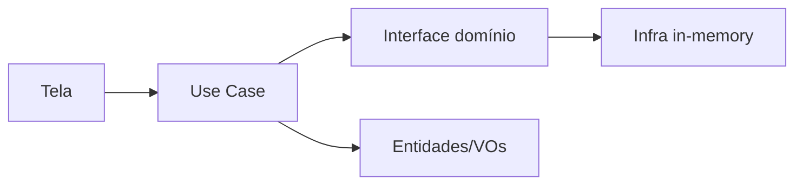
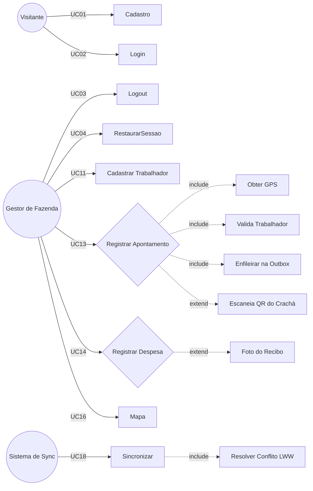
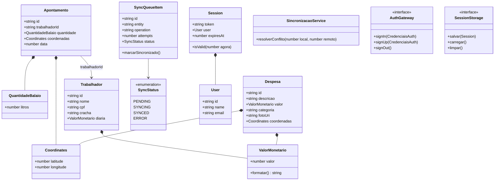
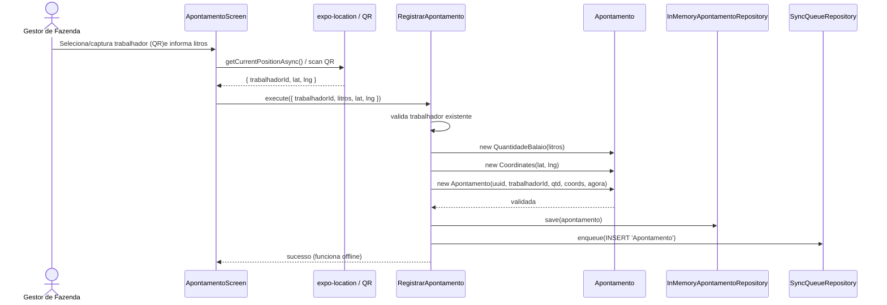
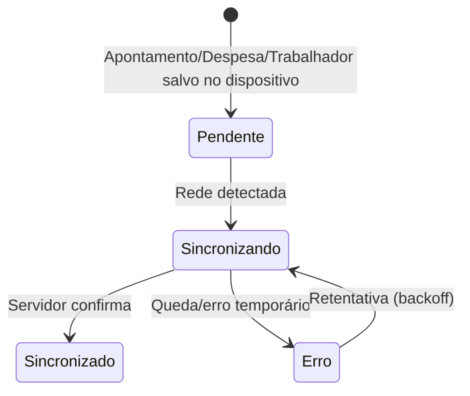

<!-- Background: dark green band with white title text is nice, but we keep the default theme for maximum portability. -->

# SafraCafé
## Gestão Offline-First da Colheita Cafeeira

**Expo SDK 54 · React Native · TypeScript · Clean Architecture + DDD + TDD**

Primeira Entrega — Desenvolvimento Mobile (CEFET-MG)

<!-- Speaker: Apresentar o problema que motivou o projeto: gestores de fazenda precisam gerenciar trabalhadores, apontamentos de colheita e despesas da operação cafeeira mesmo sem conexão. -->

---

# Agenda

1. Problema e Motivação
2. Requisitos (Funcionais e Não Funcionais)
3. Arquitetura: Clean Architecture + DDD
4. Padrões Obrigatórios de Projeto
5. Diagramas de Análise (Casos de Uso, Classes, Sequência, Estados)
6. Offline-First: Fila Outbox
7. Autenticação e Sessão Segura
8. Estratégia de Testes (TDD)
9. Demonstração da Aplicação
10. Próximos Passos

<!-- Speaker: Rodapé de roteiro da apresentação. -->

---

# Problema

**"Sistema Móvel Off-Line First para Gestão Operacional e Financeira da Colheita Cafeeira"**

Gestores de fazenda precisam, **dentro da lavoura** e mesmo **sem sinal**, controlar:
- trabalhadores da colheita (crachá com QR Code);
- produção diária de café (apontamento de balaios em litros);
- despesas da operação (diárias, combustível, insumos) com recibo.

Ferramentas genéricas falham:
- dependem de conexão para salvar;
- não persistem a sessão de forma segura;
- não estruturam (nem testam) a lógica de negócio.


<!-- Speaker: Enfatizar que o diferencial é o funcionamento 100% offline com sincronização posterior. -->

---

# Solução — SafraCafé

App **offline-first** que cadastra trabalhadores e registra apontamentos de balaio e despesas georreferenciados.

**Funcionalidades da 1ª entrega**

| Núcleo | Entrega |
| :--- | :--- |
| Trabalhadores | Cadastro (nome, CPF, crachá, diária) com `QR Code` |
| Apontamento | Balaio em litros via GPS, vinculado ao trabalhador (QR ou manual) |
| Despesas | Descrição/valor/categoria + foto do recibo (`expo-image-picker`) |
| Mapa | `Marker` + `Callout` + `Polyline` + `MapViewDirections` |
| Autenticação | Login/Logout + sessão restaurada no boot (`expo-secure-store`) |
| Sincronização | Fila `SyncQueueItem` + resolução de conflitos last-write-wins |

> Conta demo (in-memory): `pesquisador@ecofield.app` / `123456`
> Trabalhadores demo: `TRAB-001` José da Silva · `TRAB-002` Maria de Souza (diária R$ 60)

<!-- Speaker: Passar rapidamente a tabela; a demo será ao final. -->

---

# Requisitos Funcionais (destaques)

| ID | Requisito | Prioridade | UC |
| :--- | :--- | :---: | :--- |
| RF02 | Login e Logout | Alta | UC02/UC03 |
| RF03 | Cadastro de trabalhador (CPF/QR/diária) | Alta | UC11 |
| RF05 | Apontamento de balaio georreferenciado | Alta | UC13 |
| RF06 | Validações de domínio (lat/lng, litros, data) | Alta | UC13/UC14 |
| RF07 | Despesa com foto do recibo | Alta | UC14 |
| RF10/11/12 | Mapa, `Polyline`/rota e busca de local | Alta | UC16 |
| RF13 | Funcionar 100% offline (fila local) | Alta | UC17 |
| RF14 | Sincronizar a fila quando houver conexão | Alta | UC18 |
| RF15 | Enfileirar cadastro/apontamento/despesa na outbox | Alta | UC17 |

**Documento completo:** `docs/documento-software-mobile.md` — 16 RFs + 7 RNFs + rastreabilidade RF → UC → Teste.

<!-- Speaker: Todos os itens da 1ª entrega são de prioridade alta (offline-first é obrigatório). -->

---

# Requisitos Não Funcionais (destaques)

| ID | Categoria | Critério mensurável |
| :--- | :--- | :--- |
| RNF01 | Offline-First | Tudo funciona em Modo Avião |
| RNF02 | Permissões | Câmera/Galeria/GPS pedidas contextualizadas + fallback |
| RNF03 | Bateria/Dados | GPS pontual por demanda, sem polling |
| RNF05 | Sincronização | Outbox com retentativa + last-write-wins |
| RNF06 | Segurança | Tokens somente em `expo-secure-store` |
| RNF07 | Qualidade | Todos VOs, entidades e use cases com testes Jest |

<!-- Speaker: RNF06 é decisão de arquitetura forte: session nunca em texto plano. -->

---

# Arquitetura: Clean Architecture + DDD

```
Tela (app/ Expo Router)   →   Use Cases (src/usecases)
        ↓                              ↓ (injeção via construtor)
 src/factory/container.ts   ←   Gateways/Repositories (interfaces em src/domain)
        ↓
 Infra (src/infra) + Adapters (src/adapters): SDKs (Expo) na borda
```

**Regra que nunca muda:** `domain/` **não importa** `infra/`, `usecases/` nem SDKs
(`expo-*`, `react-native`, `supabase`).


<!-- Speaker: Explicar que o domínio é TypeScript puro, testável sem device. -->

---

# Estrutura do Repositório

```text
src/
  domain/
    value-objects/    SyncStatus, Coordinates, QuantidadeBalaio, ValorMonetario
    entities/         Trabalhador, Apontamento, Despesa, SyncQueueItem, User, Session
    repositories/     TrabalhadorRepository, ApontamentoRepository, DespesaRepository,
                      SyncQueueRepository (contratos)
    gateways/         AuthGateway, SessionStorage, NetworkGateway, SyncGateway
    services/         SincronizacaoService
  usecases/           CadastrarTrabalhador, ListarTrabalhadores, RegistrarApontamento,
                      RegistrarDespesa, ListarDespesas, AuthenticateUser, SignOut,
                      RestoreSession, SyncPendingQueue
  infra/              InMemory* (Singleton: trabalhador, apontamento, despesa, queue, auth, net, sync)
  adapters/auth/      AuthContext (useAuth) + SessionStorageSecureStore
  factory/            container.ts (DI Singleton)
app/
  index.tsx           Login
  (drawer)/(tabs)/    index (apontamento), trabalhadores, despesas, mapas
tests/                23 suítes / 85 testes
```

<!-- Speaker: destacar a separação de camadas; a infra pode virar SQLite/Supabase sem tocar no domínio. -->

---

# Padrões Obrigatórios (checáveis na prova)

1. **Injeção de Dependência via construtor**
   `new RegistrarApontamento(apontamentoRepository, trabalhadorRepository, syncQueueRepository)` · `new AuthenticateUser(authGateway, sessionStorage)`
2. **Singleton** — `private constructor()` + `private static instance` + `public static getInstance()`
   aplicado em `InMemory*`, `SessionStorageSecureStore` e `container`
3. **Value Objects imutáveis** com auto-validação no construtor
   `Coordinates`, `QuantidadeBalaio`, `ValorMonetario`, `SyncStatus`
4. **Entidades auto-validadas** e métodos de re-validação
   `Trabalhador`, `Apontamento`, `Despesa`, `SyncQueueItem.registrarTentativa/marcarSincronizado/marcarErro`
5. **`container.ts`** é o único ponto de wiring entre infra e use cases

<!-- Speaker: citar exemplos do código real em src/. -->

---

# Diagrama de Casos de Uso (resumo)



<!-- Speaker: atores com herança (Gestor herda de Visitante) e ator Sistema de Sincronização. -->

---

# Diagrama de Classes (núcleo)



<!-- Speaker: contratos no domínio; implementações reais na infra (in-memory agora, SQLite/Supabase depois). -->

---

# Fluxo de Registro (Visão de Sequência)



<!-- Speaker: no offline, o save local é imediato; o enqueue garante a sincronização posterior. -->

---

# Offline-First — Fila Outbox

Estado do ciclo de vida de cada item da fila:



`SyncPendingQueue` orquestra: fila pendente → `NetworkGateway.isConnected()` →
`SyncGateway.push()` → `SincronizacaoService.resolverConflito()` (last-write-wins via `updatedAt`).

**Resultado:** `{ synchronized, pending, offline }` — o app nunca trava sem rede.

<!-- Speaker: testado com fakes: fila vazia, fila com rede, fila offline. -->

---

# Autenticação e Sessão

- **Domínio:** `User` + `Session` (token, usuário, `expiresAt`, `isValid()`)
- **Contratos:** `AuthGateway` (signIn/signUp/signOut) e `SessionStorage` (salvar/carregar/limpar)
- **Use cases:** `AuthenticateUser`, `RestoreSession`, `SignOut`
- **UI:** `AuthContext` expõe `useAuth()` → `loading | authenticated | unauthenticated`
- **Segurança:** `SessionStorageSecureStore` persiste a sessão no **Keychain/Keystore** via `expo-secure-store` (RNF06) — nunca em texto plano

```text
Boot → RestoreSession → session? → (drawer) : Login
```

<!-- Speaker: restore no boot = UX sem login repetido; secure-store é o padrão exigido. -->

---

# Estratégia de Testes (TDD)

Pirâmide aplicada ao projeto — **23 suítes / 85 testes**:

| Camada | Técnica | Exemplos |
| :--- | :--- | :--- |
| Domínio | Sem mock, puro | `Coordinates`, `QuantidadeBalaio`, `ValorMonetario`, `Trabalhador`, `Apontamento`, `Despesa`, `SyncStatus`, `SyncQueueItem`, `Session`, `SincronizacaoService` |
| Use cases | Fakes in-memory | `CadastrarTrabalhador`, `RegistrarApontamento`, `RegistrarDespesa`, `AuthenticateUser`, `SyncPendingQueue` |
| Adapters | `jest.mock` dos SDKs | `SessionStorageSecureStore` |
| Telas | RNTL (async `render`/`fireEvent`) | `LoginScreen.test.tsx` |

Comandos de verificação (todos verdes):

```bash
npx jest --ci        # 23 suítes / 85 testes
npx tsc --noEmit     # typecheck limpo
npx expo lint        # sem avisos
```

<!-- Speaker: enfatizar TDD red→green→refactor e API assíncrona do RNTL v14. -->

---

# Demonstração

1. `npm install` → `npx expo start -c`
2. **Login** com conta demo (`pesquisador@ecofield.app` / `123456`)
3. **Trabalhadores:** cadastrar (nome/CPF/crachá/diária) ou usar os seeds `TRAB-001` e `TRAB-002`
4. **Apontamento:** selecionar trabalhador (ou ler QR do crachá) → informar litros → salvar com GPS
5. **Despesas:** descrever, valor, categoria e foto do recibo
6. **Mapa:** `Marker`s + `Polyline` do itinerário de colheita
7. **Offline:** modo avião → registrar → disponível na lista/mapa; fila mantém pendente


<!-- Speaker: sugerir interromper para perguntas durante a demo. -->

---

# Próximos Passos

- **Persistência real** — `expo-sqlite` (outbox) local com as tabelas `TRABALHADORES`, `APONTAMENTOS`, `DESPESAS`
- **Backend** — Supabase: Auth, Postgres com RLS, Storage de fotos de recibo
- **Upload de mídia** — fila de fotos com retentativa
- **Fechamento e diárias** — cálculo de pagamento dos trabalhadores pela produção
- **Webhook/worker** de sincronização assistindo `NetInfo`

<!-- 
Speaker: estas são as únicas pendências da especificação (RF01 e RF16 ainda
planejados); a 1ª entrega entrega o núcleo offline-first + auth + sync testados.
-->

---

# Obrigado!

**SafraCafé** — Gestão da colheita cafeeira, mesmo sem sinal.

Referências:

- Documento de especificação: `docs/documento-software-mobile.md`
- Guia de arquitetura: `guia.md` e `README.md`
- Expo SDK 54: https://docs.expo.dev/versions/v54.0.0/

<!-- Speaker: abrir para perguntas. -->