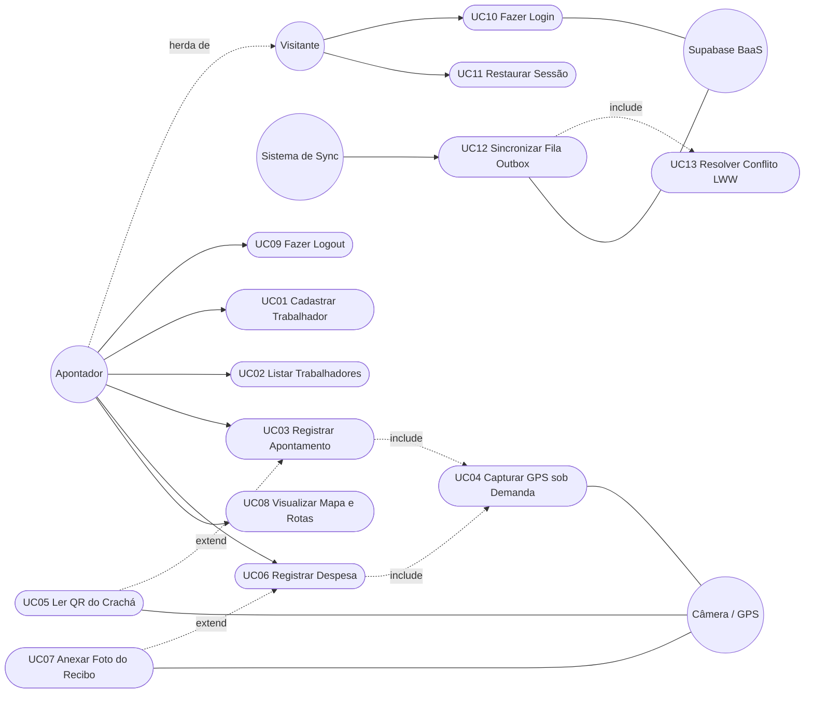
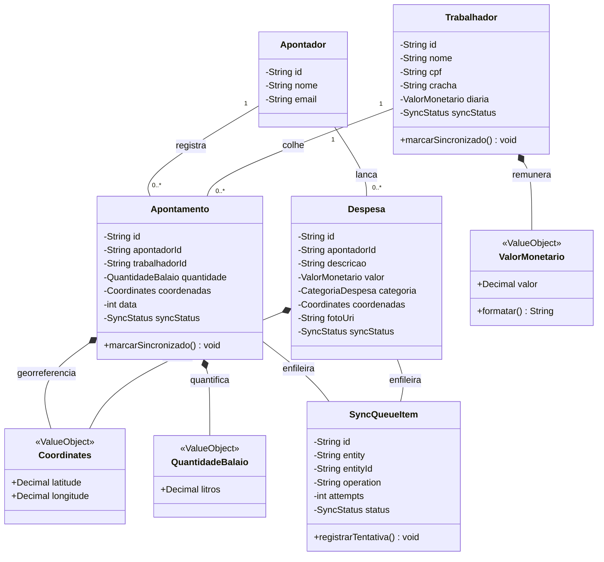
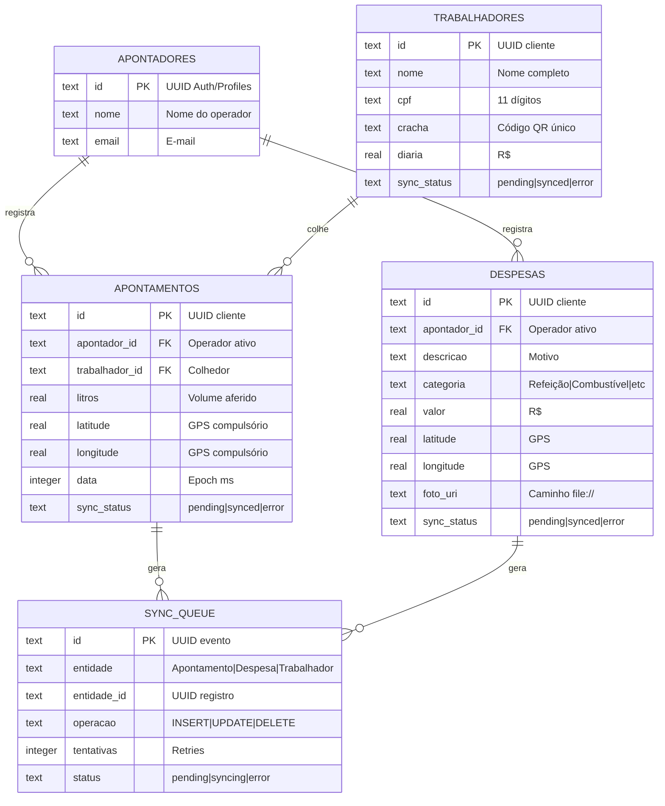
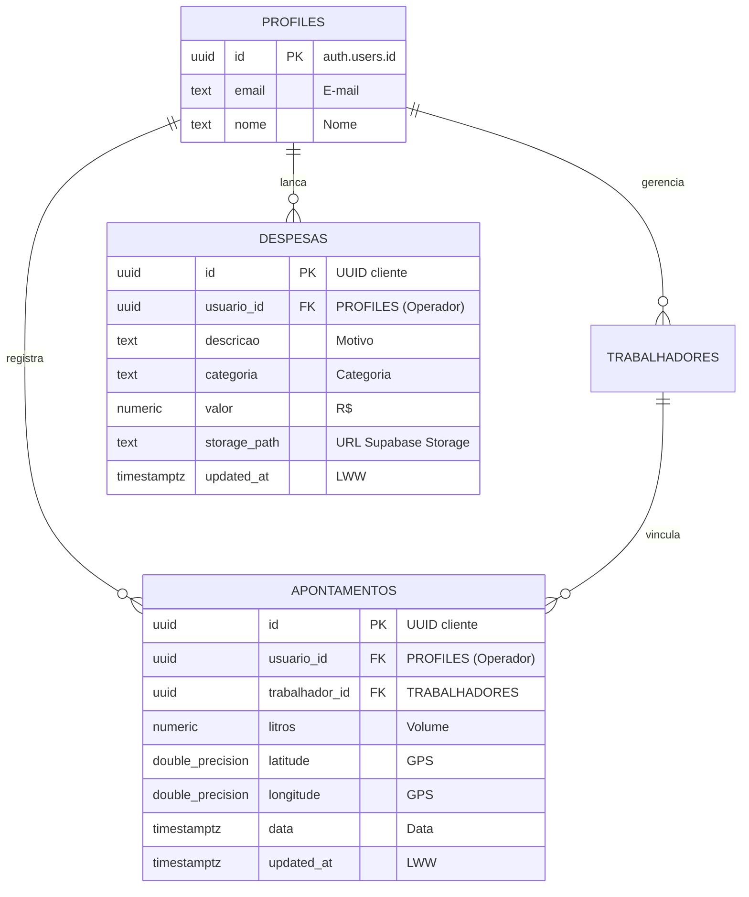
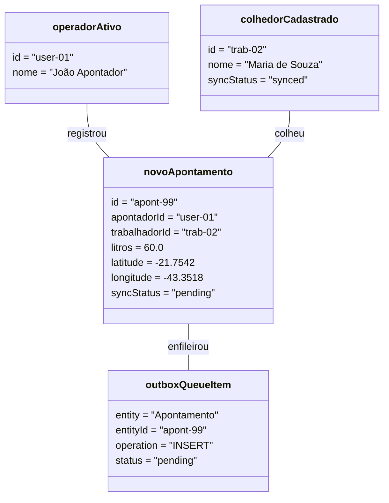
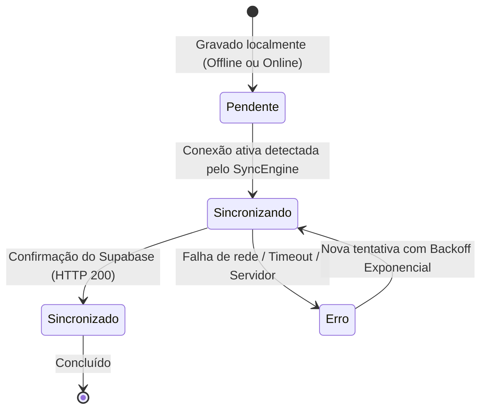
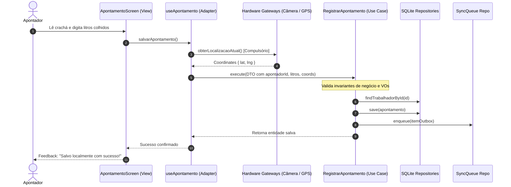
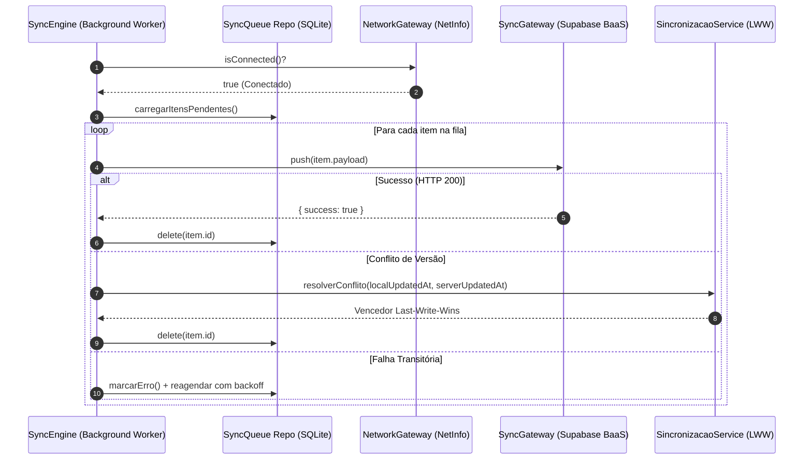
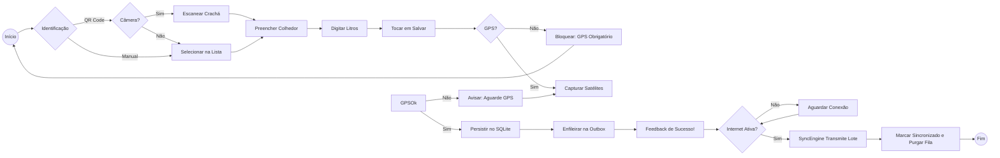
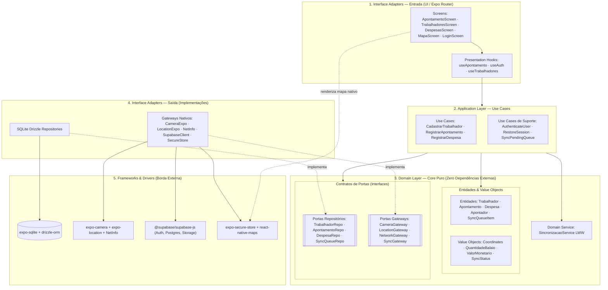

# SafraCafé — Especificação Técnica de Software Mobile (Versão Apresentação)

> **Projeto:** SafraCafé — Gestão e Controle de Colheita de Café no Eito da Lavoura  
> **Objetivo deste documento:** Versão executiva e enxuta para apresentação oral e defesa perante a banca acadêmica.  
> **Stack:** Expo SDK 57 (Expo Go / Dev Client) · SQLite (Drizzle ORM) · Supabase (PostgreSQL, Auth, Storage) · GPS & Câmera Nativos.  
> **Arquitetura:** Clean Architecture + Domain-Driven Design (DDD) + Test-Driven Development (TDD). 100% Offline-First.

---

## 🎯 1. Visão Geral & Contexto da Solução

* **Problema:** A apuração da colheita de café no eito ocorre em talhões rurais sem qualquer conectividade de internet celular, gerando perda de dados, fraudes de volume e lentidão no fechamento das diárias.
* **Solução:** Aplicativo mobile **100% Offline-First** operado pelo **Apontador**, que identifica colhedores via leitura óptica de crachás (QR Code), afere balaios (litros) com **fixação compulsória de GPS sob demanda** e enfileira lançamentos na base local (Outbox Pattern) para sincronização automática com a nuvem (Supabase BaaS).
* **Atores Centrais:**
  * **Apontador:** Operador de campo autenticado.
  * **Trabalhador:** Colhedor portador do crachá físico (QR Code).
  * **Hardware Nativo:** Sensores de Câmera e GPS do dispositivo móvel.
  * **Supabase (BaaS):** PostgreSQL em nuvem, Auth e Storage de recibos.
  * **SyncEngine:** Worker assíncrono orientado a eventos de conectividade (`NetInfo`).

---

## 📋 2. Requisitos-Chave do Sistema (RF & RNF)

### 2.1 Requisitos Funcionais Essenciais (RF)

| ID | Requisito Funcional | Ator/Origem | Regra Crítica de Negócio |
|:---|:---|:---|:---|
| **RF01/02** | Cadastrar e Listar Trabalhadores | Apontador | CPF com 11 dígitos, diária $\ge 0$, crachá único. |
| **RF03** | Leitura de QR Code de Crachás | Apontador / Câmera | Preenchimento automático do colhedor na tela. |
| **RF04/05** | Registro de Apontamento + GPS | Apontador / GPS | Volume $> 0$ litros; **bloqueio absoluto sem coordenadas GPS fixadas**. |
| **RF06/07** | Lançamento de Despesas + Foto | Apontador / Câmera | Categorias fechadas, foto do recibo opcional, GPS do local. |
| **RF08/09** | Mapa da Lavoura & Rotas | Apontador / GPS | Marcadores locais, itinerário percorrido no talhão e rotas viárias. |
| **RF10** | Autenticação & Sessão | Apontador / Supabase | Sessão persistida em hardware seguro (`SecureStore`). |
| **RF11/12** | Fila Outbox & Conflitos | Sistema de Sync | Fila local transitória; desempate *Last-Write-Wins* via `updatedAt`. |

### 2.2 Requisitos Não Funcionais (Categorias Mobile)

* **RNF01 (Offline-First):** 100% das operações de cadastro, leitura de crachá, apontamento e despesas funcionam em Modo Avião.
* **RNF02 (Sincronização Resiliente):** Lotes de até 50 registros sincronizam em $< 30\text{s}$ com retentativas exponenciais (*exponential backoff*).
* **RNF03 (Permissões Contextualizadas):** Câmera e Localização solicitadas apenas na ação de uso, nunca no cold start.
* **RNF04 (Bateria & GPS sob Demanda):** GPS acionado exclusivamente no instante do clique de gravação (1 fixação por registro; sem tracking de fundo).
* **RNF05 (Persistência Local Confiável):** Transações atômicas com SQLite local garantindo integridade ACID em modo offline.
* **RNF06 (Desempenho & Fluidez):** Tempo de inicialização a frio $< 2\text{s}$ e resposta de tela $< 100\text{ms}$ em aparelhos intermediários.
* **RNF07 (Segurança & Multitenancy):** Credenciais no `expo-secure-store` e isolamento no PostgreSQL via *Row Level Security* (`auth.uid() = usuario_id`).
* **RNF08 (Compatibilidade de Ambiente):** Android 10+ e iOS 15+.
  > [!IMPORTANT]
  > **Nota de Execução:** O módulo `react-native-maps` utiliza bibliotecas nativas de sistema, exigindo build via **Expo Dev Client** (`npx expo run:android` ou `prebuild`), não sendo suportado no Expo Go padrão.

---

## 👥 3. Diagrama de Casos de Uso

Estrutura limpa (Left-to-Right), evidenciando herança de atores, inclusões compulsórias (`<<include>>`) e extensões contextuais (`<<extend>>`):



---

## 🏛️ 4. Modelo de Classes & Rastreabilidade de Domínio

As entidades de domínio são objetos puros em TypeScript, contendo atributos essenciais de auditoria de operador (`apontadorId`) e controle de sincronização (`syncStatus`, `updatedAt`, `deletedAt`):



---

## 🗄️ 5. Diagramas Entidade-Relacionamento (DER)

A arquitetura estabelece equivalência estrutural entre a base local do smartphone e o banco em nuvem, garantindo rastreabilidade do operador (`apontador_id` / `usuario_id`).

### 5.1 DER Local (SQLite via Drizzle ORM)
Inclui a tabela transitória de mensageria local (`SYNC_QUEUE`) e o operador ativo:



### 5.2 DER Remoto (Supabase / PostgreSQL) + RLS
Isolamento multitenant no PostgreSQL protegido por *Row Level Security*:



> **Regra RLS Central no Supabase:**
> ```sql
> CREATE POLICY "Operadores gerenciam seus proprios registros"
> ON apontamentos FOR ALL USING (auth.uid() = usuario_id);
> ```

---

## 📸 6. Instantâneo de Estado Misto (Diagrama de Objetos)

Demonstra a coexistência em campo de dados sincronizados e novos registros pendentes na Outbox:



---

## 🔄 7. Ciclo de Vida da Sincronização (Diagrama de Estados)

Máquina de estados finitos que governa a transição de status dos registros e itens da Outbox:



---

## ⚡ 8. Diagramas de Sequência (Clean Architecture)

A separação em dois fluxos garante que a gravação do operador no eito nunca sofra latência de rede.

### 8.1 Fluxo Síncrono Local (Gravação Imediata em Campo)
O Caso de Uso coordena entidades e repositórios sem importar qualquer módulo nativo de UI ou Hardware:



### 8.2 Fluxo Assíncrono da Outbox (Background Sync & LWW)
Processamento desacoplado disparado por conectividade ativa:



---

## 🧭 9. Fluxo de Decisões de Campo (Diagrama de Atividades)

Visão ponta a ponta horizontal (`LR`) com ramificações explícitas de permissões de sensores e conectividade:



---

## 🧩 10. Diagrama de Componentes (Clean Architecture)

Estrutura em 5 camadas concêntricas. As setas apontam estritamente para dentro:



---

## ☕ 11. Mapeamento DDD (Linguagem Ubíqua da Lavoura)

A modelagem reflete o vocabulário fidedigno da colheita cafeeira:

| Termo do Domínio | Conceito no Software | Invariante Assegurada |
|:---|:---|:---|
| **Eito** | Local físico do cafezal | Coordenadas GPS obrigatórias (`Coordinates`). |
| **Balaio** | Unidade volumétrica de colheita | Litros estritamente positivos (`QuantidadeBalaio` $> 0$). |
| **Crachá** | Identificador óptico do colhedor | Código único impresso no formato QR Code. |
| **Diária** | Remuneração acordada por dia | Valor em reais positivo (`ValorMonetario` $\ge 0$). |
| **Apontador** | Operador responsável pela pesagem | Rastreabilidade do ID do usuário autenticado em cada registro. |

---

## 📂 12. Estrutura e Organização das Pastas (Clean Architecture)

Estrutura essencial dos diretórios, evidenciando a separação concêntrica das camadas:

```text
PROJETOMOBILE/
├── app/                  # Camada de Apresentação (Expo Router: Telas, Drawer e Tabs)
│   ├── (drawer)/(tabs)/  # Telas Centrais: Apontamento (Home), Trabalhadores, Despesas e Mapas
│   └── index.tsx         # Tela de Autenticação do Apontador
│
├── src/                  # Núcleo da Aplicação (Independente de Frameworks)
│   ├── domain/           # Domínio Puro: Entidades, Value Objects e Interfaces de Portas
│   ├── usecases/         # Casos de Uso: Regras de negócio da colheita e orquestração
│   ├── adapters/         # Adaptadores de Interface: AuthContext, SecureStore e UI Helpers
│   ├── infra/            # Frameworks & Drivers: Repositórios SQLite e Gateways Nativo/Supabase
│   └── factory/          # Composição & IoC: container.ts (Injeção de Dependências)
│
└── tests/                # Testes Automatizados TDD (Domínio, Casos de Uso e Telas)
```

> **Regra de Isolamento Arquitetural:**
> * `domain/` é 100% puro em TypeScript (zero dependências externas).
> * `usecases/` dependem apenas de contratos (`domain/`) e recebem implementações via construtor.
> * `app/` acessa os casos de uso unicamente via `Container.getInstance()`.

---

## 🏗️ 13. Ponto Único de Wiring: `container.ts` (IoC Container)

Garante o **Princípio da Inversão de Dependência**. É a única classe que instancia os adapters concretos e os injeta nos construtores dos casos de uso como Singletons:

```typescript
// src/factory/container.ts (Singleton IoC)
export class Container {
  private static instance: Container;

  // Portas de Repositório e Gateways
  public readonly trabalhadorRepository: InMemoryTrabalhadorRepository;
  public readonly apontamentoRepository: InMemoryApontamentoRepository;
  public readonly despesaRepository: InMemoryDespesaRepository;
  public readonly syncQueueRepository: InMemorySyncQueueRepository;

  // Casos de Uso
  public readonly cadastrarTrabalhador: CadastrarTrabalhador;
  public readonly registrarApontamento: RegistrarApontamento;
  public readonly registrarDespesa: RegistrarDespesa;
  public readonly syncPendingQueue: SyncPendingQueue;

  private constructor() {
    // 1. Instancia Repositórios (Singletons)
    this.trabalhadorRepository = InMemoryTrabalhadorRepository.getInstance();
    this.apontamentoRepository = InMemoryApontamentoRepository.getInstance();
    this.despesaRepository = InMemoryDespesaRepository.getInstance();
    this.syncQueueRepository = InMemorySyncQueueRepository.getInstance();

    // 2. Injeta via Construtor nos Casos de Uso
    this.cadastrarTrabalhador = new CadastrarTrabalhador(this.trabalhadorRepository, this.syncQueueRepository);
    this.registrarApontamento = new RegistrarApontamento(this.apontamentoRepository, this.trabalhadorRepository, this.syncQueueRepository);
    this.registrarDespesa = new RegistrarDespesa(this.despesaRepository, this.syncQueueRepository);
    this.syncPendingQueue = new SyncPendingQueue(this.syncQueueRepository, InMemorySyncGateway.getInstance(), InMemoryNetworkGateway.getInstance(), new SincronizacaoService());
  }

  public static getInstance(): Container {
    if (!Container.instance) Container.instance = new Container();
    return Container.instance;
  }
}
```

---

## 🧪 14. Estratégia de Testes TDD (Pirâmide de Testes)

O ecossistema conta com **25 suítes de testes e 92 testes automatizados** com **100% de aprovação**:

```text
               /\
              /E2E\       Poucos testes completos (Detox / Maestro em device)
             /------\
            / Telas  \    @testing-library/react-native (Estados visuais e alertas)
           /----------\
          / Repos & GW \  SQLite in-memory real e mocks pontuais de expo-camera/location
         /--------------\
        /   Use Cases    \ Testes de Aceitação usando Fakes em memória (Rápido: ~5s)
       /------------------\
      /  Domínio Puro & VOs\ 100% sem mocks: Coordinates, QuantidadeBalaio, ValorMonetario
     /______________________\
```

### Exemplo de Rastreabilidade RF $\rightarrow$ Teste
* **RF04 / RF05:** `Coordinates.test.ts` valida rejeição de latitudes fora de $[-90, 90]$ e longitudes fora de $[-180, 180]$.
* **RF04 / RF11:** `RegistrarApontamento.test.ts` valida que a chamada grava simultaneamente no `ApontamentoRepository` e na `SyncQueueRepository`.
* **RNF01:** `SyncPendingQueue.test.ts` comprova que quando `isConnected = false`, nenhuma chamada de rede é feita e a base local se mantém intacta.

---

## 📌 15. Checklist Rápido para a Apresentação na Banca

- [x] **1. Problema e Solução:** Explicado em 1 slide (eito sem sinal $\rightarrow$ app 100% offline-first).
- [x] **2. Rastreabilidade:** Demonstrada do RF ao Caso de Uso, Entidade, Tabela SQLite e Teste Jest.
- [x] **3. Clean Architecture:** Nenhuma dependência nativa vazando para o domínio ou aplicação.
- [x] **4. Organização das Pastas:** Camadas claramente isoladas (`domain`, `usecases`, `infra`, `app`).
- [x] **5. Resiliência de Sincronização:** Outbox pattern explicado visualmente com tolerância a falhas e Last-Write-Wins.
- [x] **6. Demonstração dos Testes:** `npm test` executando 92 testes em ~6 segundos.
