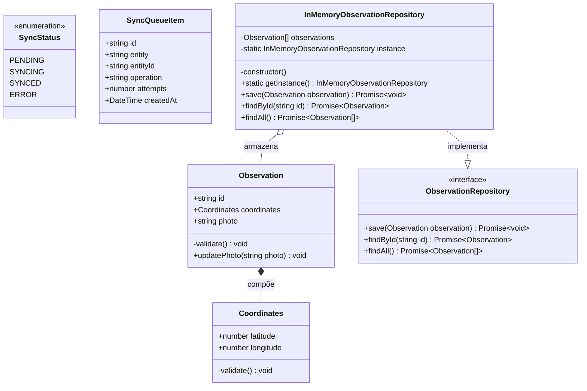
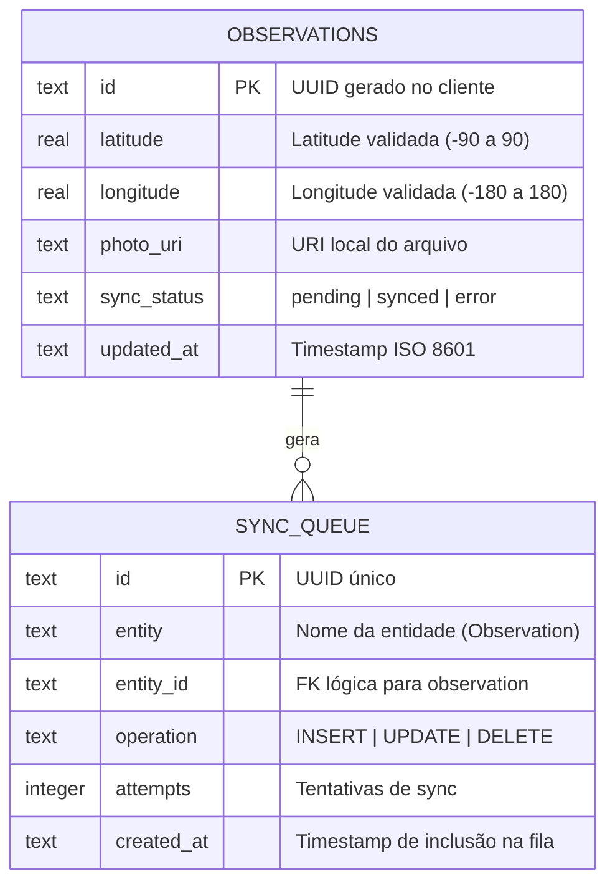
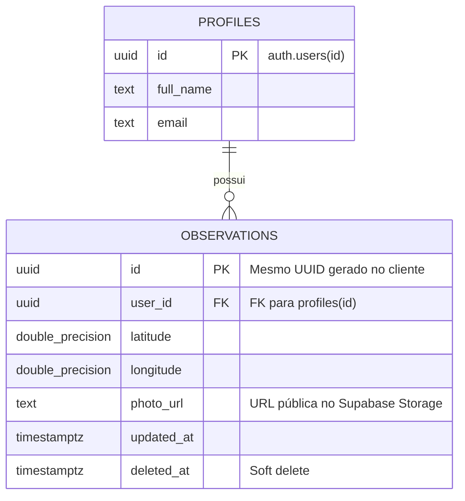
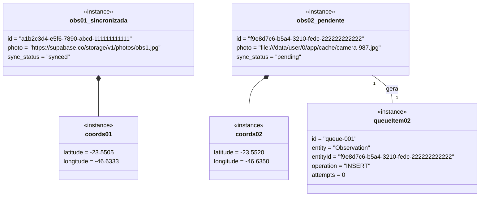
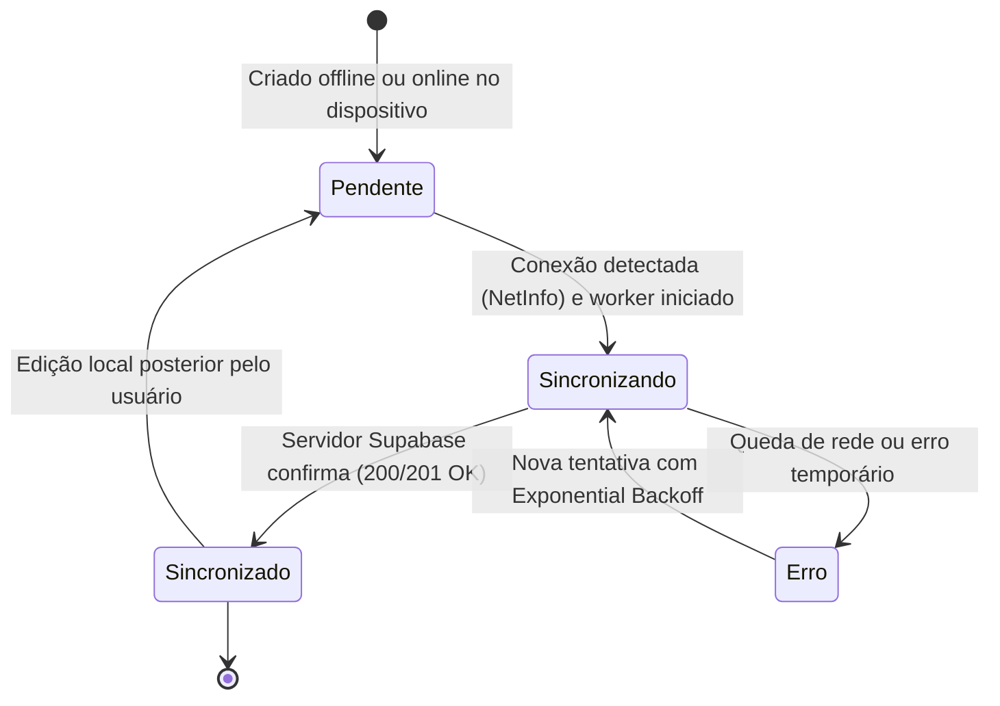
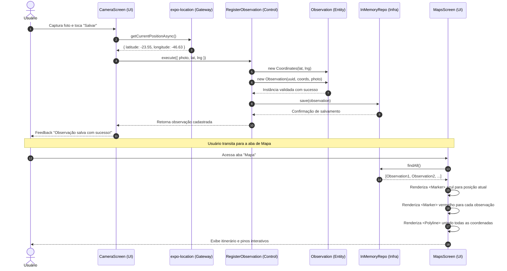
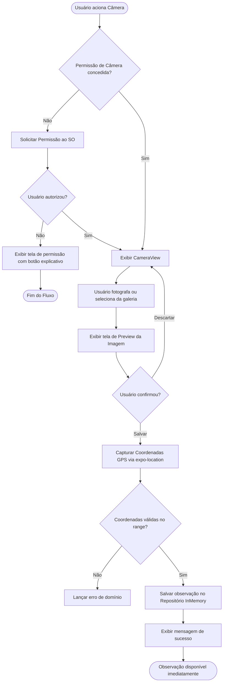

# Documento de Engenharia e Especificação de Software Mobile
## EcoField / Mobile Observation App — Expo & React Native

> **Status do Documento:** Aprovado / Baseline de Arquitetura  
> **Versão:** 1.0.0  
> **Padrão Metodológico:** SDD (Spec Driven Development), DDD (Domain-Driven Design), Clean Architecture & TDD  
> **Alinhamento Curricular:** Ementa de Desenvolvimento Mobile (07/ago a 08/set e módulos futuros de Autenticação/Sync)

---

## Sumário Executivo e Stack de Referência

O aplicativo mobile é projetado com arquitetura **Offline-First**, permitindo que pesquisadores e agentes de campo capturem observações georreferenciadas com fotos e leitura de QR Code, visualizem seus registros em listas e mapas com itinerário traçado por rotas (`Polyline`), autentiquem-se de forma segura e sincronizem seus dados de maneira assíncrona com o backend na nuvem.

| Camada / Função | Escolha Default (Adotada) | Alternativa Avaliada | Finalidade / Justificativa |
| :--- | :--- | :--- | :--- |
| **Framework Mobile** | **Expo SDK 54** + React Native 0.81 | Bare React Native | Managed workflow com compilação e acesso modular a hardware. |
| **Roteamento & Telas** | **Expo Router v6** | React Navigation puro | Roteamento baseado em arquivos com Stacks, Drawer e Bottom Tabs aninhadas. |
| **Linguagem** | **TypeScript 5.9** | JavaScript ES6+ | Tipagem estática estrita em todas as camadas de domínio e aplicação. |
| **Persistência Local** | **InMemory / SQLite** via `expo-sqlite` (Drizzle ORM) | WatermelonDB | Persistência local imediata (*outbox* pattern) com tolerância a modo avião. |
| **BaaS / Nuvem** | **Supabase** (Postgres, Auth, Storage, Realtime) | Firebase | Banco relacional com Row Level Security (RLS), Auth e bucket de fotos. |
| **Câmera & Mídia** | `expo-camera` + `expo-image-picker` | — | Captura de imagens, visualização prévia (preview), galeria e scanner de QR Code. |
| **Geolocalização & Mapas** | `expo-location` + `react-native-maps` | Mapbox | Obtenção de coordenadas GPS, exibição de mapa com `Marker`s e traçado `Polyline`. |
| **Segurança & Sessão** | `expo-secure-store` | AsyncStorage | Armazenamento cifrado de tokens JWT de sessão de usuário. |
| **Testes Unitários** | **Jest 29** + `@testing-library/react-native` | Detox / Maestro | TDD para Value Objects, Entidades e Use Cases com repositórios fakes. |

---

## 1. Levantamento de Requisitos

### 1.1 Requisitos Funcionais (RF)

| ID | Descrição | Prioridade | Ator Principal |
| :--- | :--- | :---: | :--- |
| **RF01** | O app deve permitir que o usuário realize cadastro (Sign Up) com e-mail e senha. | Média | Visitante |
| **RF02** | O app deve permitir login (Sign In) e encerramento de sessão (Sign Out). | Alta | Usuário Autenticado |
| **RF03** | O app deve capturar fotos em tempo real utilizando a câmera (frontal ou traseira). | Alta | Usuário / Câmera |
| **RF04** | O app deve permitir a seleção de fotos existentes a partir da galeria do dispositivo (`expo-image-picker`). | Média | Usuário |
| **RF05** | O app deve fornecer pré-visualização (preview) da imagem capturada com opções de descartar ou salvar. | Alta | Usuário |
| **RF06** | O app deve ler códigos QR (QR Code) através do sensor da câmera e exibir o resultado decodificado. | Média | Usuário / Câmera |
| **RF07** | O app deve capturar a geolocalização exata (latitude e longitude) no momento do registro via GPS. | Alta | Usuário / GPS |
| **RF08** | O app deve validar geograficamente as coordenadas (latitude entre -90 e 90, longitude entre -180 e 180). | Alta | Sistema |
| **RF09** | O app deve registrar a observação associando ID único (UUID), coordenadas válidas e URI da foto. | Alta | Usuário |
| **RF10** | O app deve listar todas as observações salvas em uma `FlatList` com foto e coordenadas. | Alta | Usuário |
| **RF11** | O app deve exibir um mapa interativo com marcadores (`Marker`) para a posição atual e cada observação. | Alta | Usuário |
| **RF12** | O app deve desenhar uma linha de rota (`Polyline`) conectando a sequência de observações no mapa. | Alta | Usuário |
| **RF13** | O app deve funcionar 100% offline, salvando registros na fila local sem exigir rede ativa. | Alta | Usuário |
| **RF14** | O app deve sincronizar automaticamente a fila de registros com o Supabase quando houver conexão. | Alta | Sistema Sync |

### 1.2 Requisitos Não Funcionais (RNF)

| ID | Categoria | Descrição e Critério Mensurável | Prioridade |
| :--- | :--- | :--- | :---: |
| **RNF01** | **Offline-First** | Todas as ações de captura, registro, visualização em lista e no mapa devem funcionar com o dispositivo em Modo Avião. | Alta |
| **RNF02** | **Permissões** | Permissões de Câmera, Galeria e Localização devem ser solicitadas contextualizadas na tela de uso, com fallback visual caso negadas. | Alta |
| **RNF03** | **Bateria e Dados** | A captura de localização deve ser pontual por demanda de registro (não polling contínuo desnecessário), poupando bateria. | Média |
| **RNF04** | **Armazenamento** | As fotos locais devem ser gerenciadas em diretório temporário/armazenamento do app até upload confirmado para a nuvem. | Média |
| **RNF05** | **Sincronização** | A sincronização deve usar fila outbox com retentativa (*exponential backoff*) e resolução de conflito *Last-Write-Wins* via `updated_at`. | Alta |
| **RNF06** | **Segurança** | Tokens de autenticação de sessão devem ser armazenados exclusivamente em `expo-secure-store`, nunca em texto plano. | Alta |
| **RNF07** | **Qualidade / TDD** | Todos os Value Objects, Entidades e Casos de Uso devem possuir cobertura de testes unitários isolados com Jest. | Alta |

---

## 2. Diagrama e Catálogo de Casos de Uso

### 2.1 Atores do Sistema
- **Visitante**: Usuário que acessa o app antes de autenticar.
- **Usuário Autenticado**: Agente de campo (herda de Visitante) com permissão para registrar e consultar observações.
- **Hardware do Dispositivo (Câmera / GPS)**: Sensores nativos do smartphone.
- **Sistema de Sincronização (Sync Engine)**: Worker em background que monitora conectividade de rede (`NetInfo`).
- **Supabase (BaaS)**: Backend as a Service gerenciado com Postgres, Storage e Auth.

### 2.2 Diagrama de Casos de Uso (Mermaid)

```mermaid
flowchart LR
    subgraph Atores
        Visitante((Visitante))
        Usuario((Usuário Autenticado))
        SyncWorker((Sistema de Sincronização))
        Usuario --|> Visitante
    end

    subgraph Modulo_Autenticacao["Autenticação & Sessão"]
        UC01[UC01: Fazer Cadastro]
        UC02[UC02: Fazer Login]
        UC03[UC03: Fazer Logout]
        UC04[UC04: Recuperar Sessão Ativa]
    end

    subgraph Modulo_Hardware["Hardware & Sensores"]
        UC05[UC05: Solicitar Permissões Nativas]
        UC06[UC06: Capturar Foto em Tempo Real]
        UC07[UC07: Selecionar Foto da Galeria]
        UC08[UC08: Escanear QR Code]
        UC09[UC09: Obter Geolocalização GPS]
    end

    subgraph Modulo_Observacoes["Gestão de Observações"]
        UC10[UC10: Registrar Observação]
        UC11[UC11: Listar Observações Salvas]
        UC12[UC12: Visualizar Mapa com Markers e Polyline]
    end

    subgraph Modulo_Sync["Sincronização Offline-First"]
        UC13[UC13: Enfileirar na Outbox Local]
        UC14[UC14: Sincronizar Fila Pendente]
        UC15[UC15: Fazer Upload de Mídia no Storage]
        UC16[UC16: Resolver Conflitos de Dados]
    end

    Visitante --> UC01
    Visitante --> UC02
    Usuario --> UC03
    Usuario --> UC04
    Usuario --> UC10
    Usuario --> UC11
    Usuario --> UC12

    UC10 -. <<include>> .-> UC09
    UC10 -. <<include>> .-> UC13
    UC06 -. <<extend>> .-> UC10
    UC07 -. <<extend>> .-> UC10
    UC08 -. <<extend>> .-> UC10
    UC05 -. <<include>> .-> UC06
    UC05 -. <<include>> .-> UC09

    SyncWorker --> UC14
    UC14 -. <<include>> .-> UC15
    UC14 -. <<include>> .-> UC16
```

### 2.3 Especificação Textual dos Casos de Uso Principais

#### UC10 — Registrar Observação de Campo
- **Ator Principal:** Usuário Autenticado
- **Pré-condições:** O app está aberto na tela de captura (`app/(drawer)/(tabs)/index.tsx`).
- **Fluxo Principal:**
  1. O usuário captura uma foto via câmera ou seleciona da galeria.
  2. O sistema exibe o preview da foto com opções de "Descartar" ou "Salvar".
  3. O usuário toca em "Salvar".
  4. O sistema obtém as coordenadas geográficas via `expo-location`.
  5. O caso de uso `RegisterObservation` instancia o Value Object `Coordinates`, validando limites (-90 a 90; -180 a 180).
  6. O caso de uso instancia a entidade `Observation` com UUID gerado no cliente.
  7. O repositório salva a observação localmente no repositório Singleton.
  8. O sistema notifica o usuário de sucesso e restaura a câmera para novo registro.
- **Fluxos Alternativos:**
  - *Fluxo sem rede:* O salvamento local ocorre normalmente; a observação fica disponível para visualização imediata.
  - *Permissão negada:* O sistema exibe mensagem amigável e impede o salvamento até autorização do usuário.
- **Pós-condições:** Observação armazenada e disponível para listagem e plotagem no mapa.

#### UC12 — Visualizar Mapa com Markers e Polyline
- **Ator Principal:** Usuário Autenticado
- **Pré-condições:** Permissão de localização concedida.
- **Fluxo Principal:**
  1. O usuário clica na aba "Mapa" (`app/(drawer)/(tabs)/maps.tsx`).
  2. O sistema executa `container.listObservations.execute()` recarregando as observações.
  3. O mapa centraliza na localização atual com marcador azul do usuário.
  4. Para cada observação cadastrada, renderiza um `<Marker>` vermelho com `<Callout>` interativo exibindo foto e coordenadas.
  5. Se houver 2 ou mais observações, desenha um `<Polyline>` ligando a ordem dos pontos no mapa.
- **Pós-condições:** Itinerário de campo exibido visualmente.

---

## 3. Diagrama de Classes



### 3.1 Diagramas Entidade-Relacionamento (DER Local e Remoto)

#### DER Local (SQLite via Drizzle / Cache Local)


#### DER Remoto (Supabase / Postgres com RLS)


> **Políticas de Row Level Security (RLS):**
> - `SELECT / INSERT / UPDATE`: Garantidas por `auth.uid() = user_id`.

---

## 4. Diagrama de Objetos (Validação de Cenário de Estado Misto)

Este diagrama representa um instantâneo real de dados em memória, validando que o sistema tolera de forma resiliente um estado misto (onde uma observação já foi sincronizada com a nuvem enquanto outra foi recém-criada offline e permanece pendente):



---

## 5. Diagrama de Estados do Ciclo de Sincronização



---

## 6. Classes de Fronteira, Controle e Entidade (BCE)

| Caso de Uso | Boundary de UI (Telas) | Boundary de Hardware / Gateway | Control (Casos de Uso) | Entidades Envolvidas |
| :--- | :--- | :--- | :--- | :--- |
| **Registrar Observação** | `CameraScreen` (`app/(drawer)/(tabs)/index.tsx`) | `CameraGateway`, `LocationGateway` | `RegisterObservation` | `Observation`, `Coordinates` |
| **Listar Observações** | `ListScreen` (`app/(drawer)/(tabs)/list.tsx`) | N/A (leitura em repositório local) | `ListObservations` | `Observation` |
| **Visualizar no Mapa** | `MapsScreen` (`app/(drawer)/(tabs)/maps.tsx`) | `LocationGateway`, `MapView` | `ListObservations` | `Observation`, `Coordinates` |
| **Autenticação** | `LoginScreen` / `ModalScreen` | `AuthGateway` (Supabase Auth) | `AuthenticateUserUseCase` | `User` |
| **Sincronização** | Indicador de status na UI | `SyncGateway`, `NetInfo` | `SyncQueueUseCase` | `Observation`, `SyncQueueItem` |

---

## 7. Diagrama de Sequência: Registro e Visualização no Mapa



---

## 8. Diagrama de Atividades: Fluxo de Captura com Permissões



---

## 9. Diagrama de Componentes (Clean Architecture)

```mermaid
flowchart TB
    subgraph UI_Layer["Camada de Apresentação (Interface Adapters - Entrada)"]
        CameraViewScreen["Camera Screen (app/(drawer)/(tabs)/index.tsx)"]
        ListViewScreen["List Screen (app/(drawer)/(tabs)/list.tsx)"]
        MapViewScreen["Maps Screen (app/(drawer)/(tabs)/maps.tsx)"]
    end

    subgraph Application_Layer["Camada de Aplicação (Use Cases)"]
        RegisterUC["RegisterObservation"]
        ListUC["ListObservations"]
    end

    subgraph Domain_Layer["Camada de Domínio (Pure TypeScript)"]
        ObsEntity["Observation (Entidade)"]
        CoordsVO["Coordinates (Value Object)"]
        RepoInterface[["ObservationRepository (Interface)"]]
        CamGatewayInterface[["CameraGateway (Interface)"]]
        LocGatewayInterface[["LocationGateway (Interface)"]]
    end

    subgraph Factory_Layer["Container / Injeção de Dependência"]
        DIContainer["Container (Singleton Factory)"]
    end

    subgraph Infra_Layer["Camada de Infraestrutura (Drivers & Adapters)"]
        InMemoryRepo["InMemoryObservationRepository (Singleton)"]
        ExpoSensors["Expo Camera & Location Drivers"]
    end

    CameraViewScreen --> DIContainer
    ListViewScreen --> DIContainer
    MapViewScreen --> DIContainer

    DIContainer --> RegisterUC
    DIContainer --> ListUC
    DIContainer --> InMemoryRepo

    RegisterUC --> RepoInterface
    ListUC --> RepoInterface
    RegisterUC --> ObsEntity
    RegisterUC --> CoordsVO

    InMemoryRepo ..|> RepoInterface
    InMemoryRepo --> ObsEntity

    CameraViewScreen --> ExpoSensors
    MapViewScreen --> ExpoSensors
```

---

## 10. Implementação: DDD, Clean Architecture e TDD

### 10.1 Padrões Obrigatórios Implementados no Projeto
1. **Regra da Direção das Dependências:** O diretório `domain/` é independente e não importa nada de `infra/`, `usecases/` ou bibliotecas de terceiros (`expo-*`, `react-native`).
2. **Injeção de Dependência (DI):** Todo caso de uso recebe seus repositórios por parâmetro no construtor (`constructor(private readonly repository: ObservationRepository)`).
3. **Padrão Singleton:** O repositório de infraestrutura (`InMemoryObservationRepository`) e a fábrica (`Container`) implementam o padrão Singleton com:
   - `private constructor()`
   - `private static instance`
   - `public static getInstance()`
4. **Auto-Validação:** Value Objects e Entidades se autovalidam no construtor e em métodos de modificação de estado (`updatePhoto`), impedindo estados inconsistentes no sistema.

### 10.2 Matriz de Testes TDD Executada e Aprovada

| Arquivo de Teste | Camada Alvo | Cenários Cobertos | Status |
| :--- | :--- | :--- | :---: |
| [`Coordinates.test.ts`](file:///c:/PROJETOMOBILE/tests/domain/Coordinates.test.ts) | Domain (Value Object) | Criação com lat/lng válidas; rejeição de lat > 90 ou < -90; rejeição de lon > 180 ou < -180. | ✅ Aprovado |
| [`Observations.test.ts`](file:///c:/PROJETOMOBILE/tests/domain/Observations.test.ts) | Domain (Entidade) | Criação de observação; validação de URI com protocolo `://`; método `updatePhoto` e re-validação. | ✅ Aprovado |
| [`RegisterObservation.test.ts`](file:///c:/PROJETOMOBILE/tests/usecases/RegisterObservation.test.ts) | Application (Use Case) | Execução com dados válidos salvando no fake repo; rejeição se coordenadas inválidas; rejeição se foto inválida. | ✅ Aprovado |
| [`ListObservations.test.ts`](file:///c:/PROJETOMOBILE/tests/usecases/ListObservations.test.ts) | Application (Use Case) | Retorno de lista vazia; listagem completa de itens pré-armazenados. | ✅ Aprovado |

---

## 11. Checklist Final do Documento (Conformidade com a Skill)

- [x] 1. Requisitos funcionais e não funcionais (tabela), incluindo categorias mobile (offline, permissões, bateria/dados, armazenamento local, sincronização, segurança, compatibilidade).
- [x] 2. Diagrama de casos de uso com atores (+ herança de ator, incluindo ator de Sistema de Sincronização), include, extend.
- [x] 3. Descrição textual dos casos de uso principais (pré/pós-condição, fluxos, incluindo fluxo sem rede e fluxo de permissão negada).
- [x] 4. Diagrama de classes com composição, agregação, herança, multiplicidades e atributos de controle de sync.
- [x] 5. Marcação de persistência local (SQLite) e remota (Supabase) de cada entidade.
- [x] 6. Diagramas entidade-relacionamento (DER) local e remoto, com RLS documentado.
- [x] 7. Diagrama de objetos validando cenário de estado misto (parcialmente sincronizado).
- [x] 8. Diagrama de estados do ciclo de sincronização (pending/synced/error).
- [x] 9. Classes de fronteira/controle/entidade mapeadas por caso de uso, com boundary de UI separado de boundary de recurso nativo/gateway.
- [x] 10. Diagrama de sequência dos casos de uso principais, incluindo fluxo assíncrono de sincronização.
- [x] 11. Diagrama de atividade cobrindo decisão de permissão e decisão de conectividade.
- [x] 12. Diagrama de componentes (camadas Clean Architecture + gateways de câmera/localização/auth/sync).
- [x] 13. Mapeamento DDD (aggregates, entidades, value objects, repositories, gateways).
- [x] 14. Estrutura de camadas Clean Architecture (domain/application/adapters/infra) sem SDK nativo/ORM vazando pra domain/application.
- [x] 15. Plano de testes TDD por caso de uso (domínio → use case com fakes → gateway/adapter mockado → repository real → componente).
