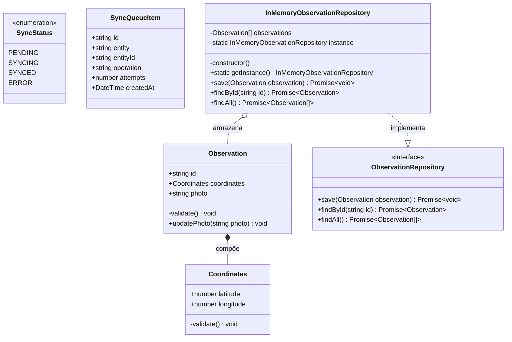
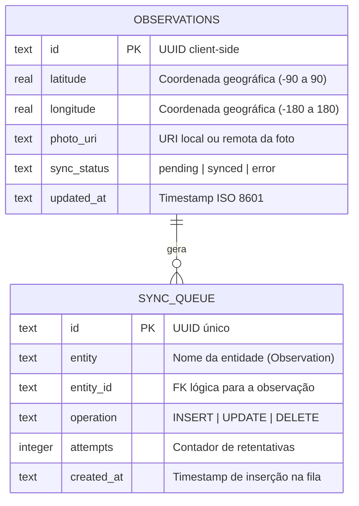
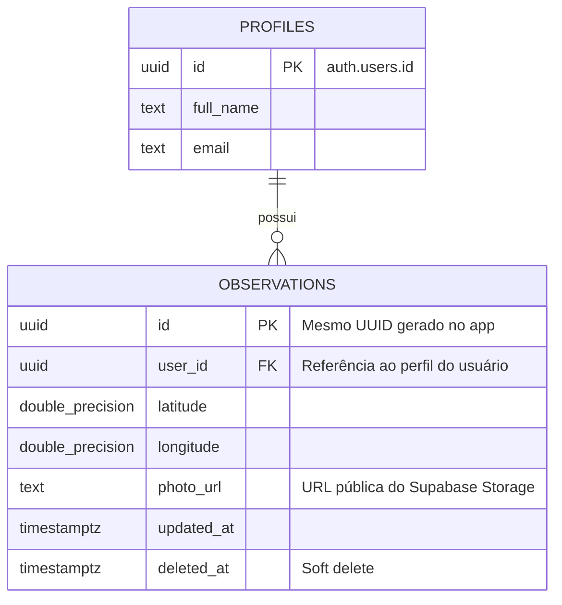
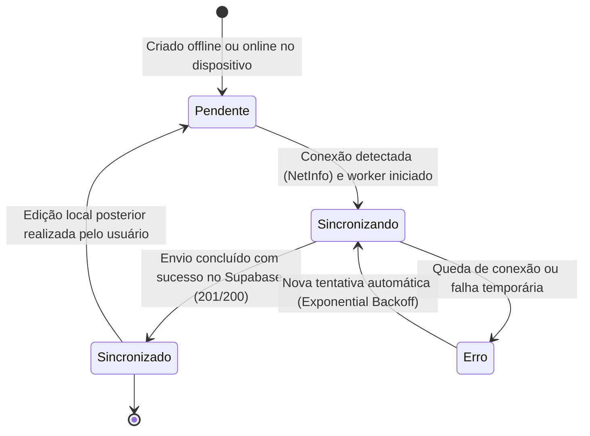
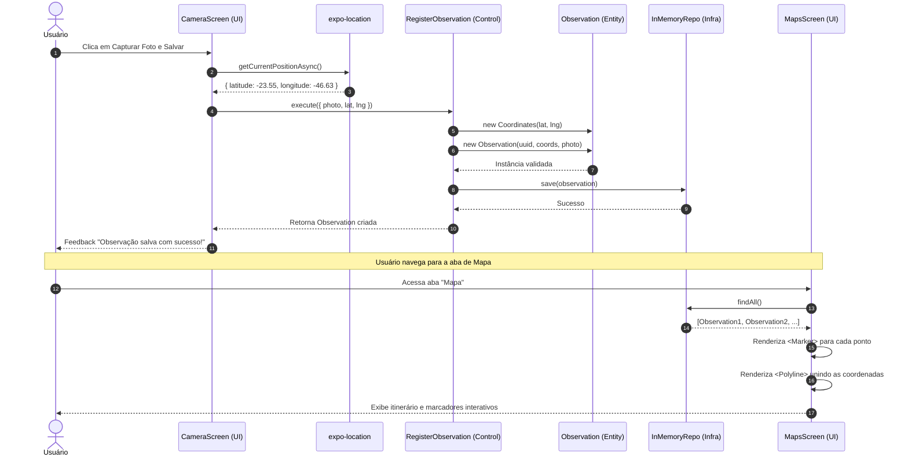
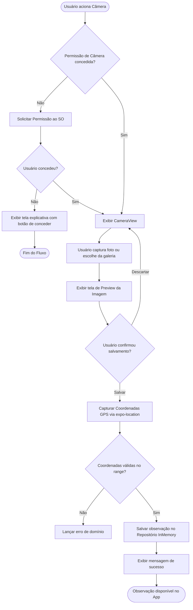

# Documento de Engenharia e Especificação de Software Mobile
## EcoField / Mobile Observation App — Expo & React Native

> **Status do Documento:** Aprovado / Baseline de Arquitetura  
> **Versão:** 1.0.0  
> **Padrão Metodológico:** SDD (Spec Driven Development), DDD (Domain-Driven Design), Clean Architecture & TDD  
> **Alinhamento Curricular:** Ementa de Desenvolvimento Mobile (07/ago a 08/set e módulos futuros de Autenticação/Sync)

---

## Sumário Executivo e Stack de Referência

O aplicativo mobile é projetado com arquitetura **Offline-First**, permitindo que pesquisadores e agentes de campo capturem observações georreferenciadas com fotos e leitura de QR Code, visualizem seus registros em listas e mapas com itinerário traçado por rotas (`Polyline`), autentiquem-se de forma segura e sincronizem seus dados de maneira assíncrona com o backend na nuvem.

| Camada / Função | Tecnologia Adotada | Finalidade / Justificativa |
| :--- | :--- | :--- |
| **Framework Mobile** | **Expo SDK 54** + React Native 0.81 | Plataforma unificada com compilação e acesso modular a hardware. |
| **Roteamento & Telas** | **Expo Router v6** | Roteamento baseado em arquivos com Stacks, Drawer e Bottom Tabs aninhadas. |
| **Linguagem** | **TypeScript 5.9** | Tipagem estática estrita em todas as camadas de domínio e aplicação. |
| **Persistência Local** | **InMemory / SQLite** via `expo-sqlite` (Drizzle ORM) | Persistência local imediata (outbox pattern) com tolerância a modo avião. |
| **BaaS / Nuvem** | **Supabase** (Postgres, Auth, Storage, Realtime) | Banco de dados relacional remoto com Row Level Security (RLS) e bucket de fotos. |
| **Câmera & Mídia** | `expo-camera` + `expo-image-picker` | Captura de imagens, visualização prévia (preview), galeria e scanner de QR Code. |
| **Geolocalização & Mapas** | `expo-location` + `react-native-maps` | Obtenção de coordenadas GPS, exibição de mapa com `Marker`s e traçado `Polyline`. |
| **Segurança & Sessão** | `expo-secure-store` | Armazenamento cifrado de tokens JWT de sessão de usuário. |
| **Testes Unitários** | **Jest 29** + `@testing-library/react-native` | TDD para Value Objects, Entidades e Use Cases com repositórios fakes. |

---

## 1. Levantamento de Requisitos

### 1.1 Requisitos Funcionais (RF)

| ID | Descrição | Prioridade | Ator Principal |
| :--- | :--- | :---: | :--- |
| **RF01** | O app deve permitir que o usuário faça cadastro (Sign Up) com e-mail e senha. | Média | Usuário |
| **RF02** | O app deve permitir autenticação (Sign In) e encerramento de sessão (Sign Out). | Alta | Usuário |
| **RF03** | O app deve capturar fotos em tempo real utilizando a câmera (frontal ou traseira). | Alta | Usuário / Câmera |
| **RF04** | O app deve permitir a seleção de fotos existentes a partir da galeria do dispositivo. | Média | Usuário |
| **RF05** | O app deve fornecer pré-visualização (preview) da imagem capturada antes do salvamento. | Alta | Usuário |
| **RF06** | O app deve ler códigos QR (QR Code) através do sensor da câmera e exibir o resultado. | Média | Usuário / Câmera |
| **RF07** | O app deve capturar a geolocalização exata (latitude e longitude) no momento do registro. | Alta | Usuário / GPS |
| **RF08** | O app deve validar geograficamente as coordenadas (latitude entre -90 e 90, longitude entre -180 e 180). | Alta | Sistema |
| **RF09** | O app deve registrar a observação associando ID único (UUID), coordenadas válidas e URI da foto. | Alta | Usuário |
| **RF10** | O app deve listar todas as observações salvas em uma `FlatList` com foto e coordenadas. | Alta | Usuário |
| **RF11** | O app deve exibir um mapa interativo com marcadores (`Marker`) para a posição atual e cada observação. | Alta | Usuário |
| **RF12** | O app deve desenhar uma linha de rota (`Polyline`) conectando a sequência de observações no mapa. | Alta | Usuário |
| **RF13** | O app deve funcionar 100% offline, salvando registros na fila local sem exigir rede. | Alta | Usuário |
| **RF14** | O app deve sincronizar automaticamente a fila de registros com o Supabase quando houver conexão. | Alta | Sistema Sync |

### 1.2 Requisitos Não Funcionais (RNF)

| ID | Categoria | Descrição e Critério Mensurável | Prioridade |
| :--- | :--- | :--- | :---: |
| **RNF01** | **Offline-First** | Todas as ações de captura, registro e listagem local devem funcionar perfeitamente com o dispositivo em Modo Avião ou sem rede de dados. | Alta |
| **RNF02** | **Permissões** | As permissões de Câmera, Galeria e Localização devem ser solicitadas contextualizadas na tela de uso, com fallback amigável caso negadas. | Alta |
| **RNF03** | **Performance** | A renderização de listas longas na `FlatList` deve manter taxa de quadros estável em 60 FPS com reciclagem de itens. | Média |
| **RNF04** | **Segurança** | Tokens de autenticação e credenciais do usuário devem ser armazenados exclusivamente em `expo-secure-store`, nunca em texto plano. | Alta |
| **RNF05** | **Consistência** | Conflitos de sincronização entre cliente e servidor devem ser resolvidos pela política de *Last-Write-Wins* baseada no timestamp `updated_at`. | Média |
| **RNF06** | **Qualidade / TDD** | Todos os Value Objects, Entidades e Casos de Uso devem possuir 100% de cobertura de testes unitários isolados com Jest. | Alta |
| **RNF07** | **Arquitetura** | O código deve seguir estritamente Clean Architecture e DDD, onde a camada de `domain` não possui nenhuma importação de frameworks ou SDKs externos. | Alta |

---

## 2. Catálogo Completo de Casos de Uso

### 2.1 Atores do Sistema
- **Visitante**: Usuário que ainda não se autenticou no aplicativo.
- **Usuário Autenticado**: Pesquisador/agente que herda as permissões de visitante e realiza registros de campo.
- **Hardware do Dispositivo (Câmera / GPS)**: Sensores nativos do smartphone que alimentam as fronteiras do sistema.
- **Sistema de Sincronização (Sync Engine)**: Agente autônomo em background disparado por eventos de conectividade (`NetInfo`).
- **BaaS (Supabase)**: Servidor de nuvem que provê Postgres, Storage e Auth com políticas RLS.

### 2.2 Diagrama de Casos de Uso (Mermaid)

```mermaid
flowchart LR
    subgraph Atores
        Visitante((Visitante))
        Usuario((Usuário Autenticado))
        SyncWorker((Sistema de Sync))
        Usuario --|> Visitante
    end

    subgraph Modulo_Autenticacao["Módulo de Autenticação"]
        UC01[UC01: Fazer Cadastro]
        UC02[UC02: Fazer Login]
        UC03[UC03: Fazer Logout]
        UC04[UC04: Recuperar Sessão Ativa]
    end

    subgraph Modulo_Hardware["Módulo de Hardware e Sensores"]
        UC05[UC05: Solicitar Permissões Nativas]
        UC06[UC06: Capturar Foto em Tempo Real]
        UC07[UC07: Selecionar Foto da Galeria]
        UC08[UC08: Escanear QR Code]
        UC09[UC09: Obter Geolocalização GPS]
    end

    subgraph Modulo_Observacoes["Módulo de Observações de Campo"]
        UC10[UC10: Registrar Observação]
        UC11[UC11: Listar Observações Salvas]
        UC12[UC12: Visualizar Mapa com Markers e Polyline]
    end

    subgraph Modulo_Sync["Módulo de Sincronização Offline-First"]
        UC13[UC13: Enfileirar na Outbox Local]
        UC14[UC14: Sincronizar Fila com Nuvem]
        UC15[UC15: Fazer Upload de Mídia no Storage]
        UC16[UC16: Resolver Conflitos de Sincronização]
    end

    Visitante --> UC01
    Visitante --> UC02
    Usuario --> UC03
    Usuario --> UC04
    Usuario --> UC10
    Usuario --> UC11
    Usuario --> UC12

    UC10 -. <<include>> .-> UC09
    UC10 -. <<include>> .-> UC13
    UC06 -. <<extend>> .-> UC10
    UC07 -. <<extend>> .-> UC10
    UC08 -. <<extend>> .-> UC10
    UC05 -. <<include>> .-> UC06
    UC05 -. <<include>> .-> UC09

    SyncWorker --> UC14
    UC14 -. <<include>> .-> UC15
    UC14 -. <<include>> .-> UC16
```

### 2.3 Especificação Textual dos Casos de Uso Principais

#### UC10 — Registrar Observação de Campo
- **Ator Principal:** Usuário Autenticado
- **Pré-condições:** O usuário está na tela de captura (`app/(drawer)/(tabs)/index.tsx`) e a permissão de câmera/localização foi autorizada.
- **Fluxo Principal:**
  1. O usuário aciona o botão de disparo para capturar uma foto via câmera ou seleciona uma foto da galeria.
  2. O sistema exibe o preview da imagem capturada.
  3. O sistema captura as coordenadas GPS atuais via `expo-location`.
  4. O usuário clica no botão "Salvar Observação".
  5. O caso de uso `RegisterObservation` instancia o Value Object `Coordinates` (validando limites de latitude e longitude).
  6. O caso de uso instancia a entidade `Observation` com UUID gerado no cliente.
  7. O repositório grava a observação localmente (`InMemoryObservationRepository` / SQLite).
  8. O sistema notifica o usuário de sucesso e reinicia o estado para uma nova captura.
- **Fluxos Alternativos:**
  - *Fluxo sem rede:* O fluxo ocorre exatamente da mesma forma; o registro é persistido localmente e marcado com `sync_status = "pending"`.
  - *Permissão de localização negada:* O sistema exibe um alerta explicativo (`Alert.alert`) e bloqueia o salvamento até que o usuário conceda acesso.
  - *Coordenadas ou Foto Inválidas:* A entidade/VO lança erro de domínio, capturado pelo formulário para exibir mensagem ao usuário.
- **Pós-condições:** Observação gravada no repositório local e disponível imediatamente para listagem e exibição no mapa.

#### UC12 — Visualizar Mapa com Markers e Polyline
- **Ator Principal:** Usuário Autenticado
- **Pré-condições:** O app possui acesso à localização atual.
- **Fluxo Principal:**
  1. O usuário acessa a aba do Mapa (`app/(drawer)/(tabs)/maps.tsx`).
  2. O sistema obtém as observações salvas via `container.listObservations.execute()`.
  3. O `MapView` centraliza na posição atual do usuário (marcador azul).
  4. O sistema renderiza um `<Marker>` vermelho para cada observação cadastrada com suas respectivas coordenadas.
  5. O usuário toca em um marcador, abrindo um `<Callout>` com a foto em miniatura e as coordenadas exatas.
  6. Caso existam duas ou mais observações, o sistema desenha um componente `<Polyline>` ligando a sequência de pontos coletados.
- **Pós-condições:** Visualização geográfica completa do itinerário de campo.

---

## 3. Diagrama de Classes de Domínio



### 3.1 Estratégia de Persistência Híbrida (Local vs Remota)

| Entidade / Objeto | Persistência Local (SQLite / InMemory) | Persistência Remota (Supabase BaaS) | Estratégia de Sincronização |
| :--- | :--- | :--- | :--- |
| **Observation** | Sim (tabela `observations`) | Sim (tabela `observations`) | UUID gerado no cliente. *Last-Write-Wins* via `updated_at`. |
| **Coordinates** | Sim (colunas `latitude`, `longitude`) | Sim (`double precision` no Postgres) | Value Object embutido diretamente na tabela da observação. |
| **Foto (Arquivo)** | Sim (armazenamento de arquivos local) | Sim (Supabase Storage Bucket `photos`) | Upload assíncrono via `SyncGateway` com gravação da URL pública. |
| **SyncQueueItem** | Sim (tabela `sync_queue`) | Não | Efêmera; apenas no cliente para gerenciar retentativas de envio. |

---

## 4. Diagramas Entidade-Relacionamento (DER)

### 4.1 DER Local (SQLite / Cache Local)


### 4.2 DER Remoto (Supabase / Postgres com RLS)


> **Políticas de Row Level Security (RLS) no Supabase:**
> - `SELECT`: `auth.uid() = user_id` (o usuário só lê suas próprias observações).
> - `INSERT`: `auth.uid() = user_id` (o usuário só insere registros vinculados ao seu ID).
> - `UPDATE`: `auth.uid() = user_id` (atualização restrita ao proprietário do dado).

---

## 5. Diagrama de Estados do Ciclo de Sincronização



---

## 6. Arquitetura Boundary-Control-Entity (BCE)

| Caso de Uso | Boundary de UI (Telas) | Boundary de Hardware / Gateway | Control (Use Cases) | Entidades Envolvidas |
| :--- | :--- | :--- | :--- | :--- |
| **Registrar Observação** | `CameraScreen` (`app/(drawer)/(tabs)/index.tsx`) | `expo-camera`, `expo-location`, `expo-image-picker` | `RegisterObservation` | `Observation`, `Coordinates` |
| **Listar Observações** | `ListScreen` (`app/(drawer)/(tabs)/list.tsx`) | N/A (leitura em cache) | `ListObservations` | `Observation` |
| **Visualizar Mapa** | `MapsScreen` (`app/(drawer)/(tabs)/maps.tsx`) | `react-native-maps`, `expo-location` | `ListObservations` | `Observation`, `Coordinates` |
| **Sincronização** | Indicador de status na UI | `NetInfo`, `SupabaseClient` | `SyncQueueUseCase` | `Observation`, `SyncQueueItem` |

---

## 7. Diagrama de Sequência: Registro e Visualização no Mapa



---

## 8. Diagrama de Atividades: Fluxo de Captura com Tratamento de Permissões



---

## 9. Diagrama de Componentes (Clean Architecture)

```mermaid
flowchart TB
    subgraph UI_Layer["Camada de Apresentação (Adapters de Entrada)"]
        CameraViewScreen["Camera Screen (app/(drawer)/(tabs)/index.tsx)"]
        ListViewScreen["List Screen (app/(drawer)/(tabs)/list.tsx)"]
        MapViewScreen["Maps Screen (app/(drawer)/(tabs)/maps.tsx)"]
    end

    subgraph Application_Layer["Camada de Aplicação (Use Cases)"]
        RegisterUC["RegisterObservation"]
        ListUC["ListObservations"]
    end

    subgraph Domain_Layer["Camada de Domínio (Pure TypeScript)"]
        ObsEntity["Observation (Entidade)"]
        CoordsVO["Coordinates (Value Object)"]
        RepoInterface[["ObservationRepository (Interface)"]]
    end

    subgraph Factory_Layer["Container / Injeção de Dependência"]
        DIContainer["Container (Singleton Factory)"]
    end

    subgraph Infra_Layer["Camada de Infraestrutura (Drivers & Adapters)"]
        InMemoryRepo["InMemoryObservationRepository (Singleton)"]
        ExpoSensors["Expo Camera & Location Drivers"]
    end

    CameraViewScreen --> DIContainer
    ListViewScreen --> DIContainer
    MapViewScreen --> DIContainer

    DIContainer --> RegisterUC
    DIContainer --> ListUC
    DIContainer --> InMemoryRepo

    RegisterUC --> RepoInterface
    ListUC --> RepoInterface
    RegisterUC --> ObsEntity
    RegisterUC --> CoordsVO

    InMemoryRepo ..|> RepoInterface
    InMemoryRepo --> ObsEntity

    CameraViewScreen --> ExpoSensors
    MapViewScreen --> ExpoSensors
```

---

## 10. Mapeamento DDD e Regras de Ouro de Implementação

### 10.1 Padrões Obrigatórios no Projeto
1. **Regra da Direção das Dependências:** O diretório `domain/` é independente e não importa nada de `infra/`, `usecases/` ou bibliotecas de terceiros (como `expo-*` ou `react-native`).
2. **Injeção de Dependência (DI):** Todo caso de uso recebe seus repositórios por parâmetro no `constructor(private readonly repository: ObservationRepository)`.
3. **Padrão Singleton:** O repositório de infraestrutura (`InMemoryObservationRepository`) e a fábrica de injeção (`Container`) implementam o padrão Singleton com:
   - `private constructor()`
   - `private static instance`
   - `public static getInstance()`
4. **Auto-Validação:** Value Objects e Entidades se autovalidam no construtor e em métodos de modificação de estado (`updatePhoto`), impedindo estados inconsistentes no sistema.

### 10.2 Matriz de Testes TDD Implementada

| Arquivo de Teste | Camada Alvo | Cenários Cobertos |
| :--- | :--- | :--- |
| [`Coordinates.test.ts`](file:///c:/PROJETOMOBILE/tests/domain/Coordinates.test.ts) | Domain (Value Object) | Criação com lat/lng válidas; rejeição de lat > 90 ou < -90; rejeição de lon > 180 ou < -180. |
| [`Observations.test.ts`](file:///c:/PROJETOMOBILE/tests/domain/Observations.test.ts) | Domain (Entidade) | Criação de observação; validação de URI de foto com protocolo `://`; método `updatePhoto` e sua re-validação. |
| [`RegisterObservation.test.ts`](file:///c:/PROJETOMOBILE/tests/usecases/RegisterObservation.test.ts) | Application (Use Case) | Execução com dados válidos salvando no fake repo; rejeição se coordenadas inválidas; rejeição se foto inválida. |
| [`ListObservations.test.ts`](file:///c:/PROJETOMOBILE/tests/usecases/ListObservations.test.ts) | Application (Use Case) | Retorno de lista vazia; listagem completa de itens pré-populados. |
