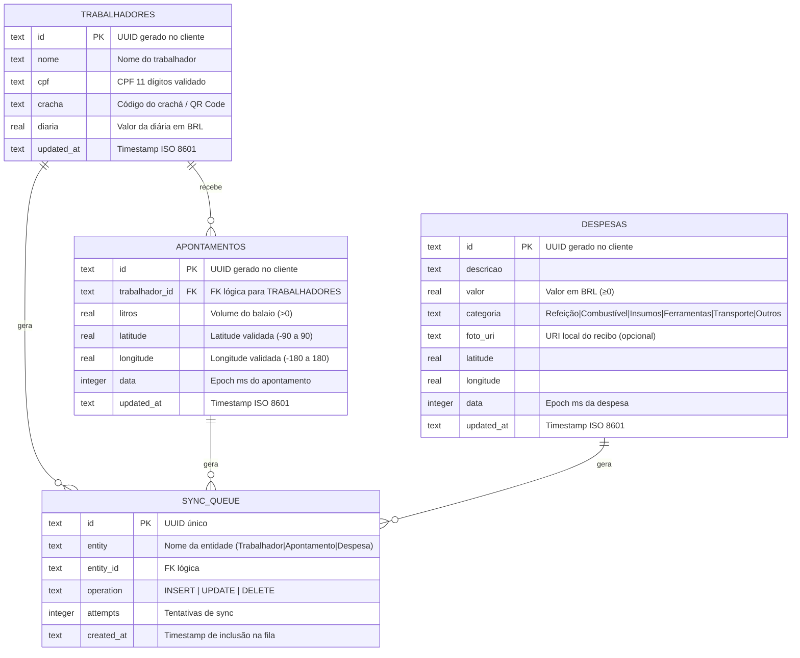
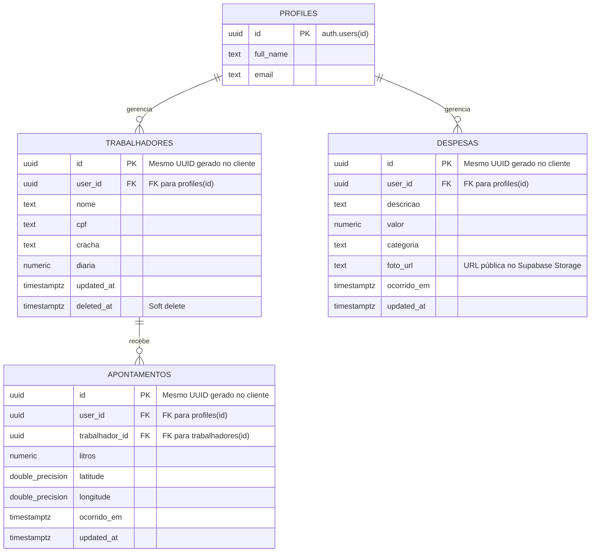
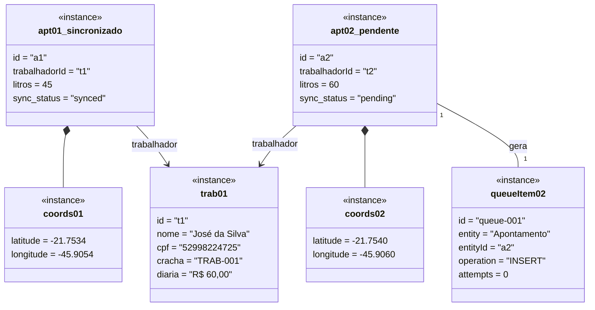
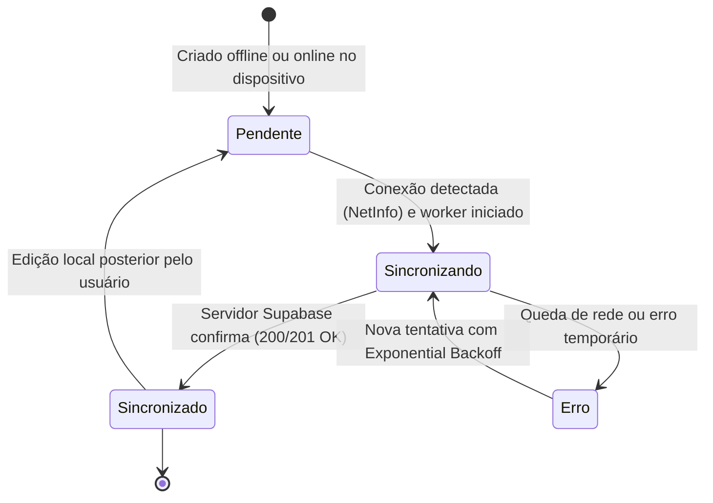
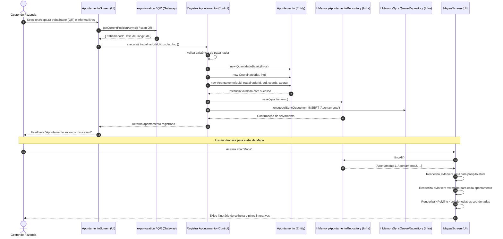
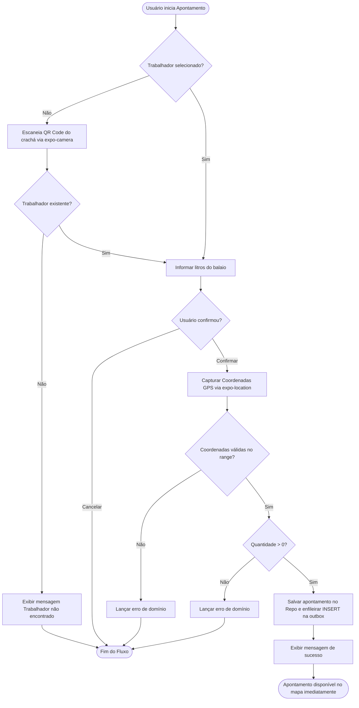

# Documento de Engenharia e Especificação de Software Mobile
## SafraCafé — Gestão Operacional e Financeira da Colheita Cafeeira (Offline-First) — Expo & React Native

> **Status do Documento:** Aprovado / Baseline de Arquitetura (atualizado: +Autenticação & Sessão +Sincronização Offline-First +Domínio SafraCafé implementados)
> **Versão:** 1.2.0
> **Padrão Metodológico:** SDD (Spec Driven Development), DDD (Domain-Driven Design), Clean Architecture & TDD
> **Alinhamento Curricular:** Ementa de Desenvolvimento Mobile (07/ago a 11/set) — QR Code, GPS/Mapas, Câmera, Autenticação, Sync

---

## Sumário Executivo e Stack de Referência

O aplicativo mobile é projetado com arquitetura **Offline-First** para gerenciar a **colheita cafeeira**:
cadastro de trabalhadores (com QR Code no crachá), apontamento diário de balaios (litros) georreferenciado,
registro de despesas com foto do recibo, visualização da lavoura em mapa com rotas (`Polyline`/`MapViewDirections`)
e sincronização assíncrona com o backend na nuvem.

| Camada / Função | Escolha Default (Adotada) | Alternativa Avaliada | Finalidade / Justificativa |
| :--- | :--- | :--- | :--- |
| **Framework Mobile** | **Expo SDK 54** + React Native 0.81 | Bare React Native | Managed workflow com compilação e acesso modular a hardware. |
| **Roteamento & Telas** | **Expo Router v6** | React Navigation puro | Roteamento baseado em arquivos com Stacks, Drawer e Bottom Tabs aninhadas. |
| **Linguagem** | **TypeScript 5.9** | JavaScript ES6+ | Tipagem estática estrita em todas as camadas de domínio e aplicação. |
| **Persistência Local** | **InMemory / SQLite** via `expo-sqlite` (Drizzle ORM) | WatermelonDB | Persistência local imediata (*outbox* pattern) com tolerância a modo avião. |
| **BaaS / Nuvem** | **Supabase** (Postgres, Auth, Storage, Realtime) | Firebase | Banco relacional com Row Level Security (RLS), Auth e bucket de fotos. |
| **Câmera & Mídia** | `expo-camera` + `expo-image-picker` | — | Captura de fotos, preview e scanner de QR Code do crachá. |
| **Geolocalização & Mapas** | `expo-location` + `react-native-maps` (+ `react-native-maps-directions`, `react-native-google-places-autocomplete`) | Mapbox | Coordenadas GPS, `Marker`s, `Polyline`, rota viária e busca de destino. |
| **Segurança & Sessão** | `expo-secure-store` | AsyncStorage | Armazenamento cifrado de tokens JWT de sessão de usuário. |
| **Testes Unitários** | **Jest 29** + `@testing-library/react-native` | Detox / Maestro | TDD para Value Objects, Entidades e Use Cases com repositórios fakes. |

---

## 1. Levantamento de Requisitos

### 1.1 Requisitos Funcionais (RF)

| ID | Descrição | Prioridade | Ator Principal |
| :--- | :--- | :---: | :--- |
| **RF01** | O app deve permitir que o usuário realize cadastro (Sign Up) com e-mail e senha. | Média | Visitante |
| **RF02** | O app deve permitir login (Sign In) e encerramento de sessão (Sign Out). | Alta | Usuário Autenticado |
| **RF03** | O app deve cadastrar trabalhadores da colheita (nome, CPF válido de 11 dígitos, código do crachá e diária em reais). | Alta | Gestor de Fazenda |
| **RF04** | O app deve ler o QR Code do crachá do trabalhador via câmera para agilizar o apontamento. | Média | Usuário / Câmera |
| **RF05** | O app deve registrar apontamentos de colheita (litros do balaio) georreferenciados via GPS, vinculados a um trabalhador existente. | Alta | Usuário / GPS |
| **RF06** | O app deve validar a quantidade de balaio (maior que zero), as coordenadas (lat -90..90, lng -180..180) e a data do apontamento. | Alta | Sistema |
| **RF07** | O app deve registrar despesas da operação (descrição, valor, categoria) com foto do recibo (ou sem foto) e geolocalização. | Alta | Usuário |
| **RF08** | O app deve listar todos os trabalhadores cadastrados e suas diárias. | Alta | Gestor de Fazenda |
| **RF09** | O app deve listar todas as despesas registradas com categoria e valor. | Alta | Usuário |
| **RF10** | O app deve exibir um mapa interativo com marcadores (`Marker` + `Callout`) para a posição atual e cada apontamento. | Alta | Usuário |
| **RF11** | O app deve desenhar a rota (`Polyline`/`MapViewDirections`) conectando os apontamentos e até o destino buscado. | Alta | Usuário |
| **RF12** | O app deve permitir busca de locais com sugestão em tempo real (`GooglePlacesAutocomplete`). | Média | Usuário |
| **RF13** | O app deve funcionar 100% offline, salvando registros na fila local sem exigir rede ativa. | Alta | Usuário |
| **RF14** | O app deve sincronizar automaticamente a fila de registros com o Supabase quando houver conexão. | Alta | Sistema Sync |
| **RF15** | O app deve enfileirar cada cadastro/apontamento/despesa na outbox de sincronização (INSERT). | Alta | Sistema |
| **RF16** | O app deve resolver conflitos de sincronização (Last-Write-Wins). | Média | Sistema Sync |

### 1.2 Requisitos Não Funcionais (RNF)

| ID | Categoria | Descrição e Critério Mensurável | Prioridade |
| :--- | :--- | :--- | :---: |
| **RNF01** | **Offline-First** | Todas as ações de captura, registro, listagem e mapa devem funcionar com o dispositivo em Modo Avião. | Alta |
| **RNF02** | **Permissões** | Permissões de Câmera, Galeria e Localização devem ser solicitadas contextualizadas na tela de uso, com fallback visual caso negadas. | Alta |
| **RNF03** | **Bateria e Dados** | A captura de localização deve ser pontual por demanda de registro (não polling contínuo desnecessário), poupando bateria. | Média |
| **RNF04** | **Armazenamento** | As fotos locais (recibos) devem ser gerenciadas em diretório temporário/armazenamento do app até upload confirmado para a nuvem. | Média |
| **RNF05** | **Sincronização** | A sincronização deve usar fila outbox com retentativa (*exponential backoff*) e resolução de conflito *Last-Write-Wins* via `updated_at`. | Alta |
| **RNF06** | **Segurança** | Tokens de autenticação de sessão devem ser armazenados exclusivamente em `expo-secure-store`, nunca em texto plano. | Alta |
| **RNF07** | **Qualidade / TDD** | Todos os Value Objects, Entidades e Casos de Uso devem possuir cobertura de testes unitários isolados com Jest. | Alta |

---

## 2. Diagrama e Catálogo de Casos de Uso

### 2.1 Atores do Sistema
- **Visitante**: Usuário que acessa o app antes de autenticar.
- **Gestor de Fazenda**: Agente de campo autenticado (herda de Visitante) que administra trabalhadores, apontamentos e despesas da colheita.
- **Hardware do Dispositivo (Câmera / GPS)**: Sensores nativos do smartphone.
- **Sistema de Sincronização (Sync Engine)**: Worker em background que monitora conectividade de rede (`NetInfo`).
- **Supabase (BaaS)**: Backend as a Service gerenciado com Postgres, Storage e Auth.

### 2.2 Diagrama de Casos de Uso (Mermaid)

```mermaid
flowchart LR
    subgraph Atores
        Visitante((Visitante))
        Gestor((Gestor de Fazenda))
        SyncWorker((Sistema de Sincronização))
        Gestor --|> Visitante
    end

    subgraph Modulo_Autenticacao["Autenticação & Sessão"]
        UC01[UC01: Fazer Cadastro]
        UC02[UC02: Fazer Login]
        UC03[UC03: Fazer Logout]
        UC04[UC04: Recuperar Sessão Ativa]
    end

    subgraph Modulo_Hardware["Hardware & Sensores"]
        UC05[UC05: Solicitar Permissões Nativas]
        UC08[UC08: Escanear QR Code do Crachá]
        UC09[UC09: Obter Geolocalização GPS]
        UC10[UC10: Capturar Foto do Recibo]
    end

    subgraph Modulo_Gestao["Gestão da Colheita"]
        UC11[UC11: Cadastrar Trabalhador]
        UC12[UC12: Listar Trabalhadores]
        UC13[UC13: Registrar Apontamento de Balaio]
        UC14[UC14: Registrar Despesa]
        UC15[UC15: Listar Despesas]
        UC16[UC16: Visualizar Mapa com Markers, Polyline e Rota]
        UC19[UC19: Buscar Local via Autocomplete]
    end

    subgraph Modulo_Sync["Sincronização Offline-First"]
        UC17[UC17: Enfileirar na Outbox Local]
        UC18[UC18: Sincronizar Fila Pendente]
        UC20[UC20: Fazer Upload de Mídia no Storage]
        UC21[UC21: Resolver Conflitos de Dados]
    end

    Visitante --> UC01
    Visitante --> UC02
    Gestor --> UC03
    Gestor --> UC04
    Gestor --> UC11
    Gestor --> UC12
    Gestor --> UC13
    Gestor --> UC14
    Gestor --> UC15
    Gestor --> UC16
    Gestor --> UC19

    UC11 -. <<include>> .-> UC17
    UC13 -. <<include>> .-> UC09
    UC13 -. <<include>> .-> UC17
    UC13 -. <<extend>> .-> UC08
    UC14 -. <<extend>> .-> UC10
    UC14 -. <<include>> .-> UC17
    UC05 -. <<include>> .-> UC09
    UC05 -. <<include>> .-> UC08

    SyncWorker --> UC18
    UC18 -. <<include>> .-> UC20
    UC18 -. <<include>> .-> UC21
```

### 2.3 Especificação Textual dos Casos de Uso Principais

#### UC13 — Registrar Apontamento de Balaio
- **Ator Principal:** Gestor de Fazenda
- **Pré-condições:** Está autenticado na tela de apontamento (`app/(drawer)/(tabs)/index.tsx`); existe pelo menos um trabalhador cadastrado.
- **Fluxo Principal:**
  1. O usuário seleciona o trabalhador (chips de lista ou leitura do QR Code do crachá via `expo-camera`).
  2. O sistema informa a quantidade de litros do balaio.
  3. O sistema obtém as coordenadas via `expo-location`.
  4. O caso de uso `RegistrarApontamento` instancia `QuantidadeBalaio` (litros > 0) e `Coordinates` (valida limites).
  5. O caso de uso valida a existência do trabalhador (lança "Trabalhador não encontrado" se ausente).
  6. A entidade `Apontamento` é criada com UUID gerado no cliente e a data atual.
  7. O repositório salva o apontamento localmente no repositório Singleton e enfileira um `INSERT` na outbox.
  8. O sistema notifica o usuário de sucesso e restaura o formulário.
- **Fluxos Alternativos:**
  - *Fluxo offline:* O salvamento local e o enfileiramento ocorrem normalmente; o apontamento fica disponível no mapa imediatamente.
  - *Trabalhador inexistente / quantidade inválida:* O sistema exibe mensagem de erro e não persiste nada.
- **Pós-condições:** Apontamento armazenado, enfileirado para sync e disponível para plotagem no mapa.

#### UC11 — Cadastrar Trabalhador da Colheita
- **Ator Principal:** Gestor de Fazenda
- **Pré-condições:** Autenticado (tela `app/(drawer)/(tabs)/trabalhadores.tsx`).
- **Fluxo Principal:**
  1. O usuário abre o modal de cadastro e informa nome, CPF, código do crachá e diária.
  2. O caso de uso `CadastrarTrabalhador` valida a entidade (`Trabalhador`: id, nome, CPF `^\d{11}$`, crachá e diária `ValorMonetario` ≥ 0).
  3. O repositório salva o trabalhador e enfileira um `INSERT` na outbox.
  4. A lista da tela é recarregada exibindo o novo trabalhador.
- **Fluxo Alternativo:** *CPF inválido* — o sistema lança erro e não altera repositório nem fila.
- **Pós-condições:** Trabalhador disponível para seleção/apontamento e sincronização.

#### UC14 — Registrar Despesa da Operação
- **Ator Principal:** Gestor de Fazenda
- **Pré-condições:** Autenticado (tela `app/(drawer)/(tabs)/despesas.tsx`).
- **Fluxo Principal:**
  1. O usuário informa descrição, valor, categoria (Refeição | Combustível | Insumos | Ferramentas | Transporte | Outros).
  2. Opcionalmente captura foto do recibo (`expo-image-picker`) e o sistema obtém a localização atual.
  3. O caso de uso `RegistrarDespesa` valida `Despesa` (descrição, `ValorMonetario`, categoria, `fotoUri` com `://` se informada, data).
  4. Salva no repositório e enfileira um `INSERT` na outbox.
- **Fluxo Alternativo:** *Valor inválido* — erro de domínio, nada é salvo nem enfileirado.
- **Pós-condições:** Despesa listada e pronta para sincronização.

#### UC16 — Visualizar Mapa de Apontamentos
- **Ator Principal:** Gestor de Fazenda
- **Pré-condições:** Permissão de localização concedida; apontamentos registrados.
- **Fluxo Principal:**
  1. O usuário clica na aba "Mapa" (`app/(drawer)/(tabs)/mapas.tsx`).
  2. O sistema executa `container.listarApontamentos.execute()` recarregando os apontamentos.
  3. Renderiza marcador azul da posição atual e `<Marker>` + `<Callout>` para cada apontamento (litros e trabalhador).
  4. Desenha `<Polyline>` ligando os pontos e, com destino buscado, traça a rota com `MapViewDirections`.
- **Pós-condições:** Lavoura exibida visualmente com o itinerário de colheita.

---

## 3. Diagrama de Classes

```mermaid
classDiagram
    class Coordinates {
        +number latitude
        +number longitude
        -validate() void
    }

    class QuantidadeBalaio {
        +number litros
        -validate() void
    }

    class ValorMonetario {
        +number valor
        +formatar() string
        -validate() void
    }

    class Trabalhador {
        +string id
        +string nome
        +string cpf
        +string cracha
        +ValorMonetario diaria
        -validate() void
    }

    class Apontamento {
        +string id
        +string trabalhadorId
        +QuantidadeBalaio quantidade
        +Coordinates coordenadas
        +number data
        -validate() void
    }

    class Despesa {
        +string id
        +string descricao
        +ValorMonetario valor
        +string categoria
        +Coordinates coordenadas
        +string fotoUri
        +number data
        -validate() void
    }

    class SyncStatus {
        <<enumeration>>
        PENDING
        SYNCING
        SYNCED
        ERROR
    }

    class SyncQueueItem {
        +string id
        +string entity
        +string entityId
        +string operation
        +number attempts
        +SyncStatus status
        +DateTime createdAt
        +DateTime updatedAt
        +registrarTentativa() void
        +marcarSincronizado() void
        +marcarErro() void
    }

    class User {
        +string id
        +string name
        +string email
        -validate() void
    }

    class Session {
        +string token
        +User user
        +number expiresAt
        +boolean isValid(number agora)
    }

    class SincronizacaoService {
        +string resolverConflito(number local, number remoto)
    }

    class TrabalhadorRepository {
        <<interface>>
        +save(Trabalhador t) Promise~void~
        +findById(string id) Promise~Trabalhador~
        +findByCracha(string codigo) Promise~Trabalhador~
        +findAll() Promise~Trabalhador[]~
    }

    class ApontamentoRepository {
        <<interface>>
        +save(Apontamento a) Promise~void~
        +findById(string id) Promise~Apontamento~
        +findByTrabalhadorId(string id) Promise~Apontamento[]~
        +findAll() Promise~Apontamento[]~
    }

    class DespesaRepository {
        <<interface>>
        +save(Despesa d) Promise~void~
        +findById(string id) Promise~Despesa~
        +findAll() Promise~Despesa[]~
    }

    class SyncQueueRepository {
        <<interface>>
        +enqueue(SyncQueueItem item) Promise~void~
        +save(SyncQueueItem item) Promise~void~
        +remove(string id) Promise~void~
        +findById(string id) Promise~SyncQueueItem~
        +findPending() Promise~SyncQueueItem[]~
        +findAll() Promise~SyncQueueItem[]~
    }

    class AuthGateway {
        <<interface>>
        +signIn(CredenciaisAuth credenciais) Promise~Session~
        +signUp(CredenciaisAuth credenciais) Promise~Session~
        +signOut() Promise~void~
    }

    class SessionStorage {
        <<interface>>
        +salvar(Session sessao) Promise~void~
        +carregar() Promise~Session~
        +limpar() Promise~void~
    }

    class NetworkGateway {
        <<interface>>
        +isConnected() Promise~boolean~
    }

    class SyncGateway {
        <<interface>>
        +push(SyncQueueItem item) Promise~SyncResultadoGateway~
    }

    class InMemoryTrabalhadorRepository {
        -Trabalhador[] trabalhadores
        -static InMemoryTrabalhadorRepository instance
        -constructor()
        +static getInstance() InMemoryTrabalhadorRepository
        +save(Trabalhador t) Promise~void~
        +findById(string id) Promise~Trabalhador~
        +findByCracha(string codigo) Promise~Trabalhador~
        +findAll() Promise~Trabalhador[]
    }

    class InMemoryApontamentoRepository {
        -Apontamento[] apontamentos
        -static InMemoryApontamentoRepository instance
        -constructor()
        +static getInstance() InMemoryApontamentoRepository
    }

    class InMemoryDespesaRepository {
        -Despesa[] despesas
        -static InMemoryDespesaRepository instance
        -constructor()
        +static getInstance() InMemoryDespesaRepository
    }

    class InMemorySyncQueueRepository {
        -SyncQueueItem[] items
        -static InMemorySyncQueueRepository instance
        -constructor()
        +static getInstance() InMemorySyncQueueRepository
    }

    class InMemoryAuthGateway {
        -static InMemoryAuthGateway instance
        -constructor()
        +static getInstance() InMemoryAuthGateway
    }

    class InMemoryNetworkGateway {
        -boolean connected
        -static InMemoryNetworkGateway instance
        -constructor()
        +static getInstance() InMemoryNetworkGateway
        +setConnected(boolean value) void
    }

    class InMemorySyncGateway {
        -static InMemorySyncGateway instance
        -constructor()
        +static getInstance() InMemorySyncGateway
    }

    class SessionStorageSecureStore {
        -static SessionStorageSecureStore instance
        -constructor()
        +static getInstance() SessionStorageSecureStore
    }

    Trabalhador *-- ValorMonetario : possui diária
    Apontamento *-- QuantidadeBalaio
    Apontamento *-- Coordinates
    Apontamento --> Trabalhador : agrega por trabalhadorId
    Despesa *-- ValorMonetario
    Despesa *-- Coordinates
    SyncQueueItem --> SyncStatus
    SyncQueueItem o-- Apontamento : referencia
    SyncQueueItem o-- Trabalhador : referencia
    SyncQueueItem o-- Despesa : referencia
    Session *-- User : possui
    InMemoryTrabalhadorRepository ..|> TrabalhadorRepository : implementa
    InMemoryApontamentoRepository ..|> ApontamentoRepository : implementa
    InMemoryDespesaRepository ..|> DespesaRepository : implementa
    InMemorySyncQueueRepository ..|> SyncQueueRepository : implementa
    InMemoryAuthGateway ..|> AuthGateway : implementa
    InMemoryNetworkGateway ..|> NetworkGateway : implementa
    InMemorySyncGateway ..|> SyncGateway : implementa
    SessionStorageSecureStore ..|> SessionStorage : implementa
    InMemoryTrabalhadorRepository o-- Trabalhador : armazena
    InMemoryApontamentoRepository o-- Apontamento : armazena
    InMemoryDespesaRepository o-- Despesa : armazena
```



### 3.1 Diagramas Entidade-Relacionamento (DER Local e Remoto)

#### DER Local (SQLite via Drizzle / Cache Local)


#### DER Remoto (Supabase / Postgres com RLS)


> **Políticas de Row Level Security (RLS):**
> - `SELECT / INSERT / UPDATE`: Garantidas por `auth.uid() = user_id` em todas as tabelas.

**Persistência da Sessão:** A sessão do usuário (`Session` — token, usuário, `expiresAt`) **não** é
persistida em SQLite: é armazenada exclusivamente no *Keychain/Keystore* do dispositivo via
`expo-secure-store` (adapter `SessionStorageSecureStore`, chave `safracafe.session`), atendendo ao
requisito RNF06 (tokens cifrados, nunca em texto plano).

---

## 4. Diagrama de Objetos (Validação de Cenário de Estado Misto)

Este diagrama representa um instantâneo real de dados em memória, validando que o sistema tolera de forma resiliente um estado misto (onde um apontamento já foi sincronizado com a nuvem enquanto outro foi recém-criado offline e permanece pendente):



---

## 5. Diagrama de Estados do Ciclo de Sincronização



---

## 6. Classes de Fronteira, Controle e Entidade (BCE)

| Caso de Uso | Boundary de UI (Telas) | Boundary de Hardware / Gateway | Control (Casos de Uso) | Entidades Envolvidas |
| :--- | :--- | :--- | :--- | :--- |
| **Cadastrar Trabalhador** | `TrabalhadoresScreen` (`app/(drawer)/(tabs)/trabalhadores.tsx`) | `AuthGateway` (sessão) | `CadastrarTrabalhador` | `Trabalhador`, `ValorMonetario` |
| **Listar Trabalhadores** | `TrabalhadoresScreen` | N/A (repositório local) | `ListarTrabalhadores` | `Trabalhador` |
| **Registrar Apontamento** | `ApontamentoScreen` (`app/(drawer)/(tabs)/index.tsx`) | `CameraGateway` (QR), `LocationGateway` | `RegistrarApontamento` | `Apontamento`, `QuantidadeBalaio`, `Coordinates`, `Trabalhador` |
| **Registrar Despesa** | `DespesasScreen` (`app/(drawer)/(tabs)/despesas.tsx`) | `ImagePickerGateway`, `LocationGateway` | `RegistrarDespesa` | `Despesa`, `ValorMonetario`, `Coordinates` |
| **Listar Despesas** | `DespesasScreen` | N/A (repositório local) | `ListarDespesas` | `Despesa` |
| **Visualizar no Mapa** | `MapasScreen` (`app/(drawer)/(tabs)/mapas.tsx`) | `LocationGateway`, `MapView`, `MapViewDirections`, `GooglePlacesAutocomplete` | `ListarApontamentos` | `Apontamento`, `Coordinates` |
| **Login** | `LoginScreen` (`app/index.tsx`) | `AuthGateway` (conta demo in-memory), `SessionStorageSecureStore` | `AuthenticateUser` | `User`, `Session` |
| **Restaurar Sessão** | `AuthProvider` (`app/_layout.tsx`) | `SessionStorageSecureStore` | `RestoreSession` | `Session` |
| **Logout** | `LoginScreen` / menu do drawer | `AuthGateway`, `SessionStorageSecureStore` | `SignOut` | `Session` |
| **Sincronizar Fila** | Indicador de status na UI | `SyncGateway` (in-memory), `NetworkGateway` (in-memory) | `SyncPendingQueue` | `SyncQueueItem`, `Trabalhador`, `Apontamento`, `Despesa` |

---

## 7. Diagrama de Sequência: Registro de Apontamento e Visualização no Mapa



---

## 8. Diagrama de Atividades: Fluxo de Apontamento com Permissões (QR/Localização)



---

## 9. Diagrama de Componentes (Clean Architecture)

```mermaid
flowchart TB
    subgraph UI_Layer["Camada de Apresentação (Interface Adapters - Entrada)"]
        LoginScreen["Login Screen (app/index.tsx)"]
        ApontamentoScreen["Apontamento Screen (app/(drawer)/(tabs)/index.tsx)"]
        TrabalhadoresScreen["Trabalhadores Screen (app/(drawer)/(tabs)/trabalhadores.tsx)"]
        DespesasScreen["Despesas Screen (app/(drawer)/(tabs)/despesas.tsx)"]
        MapasScreen["Mapas Screen (app/(drawer)/(tabs)/mapas.tsx)"]
        AuthCtx["AuthContext / useAuth (Provider)"]
    end

    subgraph Application_Layer["Camada de Aplicação (Use Cases)"]
        CadTrabUC["CadastrarTrabalhador"]
        LisTrabUC["ListarTrabalhadores"]
        RegAptUC["RegistrarApontamento"]
        LisAptUC["ListarApontamentos"]
        RegDespUC["RegistrarDespesa"]
        LisDespUC["ListarDespesas"]
        AuthUC["AuthenticateUser"]
        SignOutUC["SignOut"]
        RestoreUC["RestoreSession"]
        SyncUC["SyncPendingQueue"]
    end

    subgraph Domain_Layer["Camada de Domínio (Pure TypeScript)"]
        TrabEntity["Trabalhador (Entidade)"]
        AptEntity["Apontamento (Entidade)"]
        DespEntity["Despesa (Entidade)"]
        CoordsVO["Coordinates (Value Object)"]
        BalaioVO["QuantidadeBalaio (Value Object)"]
        ValorVO["ValorMonetario (Value Object)"]
        SyncStatusVO["SyncStatus (Value Object)"]
        QueueItemEntity["SyncQueueItem (Entidade)"]
        UserEntity["User (Entidade)"]
        SessionEntity["Session (Entidade)"]
        ConflitoSvc["SincronizacaoService (Serviço)"]
        RepoTrabInterface[["TrabalhadorRepository (Interface)"]]
        RepoAptInterface[["ApontamentoRepository (Interface)"]]
        RepoDespInterface[["DespesaRepository (Interface)"]]
        QueueRepoInterface[["SyncQueueRepository (Interface)"]]
        AuthGwInterface[["AuthGateway (Interface)"]]
        SessionStInterface[["SessionStorage (Interface)"]]
        NetGwInterface[["NetworkGateway (Interface)"]]
        SyncGwInterface[["SyncGateway (Interface)"]]
    end

    subgraph Factory_Layer["Container / Injeção de Dependência"]
        DIContainer["Container (Singleton Factory)"]
    end

    subgraph Infra_Layer["Camada de Infraestrutura (Drivers & Adapters)"]
        InMemoryTrabalhador["InMemoryTrabalhadorRepository (Singleton)"]
        InMemoryApt["InMemoryApontamentoRepository (Singleton)"]
        InMemoryDesp["InMemoryDespesaRepository (Singleton)"]
        InMemoryQueue["InMemorySyncQueueRepository (Singleton)"]
        InMemoryAuth["InMemoryAuthGateway (Singleton)"]
        InMemoryNet["InMemoryNetworkGateway (Singleton)"]
        InMemorySync["InMemorySyncGateway (Singleton)"]
        SecureStore["SessionStorageSecureStore (expo-secure-store)"]
        ExpoSensors["Expo Camera, ImagePicker & Location Drivers"]
        NativeMaps["react-native-maps + directions + places"]
    end

    LoginScreen --> AuthCtx
    AuthCtx --> DIContainer
    ApontamentoScreen --> DIContainer
    TrabalhadoresScreen --> DIContainer
    DespesasScreen --> DIContainer
    MapasScreen --> DIContainer

    DIContainer --> CadTrabUC
    DIContainer --> LisTrabUC
    DIContainer --> RegAptUC
    DIContainer --> LisAptUC
    DIContainer --> RegDespUC
    DIContainer --> LisDespUC
    DIContainer --> AuthUC
    DIContainer --> SignOutUC
    DIContainer --> RestoreUC
    DIContainer --> SyncUC
    DIContainer --> InMemoryTrabalhador
    DIContainer --> InMemoryApt
    DIContainer --> InMemoryDesp
    DIContainer --> InMemoryQueue
    DIContainer --> InMemoryAuth

    CadTrabUC --> RepoTrabInterface
    CadTrabUC --> QueueRepoInterface
    CadTrabUC --> TrabEntity
    RegAptUC --> RepoAptInterface
    RegAptUC --> RepoTrabInterface
    RegAptUC --> QueueRepoInterface
    RegAptUC --> AptEntity
    RegAptUC --> CoordsVO
    RegAptUC --> BalaioVO
    RegDespUC --> RepoDespInterface
    RegDespUC --> QueueRepoInterface
    RegDespUC --> DespEntity
    RegDespUC --> ValorVO
    LisTrabUC --> RepoTrabInterface
    LisAptUC --> RepoAptInterface
    LisDespUC --> RepoDespInterface
    AuthUC --> AuthGwInterface
    AuthUC --> SessionStInterface
    AuthUC --> UserEntity
    AuthUC --> SessionEntity
    RestoreUC --> SessionStInterface
    SignOutUC --> AuthGwInterface
    SignOutUC --> SessionStInterface
    SyncUC --> QueueRepoInterface
    SyncUC --> NetGwInterface
    SyncUC --> SyncGwInterface
    SyncUC --> ConflitoSvc
    SyncUC --> SyncStatusVO
    SyncUC --> QueueItemEntity

    InMemoryTrabalhador ..|> RepoTrabInterface
    InMemoryApt ..|> RepoAptInterface
    InMemoryDesp ..|> RepoDespInterface
    InMemoryQueue ..|> QueueRepoInterface
    InMemoryAuth ..|> AuthGwInterface
    InMemoryNet ..|> NetGwInterface
    InMemorySync ..|> SyncGwInterface
    SecureStore ..|> SessionStInterface
    InMemoryTrabalhador --> TrabEntity
    InMemoryApt --> AptEntity
    InMemoryDesp --> DespEntity
    InMemoryAuth --> UserEntity
    InMemoryAuth --> SessionEntity

    ApontamentoScreen --> ExpoSensors
    DespesasScreen --> ExpoSensors
    MapasScreen --> NativeMaps
```

---

## 10. Implementação: DDD, Clean Architecture e TDD

### 10.1 Padrões Obrigatórios Implementados no Projeto
1. **Regra da Direção das Dependências:** O diretório `domain/` é independente e não importa nada de `infra/`, `usecases/` ou bibliotecas de terceiros (`expo-*`, `react-native`).
2. **Injeção de Dependência (DI):** Todo caso de uso recebe seus repositórios/gateways por parâmetro no construtor. Ex.: `RegistrarApontamento(apontamentoRepository, trabalhadorRepository, syncQueueRepository)`, `AuthenticateUser(authGateway, sessionStorage)`, `SyncPendingQueue(syncQueueRepository, networkGateway, syncGateway)`.
3. **Padrão Singleton:** Todas as implementações concretas da infraestrutura (`InMemoryTrabalhadorRepository`, `InMemoryApontamentoRepository`, `InMemoryDespesaRepository`, `InMemorySyncQueueRepository`, `InMemoryAuthGateway`, `InMemoryNetworkGateway`, `InMemorySyncGateway`, `SessionStorageSecureStore`) e a fábrica (`src/factory/container.ts`) implementam o padrão Singleton com:
   - `private constructor()`
   - `private static instance`
   - `public static getInstance()`
4. **Auto-Validação:** Value Objects e Entidades se autovalidam no construtor e em métodos de modificação de estado (`registrarTentativa`, `marcarSincronizado`, `marcarErro`, `update*`), impedindo estados inconsistentes no sistema.

### 10.2 Matriz de Testes TDD Executada e Aprovada

> **Total:** 23 suítes / 85 testes, executando em `npx jest --ci` (verde), `npx tsc --noEmit` (limpo) e `npx expo lint` (sem avisos).

#### Camada de Domínio (sem mocks)
| Arquivo de Teste | Alvo | Cenários Cobertos | Status |
| :--- | :--- | :--- | :---: |
| [`Coordinates.test.ts`](file:///c:/PROJETOMOBILE/tests/domain/Coordinates.test.ts) | VO | Criação lat/lng válidas; rejeição lat fora de [-90,90]; rejeição lng fora de [-180,180]. | ✅ Aprovado |
| [`QuantidadeBalaio.test.ts`](file:///c:/PROJETOMOBILE/tests/domain/QuantidadeBalaio.test.ts) | VO | Criação com litros positivos; rejeição de zero/negativo/Não-numérico. | ✅ Aprovado |
| [`ValorMonetario.test.ts`](file:///c:/PROJETOMOBILE/tests/domain/ValorMonetario.test.ts) | VO | Criação válida/zero; rejeição de negativo; `formatar()` pt-BR (R$). | ✅ Aprovado |
| [`Trabalhador.test.ts`](file:///c:/PROJETOMOBILE/tests/domain/Trabalhador.test.ts) | Entidade | Criação válida; rejeição de id/nome/crachá vazios e CPF inválido. | ✅ Aprovado |
| [`Apontamento.test.ts`](file:///c:/PROJETOMOBILE/tests/domain/Apontamento.test.ts) | Entidade | Criação válida com quantidade/coordenadas/data; rejeição de campos inválidos. | ✅ Aprovado |
| [`Despesa.test.ts`](file:///c:/PROJETOMOBILE/tests/domain/Despesa.test.ts) | Entidade | Criação com/sem foto; rejeição de descrição/categoria/foto sem `://`/data inválidas. | ✅ Aprovado |
| [`SyncStatus.test.ts`](file:///c:/PROJETOMOBILE/tests/domain/SyncStatus.test.ts) | VO | `deValor` para estados válidos; rejeição de estado desconhecido. | ✅ Aprovado |
| [`SyncQueueItem.test.ts`](file:///c:/PROJETOMOBILE/tests/domain/SyncQueueItem.test.ts) | Entidade | Criação com op INSERT; incremento de `attempts`; transição para SYNCED; falha em operação inválida. | ✅ Aprovado |
| [`Session.test.ts`](file:///c:/PROJETOMOBILE/tests/domain/Session.test.ts) | Entidade | `Session` válida/`isValid`; expiração; entidade `User` (e-mail/nome/id inválidos). | ✅ Aprovado |
| [`SincronizacaoService.test.ts`](file:///c:/PROJETOMOBILE/tests/domain/SincronizacaoService.test.ts) | Serviço | Resolução last-write-wins para `'local'`, `'remoto'` e empate. | ✅ Aprovado |

#### Camada de Aplicação (use cases com fakes in-memory)
| Arquivo de Teste | Alvo | Cenários Cobertos | Status |
| :--- | :--- | :--- | :---: |
| [`CadastrarTrabalhador.test.ts`](file:///c:/PROJETOMOBILE/tests/usecases/CadastrarTrabalhador.test.ts) | Use case | Salva e enfileira INSERT 'Trabalhador'; CPF inválido não altera repositório nem fila. | ✅ Aprovado |
| [`ListarTrabalhadores.test.ts`](file:///c:/PROJETOMOBILE/tests/usecases/ListarTrabalhadores.test.ts) | Use case | Lista completa; lista vazia. | ✅ Aprovado |
| [`RegistrarApontamento.test.ts`](file:///c:/PROJETOMOBILE/tests/usecases/RegistrarApontamento.test.ts) | Use case | Salva e enfileira INSERT 'Apontamento'; trabalhador inexistente rejeitado; litros inválidos não enfileiram. | ✅ Aprovado |
| [`ListarApontamentos.test.ts`](file:///c:/PROJETOMOBILE/tests/usecases/ListarApontamentos.test.ts) | Use case | Lista completa; filtro por trabalhador. | ✅ Aprovado |
| [`RegistrarDespesa.test.ts`](file:///c:/PROJETOMOBILE/tests/usecases/RegistrarDespesa.test.ts) | Use case | Salva e enfileira com/sem foto de recibo; valor inválido não enfileira. | ✅ Aprovado |
| [`ListarDespesas.test.ts`](file:///c:/PROJETOMOBILE/tests/usecases/ListarDespesas.test.ts) | Use case | Lista completa; lista vazia. | ✅ Aprovado |
| [`AuthenticateUser.test.ts`](file:///c:/PROJETOMOBILE/tests/usecases/AuthenticateUser.test.ts) | Use case | Login com credenciais válidas salva sessão; rejeição de credenciais inválidas. | ✅ Aprovado |
| [`RestoreSession.test.ts`](file:///c:/PROJETOMOBILE/tests/usecases/RestoreSession.test.ts) | Use case | Restaura sessão válida; retorna `null` sem sessão/vencida. | ✅ Aprovado |
| [`SignOut.test.ts`](file:///c:/PROJETOMOBILE/tests/usecases/SignOut.test.ts) | Use case | Encerra sessão e limpa storage. | ✅ Aprovado |
| [`SyncPendingQueue.test.ts`](file:///c:/PROJETOMOBILE/tests/usecases/SyncPendingQueue.test.ts) | Use case | Sincroniza fila com rede; mantém pendentes offline; não trava sem rede. | ✅ Aprovado |

#### Camada de Adapters e Telas (mocks + RNTL)
| Arquivo de Teste | Alvo | Cenários Cobertos | Status |
| :--- | :--- | :--- | :---: |
| [`SessionStorageSecureStore.test.ts`](file:///c:/PROJETOMOBILE/tests/adapters/SessionStorageSecureStore.test.ts) | Adapter | `salvar`/`carregar` serializa JSON no SecureStore; `limpar` remove a chave. | ✅ Aprovado |
| [`AuthContext.test.tsx`](file:///c:/PROJETOMOBILE/tests/adapters/AuthContext.test.tsx) | Adapter/React | Restaura sessão no boot; estado `unauthenticated`; login autentica e persiste; logout limpa. | ✅ Aprovado |
| [`LoginScreen.test.tsx`](file:///c:/PROJETOMOBILE/tests/screens/LoginScreen.test.tsx) | Tela | Login válido navega para o painel; credenciais inválidas disparam `Alert`; campos vazios não navegam. | ✅ Aprovado |

### 10.3 Rastreabilidade RF → Caso de Uso → Teste

| Requisito | Caso de Uso | Teste de Referência | Status |
| :--- | :--- | :--- | :---: |
| RF01 (cadastro) | UC01 — *planejado* (gateway `signUp` no contrato) | — | ⏳ Próximo módulo |
| RF02 (login/logout) | UC02, UC03 | `AuthenticateUser.test.ts`, `SignOut.test.ts`, `LoginScreen.test.tsx` | ✅ |
| RF03/RF06/RF15 (trabalhador) | UC11, UC17 | `CadastrarTrabalhador.test.ts`, `Trabalhador.test.ts` | ✅ |
| RF04 (QR crachá) | UC13 (extend) | Verificação manual na tela de apontamento (`expo-camera`) | ✅ |
| RF05 (apontamento) | UC13 | `RegistrarApontamento.test.ts`, `Apontamento.test.ts` | ✅ |
| RF06 (validações geo/qtd/data) | UC13/UC14 | `QuantidadeBalaio.test.ts`, `Coordinates.test.ts`, `Apontamento.test.ts`, `Despesa.test.ts` | ✅ |
| RF07 (despesa) | UC14 | `RegistrarDespesa.test.ts`, `Despesa.test.ts` | ✅ |
| RF08 (lista trabalhadores) | UC12 | `ListarTrabalhadores.test.ts` | ✅ |
| RF09 (lista despesas) | UC15 | `ListarDespesas.test.ts` | ✅ |
| RF10/RF11/RF12 (mapa/rota/busca) | UC16/UC19 | Verificação manual na tela `mapas.tsx` (renderização) | ✅ |
| RF13/RF15 (offline) | UC17 | `RegistrarApontamento.test.ts`, `CadastrarTrabalhador.test.ts`, `RegistrarDespesa.test.ts` (enfileiram offline) | ✅ |
| RF14 (sync) | UC18 | `SyncPendingQueue.test.ts` | ✅ |
| RF16 (conflitos) | UC21 | `SincronizacaoService.test.ts`, `SyncQueueItem.test.ts` | ✅ |
| RNF06 (sessão segura) | UC02/UC04 | `SessionStorageSecureStore.test.ts`, `Session.test.ts` | ✅ |
| RNF07 (qualidade) | Todos | Matriz 10.2 (23 suítes / 85 testes) | ✅ |
| RNF01/RNF02/RNF03/RNF04 | Cross-cutting | Não testáveis unitariamente — aceitos por implementação + revisão manual | — |

---

## 11. Checklist Final do Documento (Conformidade com a Skill)

- [x] 1. Requisitos funcionais e não funcionais (tabela), incluindo categorias mobile (offline, permissões, bateria/dados, armazenamento local, sincronização, segurança, compatibilidade).
- [x] 2. Diagrama de casos de uso com atores (+ herança de ator, incluindo ator de Sistema de Sincronização), include, extend.
- [x] 3. Descrição textual dos casos de uso principais (pré/pós-condição, fluxos, incluindo fluxo sem rede e fluxo de permissão negada).
- [x] 4. Diagrama de classes com composição, agregação, herança, multiplicidades e atributos de controle de sync.
- [x] 5. Marcação de persistência local (SQLite) e remota (Supabase) de cada entidade.
- [x] 6. Diagramas entidade-relacionamento (DER) local e remoto, com RLS documentado.
- [x] 7. Diagrama de objetos validando cenário de estado misto (parcialmente sincronizado).
- [x] 8. Diagrama de estados do ciclo de sincronização (pending/synced/error).
- [x] 9. Classes de fronteira/controle/entidade mapeadas por caso de uso, com boundary de UI separado de boundary de recurso nativo/gateway.
- [x] 10. Diagrama de sequência dos casos de uso principais, incluindo fluxo assíncrono de sincronização.
- [x] 11. Diagrama de atividade cobrindo decisão de permissão e decisão de conectividade.
- [x] 12. Diagrama de componentes (camadas Clean Architecture + gateways de câmera/localização/auth/sync).
- [x] 13. Mapeamento DDD (aggregates, entidades, value objects, repositories, gateways).
- [x] 14. Estrutura de camadas Clean Architecture (domain/application/adapters/infra) sem SDK nativo/ORM vazando pra domain/application.
- [x] 15. Plano de testes TDD por caso de uso (domínio → use case com fakes → gateway/adapter mockado → repository real → componente).
- [x] 16. Matriz de rastreabilidade RF → Caso de Uso → Teste (seção 10.3), marcando o que é implementado vs. planejado.