# Documento de Especificação de Software Mobile — SafraCafé

> **App:** SafraCafé — Gestão e Controle de Colheita de Café no Eito da Lavoura (Offline-First)  
> **Stack:** Expo SDK 57 (React Native + Expo Router) · SQLite via `expo-sqlite` + Drizzle ORM · Supabase (Postgres, Auth, Storage) · `expo-camera` / `expo-image-picker` · `expo-location` · `react-native-maps` · `expo-secure-store` · `@react-native-community/netinfo`  
> **Arquitetura:** Clean Architecture + Domain-Driven Design (DDD) + Test-Driven Development (TDD). Nenhuma dependência nativa vaza para as camadas de `domain/` e `application/` (`usecases/`).  
> **Metodologia:** Em conformidade estrita com a skill `mobile-design-doc` — rastreabilidade: Requisitos → Casos de Uso → Classes → DER → Objetos → Estados → BCE → Sequência → Atividades → Componentes → DDD → Camadas → TDD.  
> **Versão:** 2.1.0 — Documento de Engenharia e Arquitetura de Software Mobile.

---

## Contexto Mínimo do Projeto (Skill Reference)

| Pergunta da Skill | Resposta / Definição do SafraCafé |
|---|---|
| **Domínio do sistema** | Gestão operacional de colheita de café no eito da lavoura cafeeira. O app registra o volume colhido por cada trabalhador (litros/balaio), controla despesas de campo com fotos de recibos, exibe mapa georreferenciado da lavoura com itinerários de colheita e sincroniza dados assincronamente com o backend em nuvem. |
| **Atores principais** | **Apontador** (operador humano no eito), **Trabalhador** (colhedor, identificado via QR no crachá), **Câmera/GPS** (sensores e hardware nativo do dispositivo) e **Supabase** (BaaS para autenticação, persistência relacional e armazenamento de arquivos). |
| **Plataformas-alvo e Workflow** | Android e iOS (com suporte Web para fallback e demonstração). Desenvolvido em Expo Managed Workflow / Dev Client (Expo SDK 57), garantindo compatibilidade com módulos nativos sem necessidade de eject precoce. |
| **Grau de Offline-First** | **100% Offline-First**. Todas as operações de negócio (cadastros, leituras de crachá, apontamento de colheita, lançamentos de despesas, renderização de mapas com dados locais) são executadas e persistidas localmente no SQLite, mesmo em modo avião. A conexão de rede é necessária estritamente para autenticação inicial, traçado de rota viária externa e sincronização com o Supabase. |
| **Recursos nativos obrigatórios** | **Câmera** (`expo-camera` / `expo-image-picker` para leitura de QR Code e foto do comprovante de despesa), **Geolocalização** (`expo-location` com captura compulsória sob demanda no ato do registro, sem tracking contínuo de fundo) e **Armazenamento Seguro** (`expo-secure-store` para tokens de sessão). |

---

## 1. Levantamento de Requisitos

A tabela a seguir consolida os Requisitos Funcionais (RF) e Não Funcionais (RNF), com categorização específica para aplicativos móveis operando em condições de campo sem conectividade.

### 1.1 Requisitos Funcionais (RF)

| ID | Descrição | Prioridade | Ator/Origem |
|----|-----------|-----------|-------------|
| **RF01** | O app deve permitir cadastrar novos trabalhadores informando nome completo, CPF (11 dígitos), código impresso no crachá e valor da diária (R$). | Alta | Apontador |
| **RF02** | O app deve permitir listar, filtrar e consultar os trabalhadores cadastrados localmente. | Alta | Apontador |
| **RF03** | O app deve permitir a leitura do QR Code do crachá do trabalhador através da câmera do dispositivo, preenchendo automaticamente o colhedor correspondente. | Alta | Apontador / Câmera |
| **RF04** | O app deve permitir o registro de apontamento de colheita associando trabalhador, volume colhido em litros (balaios) e captura compulsória de coordenadas GPS sob demanda no instante exato da pesagem/medição. | Alta | Apontador / GPS |
| **RF05** | O app deve autovalidar as invariantes de negócio de apontamento: volume de balaio estritamente maior que zero, coordenadas válidas (latitude entre -90 e 90, longitude entre -180 e 180) e timestamp válido. | Alta | Sistema (Domínio) |
| **RF06** | O app deve permitir o lançamento de despesas operacionais da lavoura contendo descrição, valor monetário positivo, categoria pré-definida, coordenadas GPS sob demanda e captura opcional de foto do recibo via câmera. | Alta | Apontador / Câmera / GPS |
| **RF07** | O app deve listar todos os apontamentos e despesas registrados no dia ou em períodos anteriores, indicando o estado de sincronização de cada item. | Alta | Apontador |
| **RF08** | O app deve exibir o mapa da lavoura com marcadores georreferenciados de todos os apontamentos efetuados, localização atual do apontador e linha poligonal de itinerário percorrido no talhão. | Alta | Apontador / GPS |
| **RF09** | O app deve permitir a busca de destinos de interesse (armazém, cooperativa, sede) e cálculo/traçado de rota viária quando houver conexão de rede. | Média | Apontador |
| **RF10** | O app deve permitir autenticação do apontador via e-mail e senha no Supabase Auth, persistência segura da sessão e logout. | Alta | Visitante / Apontador |
| **RF11** | O app deve implementar o padrão Outbox (Fila de Sincronização Assíncrona), enfileirando toda operação de escrita (`INSERT`, `UPDATE`, `DELETE`) em banco de dados SQLite local para propagação ao Supabase quando houver conectividade. | Alta | Sistema de Sincronização |
| **RF12** | O app deve resolver conflitos de sincronização utilizando a estratégia *Last-Write-Wins* (LWW) baseada no carimbo de data/hora (`updatedAt`). | Alta | Sistema de Sincronização |
| **RF13** | O app deve fornecer feedback visual transparente sobre o status da sincronização (pendente, sincronizando, sincronizado, erro) e sobre a prontidão de sensores nativos (GPS fixado, QR lido). | Média | Apontador |

### 1.2 Requisitos Não Funcionais (RNF) — Categorias Mobile

| ID | Categoria | Descrição e Critério Mensurável | Prioridade |
|----|-----------|----------------------------------|------------|
| **RNF01** | **Offline-First** | 100% das funcionalidades de cadastro, leitura de crachá, apontamento, despesas e renderização de dados georreferenciados locais devem funcionar perfeitamente em Modo Avião ou áreas rurais sem sinal de celular. | Alta |
| **RNF02** | **Sincronização** | O processamento da fila de sincronização (até 50 registros pendentes) deve concluir em no máximo 30 segundos sob conexão 3G/4G estável, utilizando retentativas exponenciais (*exponential backoff*) sem gerar duplicidade de dados (UUID v4 gerado no cliente). | Alta |
| **RNF03** | **Permissões de Dispositivo** | As permissões de Câmera e Localização Foreground só devem ser solicitadas contextualmente no momento do uso (ao abrir o scanner de QR ou na tela de apontamento), nunca no cold start do app. Em caso de recusa, o app não deve quebrar e deve apresentar alternativas manuais (ex: digitação do código do crachá). | Alta |
| **RNF04** | **Uso de Bateria e Dados** | A captura de GPS deve ocorrer exclusivamente sob demanda no momento do clique de salvamento/leitura (1 fixação por registro), sem serviço de geolocalização contínuo em segundo plano que drene a bateria. Imagens capturadas da câmera devem ser compactadas localmente antes do upload. | Alta |
| **RNF05** | **Armazenamento Local** | Utilização de SQLite gerenciado via Drizzle ORM. Mídia física (fotos de recibo) armazenada no diretório de arquivos da aplicação (`FileSystem.documentDirectory`). Itens da fila `sync_queue` são transitórios e expurgados após confirmação do servidor. | Média |
| **RNF06** | **Consistência de Dados** | Todos os identificadores são UUIDs v4 gerados no cliente. Exclusões de registros locais utilizam *Soft Delete* (`deletedAt`), propagando-se como eventos de exclusão na fila de sincronização. | Alta |
| **RNF07** | **Segurança** | Tokens de autenticação e segredos de sessão devem ser armazenados exclusivamente no `expo-secure-store` com chave criptografada em hardware (Keystore/Keychain), nunca em `AsyncStorage` aberto. No backend Supabase, tabelas devem ser protegidas por *Row Level Security* (RLS) restritas a `usuario_id = auth.uid()`. | Alta |
| **RNF08** | **Compatibilidade** | Suporte a Android 10+ (API 29+) e iOS 15+, executando no runtime Expo SDK 57. Degradação graciosa em ambiente Web para desenvolvimento e testes.<br>*Nota Técnica:* O módulo `react-native-maps` requer build nativo via Expo Dev Client (`npx expo run:android` ou `npx expo prebuild`), não sendo suportado no Expo Go puro. | Média |
| **RNF09** | **Usabilidade em Campo** | Interface de alto contraste e botões de grande dimensão para operação sob sol forte na lavoura. Indicadores visuais imediatos de estado de sincronização e avisos claros de bloqueio caso o sensor GPS não tenha obtido fixação precisa. | Alta |
| **RNF10** | **Testabilidade e Isolamento** | Nenhuma dependência nativa (`expo-*`), ORM (`drizzle-orm`) ou cliente de rede (`@supabase/supabase-js`) deve ser importada dentro das pastas `src/domain/` ou `src/application/`. Todos os use cases devem ser testáveis isoladamente via TDD com Jest e fakes em memória. | Alta |

> [!IMPORTANT]
> **Nota Técnica de Ambiente e Execução (RNF08):**  
> A biblioteca de mapas nativos `react-native-maps` (com provedor Google Maps / Apple Maps) requer módulos nativos compilados com chaves de API específicas. Consequentemente, sua execução plena necessita de compilação via **Expo Dev Client** (`npx expo run:android` / `npx expo run:ios` ou `npx expo prebuild`), **não sendo suportada no Expo Go puro**. Em ambiente Web ou de teste local automatizado, o sistema adota degradação graciosa com mock/implementação compatível.

### 1.3 Matriz de Operação Offline × Online (RNF01 Detalhado)

| Funcionalidade / Tela | Comportamento Sem Rede (Offline) | Comportamento Com Rede (Online) |
|---|---|---|
| **Autenticação (Login)** | Permitido somente com sessão prévia válida persistida no `SecureStore`. Login inicial de novo usuário exige conexão. | Autentica contra Supabase Auth, recupera tokens JWT e armazena credencial. |
| **Cadastro de Trabalhadores** | Persiste no SQLite local e enfileira `INSERT` na `sync_queue`. | Persiste localmente, enfileira e aciona imediatamente o sync engine. |
| **Leitura de Crachá (QR Code)** | Totalmente funcional. Câmera lê o código e busca trabalhador na base SQLite local. | Sem alteração (operação 100% autônoma e local). |
| **Registro de Apontamento + GPS** | Totalmente funcional. GPS nativo obtém coordenadas satelitais, grava no SQLite e gera item na outbox. | Salva localmente e dispara envio em lote pela fila de sync. |
| **Lançamento de Despesa + Foto** | Foto salva em arquivo local; dados salvos no SQLite; item da fila gerado com status pendente de upload. | Salva localmente, transmite dados ao Postgres e faz upload do binário para o Supabase Storage. |
| **Mapa da Lavoura e Itinerário** | Renderiza pontos georreferenciados dos apontamentos locais e posição atual via satélite. Tiles em cache são exibidos. | Renderiza pontos locais + atualizados, tiles de alta resolução e permite traçado de rotas viárias externas. |
| **Fila de Sincronização** | Permanece no estado *Aguardando Conectividade*, monitorando eventos de rede via `NetInfo`. | Processa itens pendentes em lote com retentativas e controle de conflito LWW. |

---

## 2. Diagrama de Casos de Uso

Os casos de uso representam todas as interações dos atores humanos, sensores de hardware e sistemas externos com o SafraCafé.

### Atores do Sistema
1. **Visitante**: Usuário do dispositivo móvel que ainda não possui credencial ou sessão autenticada ativa.
2. **Apontador**: Operador autenticado em campo que gerencia colhedores, despesas e apontamentos (herda de *Visitante*).
3. **Trabalhador (Colhedor)**: Ator passivo do ecossistema, portador do crachá físico com QR Code, não opera o terminal.
4. **Câmera/GPS (Hardware Nativo)**: Sensores físicos do dispositivo móvel responsáveis pela captura óptica e posicionamento por satélite.
5. **Supabase (BaaS Externo)**: Serviço de nuvem que hospeda PostgreSQL gerenciado, Supabase Auth e Supabase Storage.
6. **Sistema de Sincronização**: Agente de segundo plano / orientado a eventos de conectividade que processa a fila Outbox.

### 2.1 Diagrama de Casos de Uso (Mermaid)

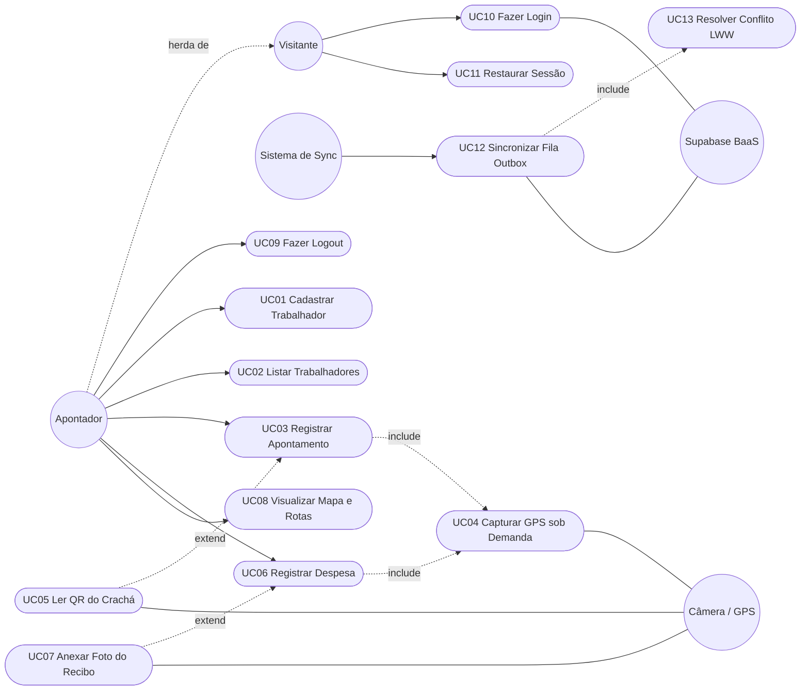

### 2.2 Notação Textual Estruturada dos Casos de Uso

```text
Ator: Visitante
Ator: Apontador (especialização de Visitante)
Ator Externo de Hardware: Câmera / GPS
Ator Externo BaaS: Supabase
Ator de Sistema/Tempo: Sistema de Sincronização

UC01 Cadastrar Trabalhador (Ator: Apontador)
UC02 Listar Trabalhadores (Ator: Apontador)
UC03 Registrar Apontamento (Ator: Apontador)
  <<include>> UC04 Capturar GPS sob Demanda (Hardware: GPS)
  <<extend>>  UC05 Ler QR do Crachá (Hardware: Câmera; Ponto de Extensão: Seleção do Trabalhador)
UC06 Registrar Despesa (Ator: Apontador)
  <<include>> UC04 Capturar GPS sob Demanda (Hardware: GPS)
  <<extend>>  UC07 Anexar Foto do Recibo (Hardware: Câmera; Ponto de Extensão: Antes de Concluir Despesa)
UC08 Visualizar Mapa da Lavoura e Rotas (Ator: Apontador)
UC09 Fazer Logout (Ator: Apontador)
UC10 Fazer Login (Ator: Visitante; Sistema: Supabase)
UC11 Restaurar Sessão (Ator: Visitante; Armazenamento Local Cifrado)
UC12 Sincronizar Fila Outbox (Ator: Sistema de Sincronização; Sistema: Supabase)
  <<include>> UC13 Resolver Conflito por Data de Atualização (Last-Write-Wins)
```

---

## 3. Descrição Textual dos Casos de Uso Principais

### UC01 — Cadastrar Trabalhador
- **Ator Principal:** Apontador.
- **Pré-condições:** Apontador autenticado com sessão válida (ou sessão restaurada localmente).
- **Fluxo Principal:**
  1. O Apontador acessa o menu de trabalhadores e seleciona a opção "Novo Trabalhador".
  2. Informa nome completo, CPF (11 dígitos numéricos), código do crachá (ex: `TRAB-001`) e valor da diária em reais.
  3. O use case `CadastrarTrabalhador` cria a entidade `Trabalhador`, validando as invariantes (nome não vazio, CPF válido, diária não negativa).
  4. O repositório persiste a entidade no SQLite local.
  5. É enfileirado um comando `INSERT` com o payload da entidade na `SyncQueueRepository` (Outbox).
  6. O sistema emite feedback de sucesso ao Apontador.
- **Fluxo Alternativo — Operação Sem Rede:**
  - O fluxo transcorre com 100% de sucesso. Os dados ficam salvos localmente e o item na outbox aguarda conexão para despacho.
- **Fluxo Alternativo — Dados Inválidos:**
  - Se o CPF não tiver exatamente 11 dígitos numéricos, se o nome for em branco ou a diária negativa, o domínio lança exceção com a mensagem de erro específica. O use case propaga a mensagem para a UI e nada é persistido.
- **Pós-condições:** Trabalhador disponível para listagem e seleção de apontamentos no dispositivo; comando de sincronização registrado na fila.

### UC03 — Registrar Apontamento (com UC04 include e UC05 extend)
- **Ator Principal:** Apontador (+ Hardware de Câmera e GPS).
- **Pré-condições:** Pelo menos um trabalhador previamente cadastrado; permissões de hardware concedidas.
- **Fluxo Principal:**
  1. O Apontador abre o formulário de Registro de Apontamento.
  2. Seleciona o trabalhador através da lista suspensa ou ativa o escaneamento óptico (UC05).
  3. Digita a quantidade colhida em litros (volume do balaio, ex: 60 litros).
  4. Ao clicar em "Salvar Apontamento", o sistema aciona compulsoriamente a captura de coordenadas GPS sob demanda (UC04).
  5. O use case `RegistrarApontamento` valida se o trabalhador existe no repositório, valida o VO `QuantidadeBalaio` (> 0) e o VO `Coordinates` (lat -90..90, lng -180..180).
  6. Gera um novo `Apontamento` com UUID v4 cliente, data corrente (timestamp ms) e status inicial `pending`.
  7. Persiste a entidade no repositório SQLite local.
  8. Enfileira o evento `INSERT` correspondente na tabela `sync_queue`.
  9. A tela exibe confirmação imediata: "Apontamento salvo localmente com sucesso!".
- **Fluxo de Extensão — UC05 Leitura de QR Code:**
  1. O Apontador toca no ícone de Câmera/QR Code.
  2. A interface abre o leitor óptico e focaliza o crachá do colhedor.
  3. O leitor decodifica o texto (ex: `TRAB-002`) e consulta o repositório por `findByCracha(codigo)`.
  4. Se encontrado, o trabalhador é pré-selecionado automaticamente na tela.
- **Fluxo Alternativo — Permissão de Câmera Negada:**
  - O app exibe alerta informando a necessidade da permissão e orienta o Apontador a selecionar o trabalhador manualmente na lista, sem interromper o trabalho de campo.
- **Fluxo Alternativo — Sinal de GPS Indisponível / Permissão Negada (GPS Compulsório):**
  - Caso o sensor de localização esteja desativado ou o dispositivo não consiga obter fixação das coordenadas satelitais, o salvamento é **bloqueado**. Uma mensagem em destaque alerta: *"Não foi possível capturar a coordenada GPS compulsória. Ative a localização e tente novamente"*. O apontamento não é salvo com coordenadas nulas.
- **Fluxo Alternativo — Sem Conectividade de Internet:**
  - Toda a operação é concretizada localmente no SQLite. O status permanece `pending` até haver reconexão.
- **Pós-condições:** Colheita georreferenciada gravada no dispositivo local e enfileirada para envio à nuvem.

### UC06 — Registrar Despesa Operacional (com UC07 extend)
- **Ator Principal:** Apontador (+ Hardware Câmera/GPS).
- **Pré-condições:** Sessão local ativa.
- **Fluxo Principal:**
  1. O Apontador informa a descrição da despesa (ex: "Óleo diesel para trator"), o valor em reais e seleciona a categoria (`Refeição`, `Combustível`, `Insumos`, `Ferramentas`, `Transporte` ou `Outros`).
  2. Opcionalmente, clica em "Fotografar Recibo" para capturar a imagem do comprovante (UC07).
  3. O sistema dispara a captura obrigatória das coordenadas GPS do local da compra.
  4. O use case `RegistrarDespesa` valida a entidade e seus VOs (`ValorMonetario`, `Coordinates`, enum de categoria).
  5. A despesa é salva no SQLite local com o caminho local do arquivo da foto (`file://...`).
  6. É registrado um item `INSERT` na outbox.
- **Fluxo Alternativo — Sem Foto:**
  - O campo `fotoUri` permanece `null`. A despesa é gravada normalmente.
- **Fluxo Alternativo — Sem Rede:**
  - A despesa é gravada localmente. O arquivo da foto permanece no storage interno do aparelho aguardando conexão para upload no Supabase Storage.
- **Pós-condições:** Despesa financeira computada localmente com comprovante armazenado em disco.

### UC08 — Visualizar Mapa da Lavoura e Rotas
- **Ator Principal:** Apontador.
- **Pré-condições:** Apontamentos existentes na base local; módulo de mapas inicializado.
- **Fluxo Principal:**
  1. O Apontador acessa a aba "Mapa da Lavoura".
  2. O sistema recupera todos os apontamentos do repositório local e a posição GPS atual.
  3. Para cada apontamento, é renderizado um marcador com os dados do colhedor e litros apurados.
  4. Uma linha poligonal (`Polyline`) conecta a sequência de apontamentos, traçando o itinerário percorrido no cafezal.
  5. O Apontador pode selecionar um destino (ex: armazém da fazenda) para traçar rotas viárias.
- **Fluxo Alternativo — Operação 100% Offline:**
  - O mapa renderiza normalmente os marcadores e a linha do itinerário baseados nas coordenadas locais. A funcionalidade de busca de endereços remotos e rota viária em tempo real fica desabilitada até o retorno da rede.

### UC12 — Sincronizar Fila Outbox (Processo em Background / Event-Driven)
- **Ator Principal:** Sistema de Sincronização.
- **Pré-condições:** Itens pendentes (`pending` ou `error`) na tabela `sync_queue`.
- **Fluxo Principal:**
  1. O mecanismo de sincronização detecta conectividade via `NetworkGateway.isConnected()`.
  2. Carrega os registros pendentes ordenados por data de criação (`createdAt` ascendente).
  3. Para cada item da fila:
     a. Incrementa o contador de tentativas (`attempts`).
     b. Invoca o `SyncGateway` para enviar a operação ao Supabase.
     c. Se o item contiver anexo de mídia (foto de despesa), efetua o upload do arquivo ao Supabase Storage antes de persistir o registro relacional.
     d. O `SincronizacaoService` executa a verificação de conflitos (UC13): se o registro no servidor tiver sido modificado com timestamp posterior (`serverUpdatedAt > localUpdatedAt`), a versão remota é mantida (*Last-Write-Wins*). Caso contrário, o registro local sobrescreve o remoto.
     e. Ao receber confirmação de sucesso (HTTP 2xx) do Supabase, o item é expurgado da `sync_queue` e o registro local tem seu status atualizado para `synced`.
- **Fluxo Alternativo — Falha de Conexão ou Erro de Servidor (5xx):**
  - O item da fila é marcado com status `error`, o erro é registrado e o temporizador de reprocessamento é acionado com intervalo calculado por backoff exponencial (1s, 2s, 4s, 8s...). Nenhum dado é perdido ou corrompido.
- **Pós-condições:** Base de dados na nuvem rigorosamente sincronizada com o terminal móvel.

---

## 4. Diagrama de Classes

O modelo estrutural a seguir reflete a separação estrita de responsabilidades, detalhando entidades de domínio, objetos de valor (Value Objects), invariantes e atributos essenciais de controle de sincronização:
- `id`: UUID v4 gerado no dispositivo móvel.
- `updatedAt`: Carimbo de data/hora (epoch ms) utilizado para desempate *Last-Write-Wins*.
- `deletedAt`: Timestamp de exclusão lógica (*Soft Delete*).
- `syncStatus`: Estado de propagação na rede (`pending`, `syncing`, `synced`, `error`).

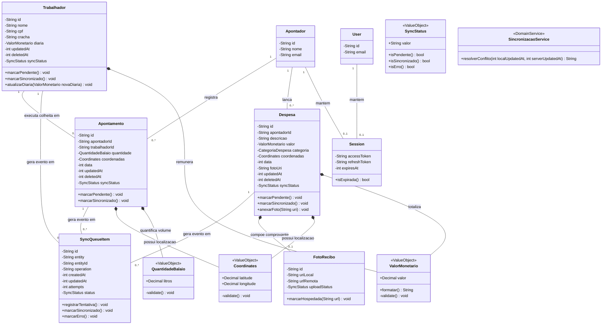

---

## 5. Persistência Local (SQLite) × Remota (Supabase)

Em uma arquitetura Offline-First, cada entidade de negócio possui uma representação no armazenamento local do dispositivo e uma contraparte no banco de dados gerenciado em nuvem.

| Entidade / Classe | Persistência Local (SQLite via Drizzle ORM) | Persistência Remota (Supabase BaaS) | Estratégia de Sincronização e Fonte da Verdade |
|---|---|---|---|
| **Apontador** | Sim (tabela `apontadores`) | Sim (`profiles` no Postgres) | Espelha os dados cadastrais do operador autenticado na sessão ativa para auditoria e rastreabilidade local. |
| **Trabalhador** | Sim (tabela `trabalhadores`) | Sim (tabela `trabalhadores` no Postgres) | O terminal local é a fonte da verdade no ato do cadastro. O servidor consolida os dados; conflitos são resolvidos via *Last-Write-Wins* (`updated_at`). |
| **Apontamento** | Sim (tabela `apontamentos`, com `apontador_id`) | Sim (tabela `apontamentos` no Postgres, com `usuario_id`) | Registro imutável de evento de campo vinculado ao apontador e ao colhedor. Criado localmente com UUID próprio e propagado assincronamente. |
| **Despesa** | Sim (tabela `despesas`, com `apontador_id`) | Sim (tabela `despesas` no Postgres, com `usuario_id`) | Local armazena dados operacionais com vínculo do apontador e caminho do arquivo; Supabase armazena metadados e URL do Storage. |
| **FotoRecibo** | Sim (arquivo físico no `FileSystem` + URI) | Sim (Supabase Storage bucket `recibos`) | Upload assíncrono do binário desacoplado da inserção relacional para resiliência de banda. |
| **SyncQueueItem** | Sim (tabela `sync_queue`) | **Não** (tabela exclusivamente local) | Fila efêmera (Outbox). Cada item é excluído da base local assim que o Supabase confirma o recebimento. |
| **User** | Sim (cache de perfil do operador) | Sim (`auth.users` + tabela `profiles`) | A fonte primária da verdade é o Supabase Auth. O aparelho guarda cache para reconhecimento de sessão offline. |
| **Session** | Sim (cifrado no `expo-secure-store`) | Sim (Sessão de JWT gerada no Supabase) | Criptografado no Keystore nativo do smartphone; utilizado para renovação silenciosa via refresh token. |

---

## 6. Diagramas Entidade-Relacionamento (DER) e Políticas de RLS

### 6.1 DER Local — SQLite (Drizzle ORM)

O modelo local inclui a tabela de `APONTADORES` (espelhando a sessão do operador ativo), a tabela transitória de fila (`SYNC_QUEUE`) e as chaves estrangeiras de rastreabilidade de operador (`apontador_id`):

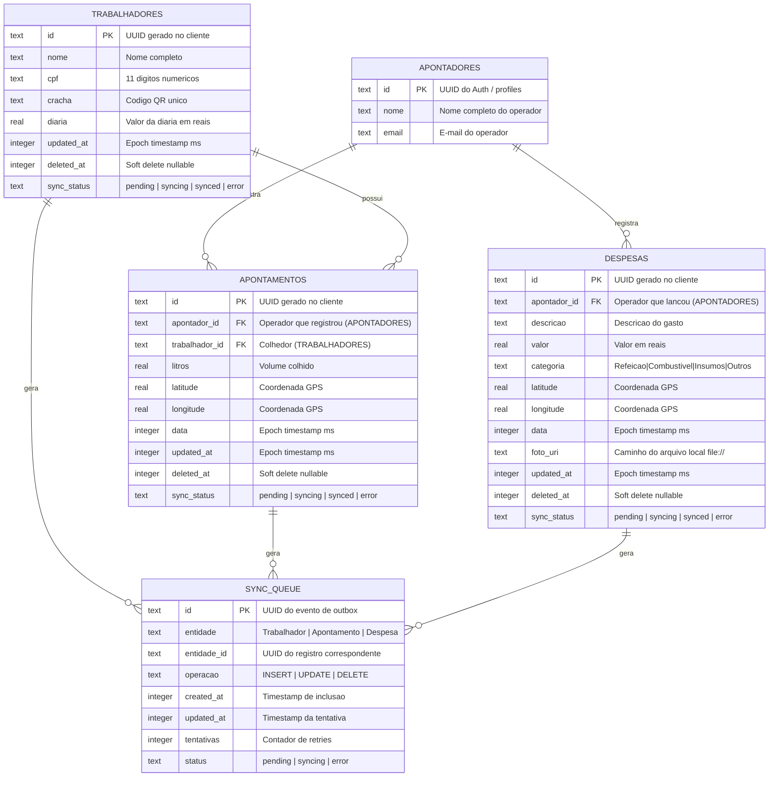

### 6.2 DER Remoto — Supabase (PostgreSQL)

O schema em nuvem não contém tabela de fila, operando com tipos de precisão nativos do PostgreSQL (`timestamptz`, `numeric`, `double precision`) e referenciando a chave primária `id` de `PROFILES` (vinculada a `auth.users`) em todas as tabelas transacionais (`usuario_id FK`), garantindo rastreabilidade completa e isolamento multitenant por operador:

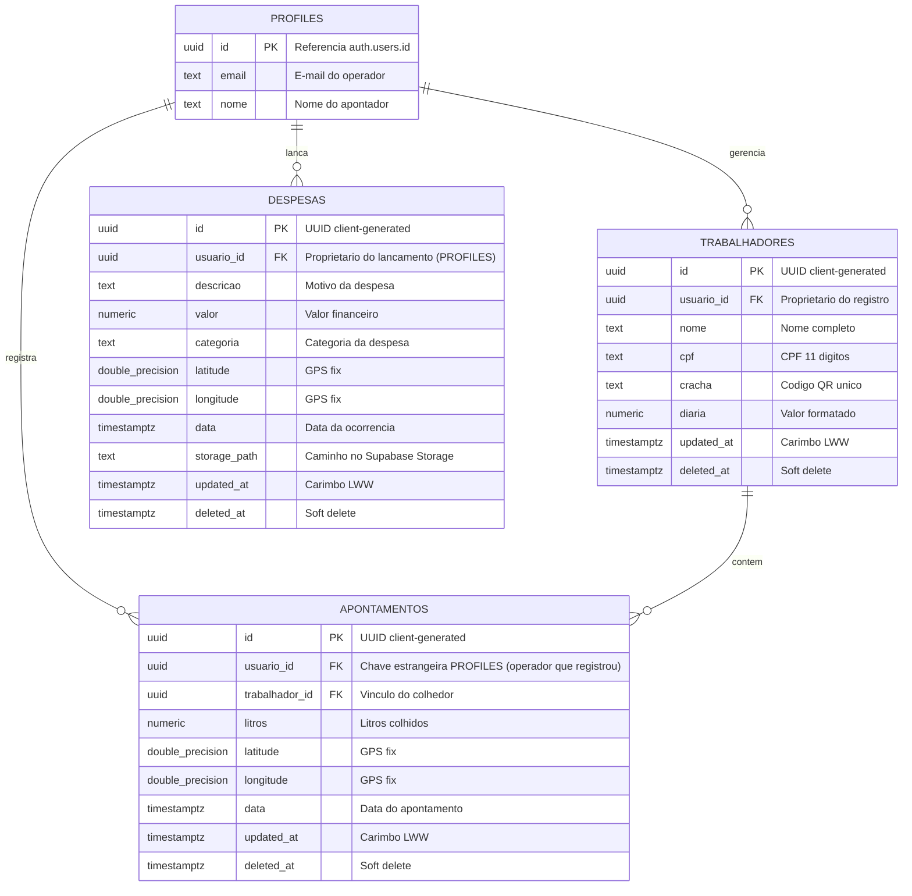

### 6.3 Políticas de Segurança (Row Level Security — RLS no Supabase)

Para garantir o isolamento entre diferentes fazendas ou operadores, todas as tabelas no Supabase possuem RLS ativado compulsoriamente:

```sql
-- Ativação de RLS em todas as tabelas
ALTER TABLE profiles ENABLE ROW LEVEL SECURITY;
ALTER TABLE trabalhadores ENABLE ROW LEVEL SECURITY;
ALTER TABLE apontamentos ENABLE ROW LEVEL SECURITY;
ALTER TABLE despesas ENABLE ROW LEVEL SECURITY;

-- 1. Políticas para a tabela PROFILES
CREATE POLICY "Operadores podem ver seu proprio perfil"
ON profiles FOR SELECT USING (auth.uid() = id);

-- 2. Políticas para a tabela TRABALHADORES
CREATE POLICY "Operadores gerenciam seus proprios trabalhadores"
ON trabalhadores FOR ALL
USING (auth.uid() = usuario_id)
WITH CHECK (auth.uid() = usuario_id);

-- 3. Políticas para a tabela APONTAMENTOS
CREATE POLICY "Operadores gerenciam seus proprios apontamentos"
ON apontamentos FOR ALL
USING (auth.uid() = usuario_id)
WITH CHECK (auth.uid() = usuario_id);

-- 4. Políticas para a tabela DESPESAS
CREATE POLICY "Operadores gerenciam suas proprias despesas"
ON despesas FOR ALL
USING (auth.uid() = usuario_id)
WITH CHECK (auth.uid() = usuario_id);

-- 5. Segurança do Supabase Storage (Bucket 'recibos')
CREATE POLICY "Upload restrito a pasta do proprio usuario"
ON storage.objects FOR INSERT
WITH CHECK (
  bucket_id = 'recibos' 
  AND (storage.foldername(name))[1] = auth.uid()::text
);

CREATE POLICY "Leitura de recibos do proprio usuario"
ON storage.objects FOR SELECT
USING (
  bucket_id = 'recibos' 
  AND (storage.foldername(name))[1] = auth.uid()::text
);
```

---

## 7. Diagrama de Objetos (Estado Misto de Sincronização)

O diagrama a seguir retrata um instantâneo do sistema em campo: um colhedor cadastrado e já sincronizado, um novo apontamento efetuado offline com sincronização pendente, uma despesa com comprovante em disco aguardando upload, e o respectivo item enfileirado na Outbox:

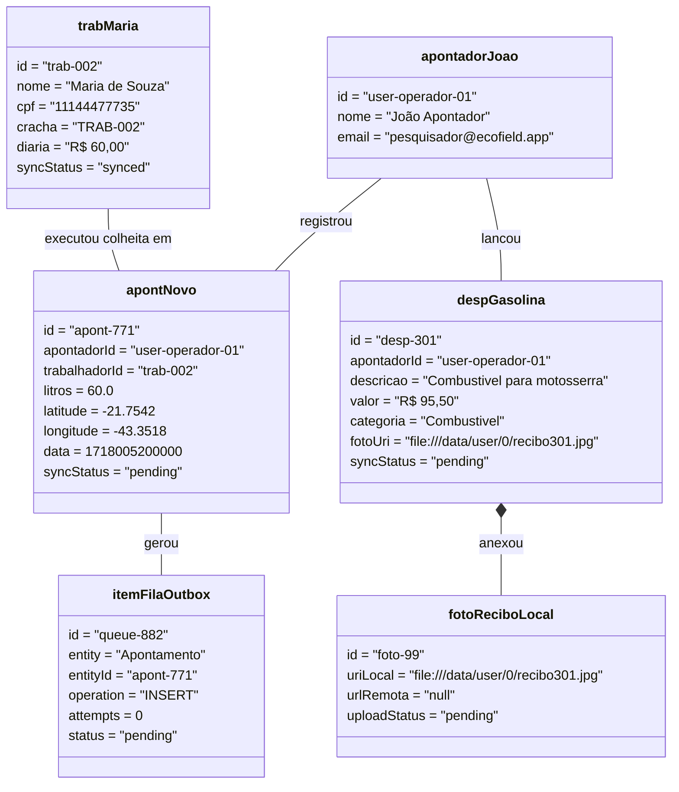

---

## 8. Diagramas de Estados

### 8.1 Ciclo de Vida da Sincronização (SyncStatus)

Modelagem formal do ciclo de vida dos registros sincronizáveis e dos eventos na fila Outbox:

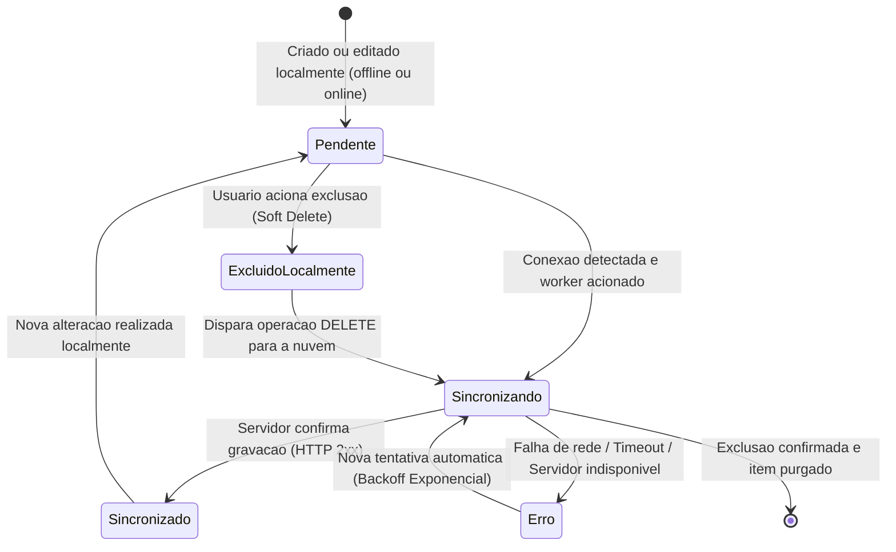

### 8.2 Ciclo de Vida do Upload de Mídia (`FotoRecibo.uploadStatus`)

Desacoplado do ciclo de metadados relacionais para suportar conexões instáveis e uploads resumíveis:

```mermaid
stateDiagram-v2
    [*] --> SemFoto : Despesa cadastrada sem comprovante visual
    [*] --> LocalPendente : Foto capturada e armazenada no FileSystem
    LocalPendente --> Enviando : Rede ativa; stream de envio iniciado
    Enviando --> Hospedada : Supabase Storage retorna URL publica/path
    Enviando --> LocalPendente : Conexao caiu; retry reagendado
    Hospedada --> [*]
    SemFoto --> [*]
```

---

## 9. Classes de Fronteira, Controle e Entidade (Boundary-Control-Entity)

O padrão BCE desacopla a interface com o usuário e as interfaces de hardware externo dos casos de uso e das entidades puras de negócio.

### 9.1 Mapeamento Estrutural
- **Boundary UI (Fronteira com o Usuário):** Telas do Expo Router e formulários React Native (`ApontamentoScreen`, `TrabalhadoresScreen`, `DespesasScreen`, `MapaScreen`, `LoginScreen`).
- **Boundary Hardware / SDK (Gateways Externos):** Portas de integração com hardware nativo e serviços externos (`CameraGateway`, `LocationGateway`, `AuthGateway`, `SyncGateway`, `NetworkGateway`, `SessionStorage`).
- **Control (Casos de Uso da Aplicação):** Orquestradores que não guardam estado e executam as regras do app (`RegistrarApontamento`, `CadastrarTrabalhador`, `RegistrarDespesa`, `SyncPendingQueue`).
- **Entity (Entidades de Domínio):** Modelos e regras de negócio invariantes (`Apontamento`, `Trabalhador`, `Despesa`, `SyncQueueItem`).

### 9.2 Diagrama de Robustez — Registro de Apontamento

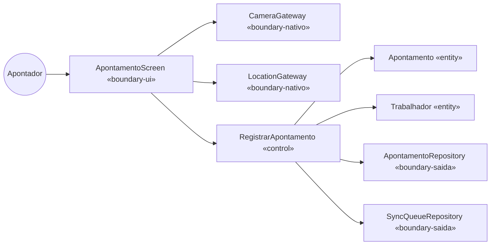

### 9.3 Tabela de Rastreabilidade BCE por Caso de Uso

| Caso de Uso | Boundary (UI) | Boundary (Hardware / SDK Nativo) | Control (Use Case) | Entidades Envolvidas |
|---|---|---|---|---|
| **UC01 Cadastrar Trabalhador** | `TrabalhadoresScreen` | — | `CadastrarTrabalhador` | `Trabalhador`, `SyncQueueItem` |
| **UC02 Listar Trabalhadores** | `TrabalhadoresScreen` | — | `ListarTrabalhadores` | `Trabalhador` |
| **UC03 Registrar Apontamento** | `ApontamentoScreen` | `CameraGateway` (QR), `LocationGateway` (GPS) | `RegistrarApontamento` | `Apontamento`, `Trabalhador`, `SyncQueueItem` |
| **UC06 Registrar Despesa** | `DespesasScreen` | `CameraGateway` (Foto), `LocationGateway` (GPS) | `RegistrarDespesa` | `Despesa`, `SyncQueueItem` |
| **UC08 Mapa da Lavoura** | `MapaScreen` | `LocationGateway`, `MapGateway` | `ListarApontamentos` | `Apontamento` |
| **UC10 / UC11 / UC09 Auth** | `LoginScreen` | `AuthGateway`, `SessionStorage` | `AuthenticateUser`, `RestoreSession`, `SignOut` | `User`, `Session` |
| **UC12 Sincronizar Fila Outbox** | *(Background)* | `SyncGateway`, `NetworkGateway` | `SyncPendingQueue` (+ `SincronizacaoService`) | `SyncQueueItem` |

---

## 10. Diagrama de Sequência (Escrita Síncrona + Sync Assíncrono)

Em sistemas móveis Offline-First, as operações de escrita são divididas em **dois momentos desacoplados**: (1) gravação local síncrona com resposta imediata ao operador; e (2) processamento assíncrono em segundo plano condicionado à conectividade. Para máxima clareza e legibilidade, o fluxo é apresentado em dois diagramas complementares.

### 10.1 Registro Síncrono Local (UI $\rightarrow$ Hook $\rightarrow$ Gateways $\rightarrow$ Use Case $\rightarrow$ SQLite $\rightarrow$ Outbox)

Demonstra a coleta dos dados em campo, a invocação dos sensores nativos pelos adapters, a orquestração do Caso de Uso e a persistência na base local SQLite e fila Outbox, culminando no feedback visual imediato:

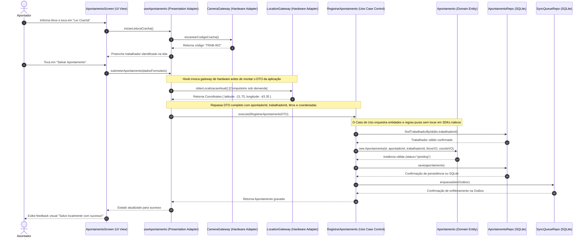

### 10.2 Processamento Assíncrono da Outbox (Outbox $\rightarrow$ NetInfo $\rightarrow$ SyncGateway $\rightarrow$ Supabase)

Demonstra a rotina de segundo plano responsável pela leitura da fila, verificação de conectividade, envio dos lotes, resolução de conflitos *Last-Write-Wins* (LWW) e agendamento de retentativas com backoff exponencial:

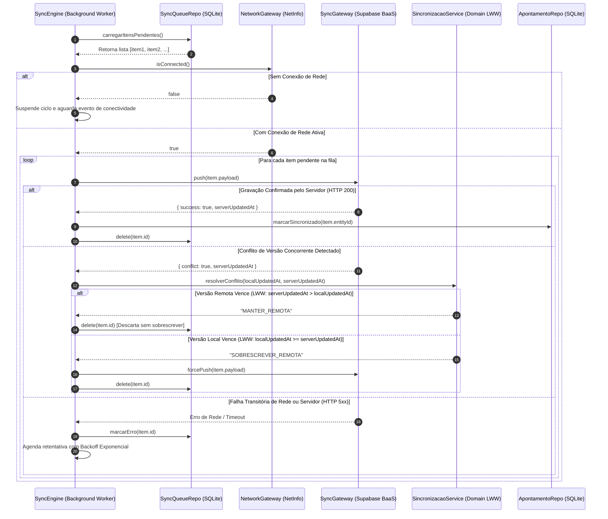

---

## 11. Diagrama de Atividades (Permissão e Conectividade Explícitas)

O fluxo operacional do registro de colheita evidencia os dois pontos centrais de desvio em dispositivos móveis: a concessão/bloqueio de permissões nativas de hardware e a presença/ausência de conectividade de rede.

```mermaid
flowchart LR
    Start((Início)) --> DecisaoIdentificacao{Identificar Colhedor?}
    
    %% Ramo Leitura QR Code
    DecisaoIdentificacao -- QR Code --> CheckPermCam{Permissão Câmera?}
    CheckPermCam -- Não --> PedirCam[Solicitar Permissão] --> PermCamResult{Liberada?}
    PermCamResult -- Não --> ListaManual[Selecionar na Lista]
    PermCamResult -- Sim --> ScanQR[Escanear Crachá] --> AchouTrab{Cadastrado?}
    AchouTrab -- Não --> AlertaQR[Avisar 'Não Encontrado'] --> ListaManual
    AchouTrab -- Sim --> PreencheCampos[Preencher Colhedor]
    
    %% Ramo Seleção Manual
    DecisaoIdentificacao -- Manual --> ListaManual --> PreencheCampos

    %% Entrada de Volume e Captura Compulsória de GPS
    PreencheCampos --> InformaLitros[Digitar Volume Litros] --> BotaoSalvar[Tocar em Salvar]
    BotaoSalvar --> CheckPermGPS{Permissão GPS?}
    CheckPermGPS -- Não --> PedirGPS[Solicitar GPS] --> PermGPSResult{Liberada?}
    PermGPSResult -- Não --> ErroGPSBloqueante[Bloquear: GPS Compulsório] --> Start
    
    CheckPermGPS -- Sim --> CapturaGPS[Capturar Coordenadas]
    PermGPSResult -- Sim --> CapturaGPS
    CapturaGPS --> GPSValido{GPS Fixado?}
    GPSValido -- Não --> RetryGPS[Avisar e Retentar Fixação] --> CapturaGPS
    
    %% Validação e Gravação Local
    GPSValido -- Sim --> ValidaDominio{Invariantes Válidas?}
    ValidaDominio -- Não --> ErroValidacao[Exibir Erro de Domínio] --> InformaLitros
    ValidaDominio -- Sim --> SalvaSQLite[Persistir no SQLite]
    SalvaSQLite --> GeraOutbox[Enfileirar na sync_queue]
    GeraOutbox --> FeedbackSucesso[Feedback 'Salvo Localmente!']
    
    %% Sincronização Assíncrona em Segundo Plano
    FeedbackSucesso --> ChecaRede{Rede Conectada?}
    ChecaRede -- Não --> EsperaNet[Aguardar Reconexão NetInfo] --> ChecaRede
    ChecaRede -- Sim --> DespachaFila[SyncEngine Envia Lote]
    DespachaFila --> RespostaSupabase{Servidor Confirmou?}
    RespostaSupabase -- Sim HTTP 200 --> ConfirmaSync[Marcar 'synced' e Purgar Fila] --> Fim((Fim))
    RespostaSupabase -- Conflito LWW --> ResolveConflito[Preservar Maior updatedAt] --> Fim
    RespostaSupabase -- Falha/Erro --> AgendaBackoff[Agendar Retry Backoff] --> EsperaNet
```

---

## 12. Diagrama de Componentes (Clean Architecture)

A estrutura arquitetural do SafraCafé estabelece que as dependências fluem **sempre de fora para dentro**. O módulo `domain/` não conhece `usecases/`, `adapters/` ou `infra/`. As bibliotecas de terceiros e SDKs de hardware residem exclusivamente na borda externa (*Frameworks & Drivers*).

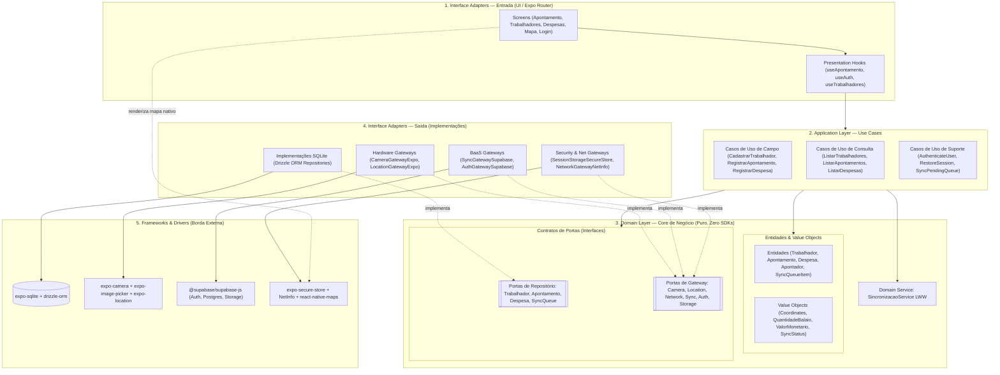

> [!NOTE]
> **Nota de Arquitetura e Ambiente sobre Mapas:**  
> O componente `MapaLavoura.native.tsx` faz uso de `react-native-maps`, que requer compilação nativa com vinculação de bibliotecas de sistema (Google Play Services no Android e Apple Maps no iOS). Por essa razão arquitetural, sua execução plena é suportada exclusivamente via **Expo Dev Client** (`npx expo run:android` ou `npx expo prebuild`), não rodando no ambiente limitado do Expo Go padrão.

---

## 13. Mapeamento DDD (Domain-Driven Design)

O SafraCafé adota a **Linguagem Ubíqua** autêntica da cafeicultura brasileira (eito, balaio, crachá, apontamento, diária), abolindo nomenclaturas genéricas.

### 13.1 Tabela de Agregados e Elementos Táticos DDD

| Aggregate Root | Entidades Internas | Value Objects | Contrato de Repositório | Gateways Envolvidos | Invariantes de Negócio Asseguradas |
|---|---|---|---|---|---|
| **Apontador** | `Session` | `Email` | `ApontadorRepository` *(ou cache local; autoritativo no Supabase Auth)* | `AuthGateway`, `SessionStorage` | Operador autenticado com credencial ativa; rastreabilidade de todas as coletas em campo. |
| **Trabalhador** | — | `ValorMonetario` (diária), `SyncStatus` | `TrabalhadorRepository` | `SyncGateway`, `NetworkGateway` | CPF com exatamente 11 dígitos numéricos; código de crachá único e não vazio; diária ≥ R$ 0,00. |
| **Apontamento** | — (referência `trabalhadorId` e `apontadorId`) | `QuantidadeBalaio`, `Coordinates`, `SyncStatus` | `ApontamentoRepository` | `CameraGateway` (QR), `LocationGateway` (GPS), `SyncGateway` | Rastreabilidade do operador (`apontadorId`); colhedor cadastrado; volume do balaio > 0 litros; coordenadas GPS válidas (lat -90..90, lng -180..180); data > 0. |
| **Despesa** | `FotoRecibo` (composição 0..1) | `ValorMonetario`, `Coordinates`, `CategoriaDespesa` (enum), `SyncStatus` | `DespesaRepository` | `CameraGateway` (Foto), `LocationGateway` (GPS), `SyncGateway` | Rastreabilidade do operador (`apontadorId`); descrição não vazia; valor monetário ≥ 0; categoria pertencente à lista fechada; URI de foto deve conter scheme `://`. |
| **SyncQueueItem** | — (entidade da infraestrutura de sync) | `SyncStatus`, `SyncQueueOperation` (`INSERT\|UPDATE\|DELETE`) | `SyncQueueRepository` | `SyncGateway`, `NetworkGateway` | Operação permitida; `updatedAt >= createdAt`; número de retentativas consistente. |

### 13.2 Serviço de Domínio (Domain Service)
- **`SincronizacaoService`**:
  Responsável pela decisão pura de reconciliação de concorrência:
  $$\text{Vencedor} = \begin{cases} \text{Remoto}, & \text{se } \text{serverUpdatedAt} > \text{localUpdatedAt} \\ \text{Local}, & \text{caso contrário (Last-Write-Wins)} \end{cases}$$

---

## 14. Estrutura de Camadas da Clean Architecture

A árvore física de código-fonte em `src/` obedece rigidamente à separação de camadas. Nenhum arquivo dentro de `domain/` ou `usecases/` importa dependências de React, React Native, Expo, Drizzle ou Supabase.

### 14.1 Árvore de Diretórios

```text
src/
├── domain/                               # REGRAS EMPRESARIAIS CENTRAIS (Puras, TS limpo)
│   ├── entities/
│   │   ├── Trabalhador.ts                # Entidade de domínio do colhedor
│   │   ├── Apontamento.ts                # Entidade do registro de colheita
│   │   ├── Despesa.ts                    # Entidade financeira de campo
│   │   ├── FotoRecibo.ts                 # Entidade de comprovante fotográfico
│   │   ├── SyncQueueItem.ts              # Entidade da fila de sincronização (Outbox)
│   │   ├── User.ts                       # Usuário autenticado
│   │   └── Session.ts                    # Tokens de sessão
│   ├── value-objects/
│   │   ├── Coordinates.ts                # Latitude [-90, 90], Longitude [-180, 180]
│   │   ├── QuantidadeBalaio.ts           # Volume em litros (> 0)
│   │   ├── ValorMonetario.ts             # Valor financeiro (>= 0) com formatação BRL
│   │   └── SyncStatus.ts                 # pending | syncing | synced | error
│   ├── repositories/                     # Interfaces/Contratos (Ports)
│   │   ├── TrabalhadorRepository.ts
│   │   ├── ApontamentoRepository.ts
│   │   ├── DespesaRepository.ts
│   │   └── SyncQueueRepository.ts
│   ├── gateways/                         # Interfaces de Recursos Externos (Ports)
│   │   ├── CameraGateway.ts              # Leitura de QR e captura de foto
│   │   ├── LocationGateway.ts            # Leitura de GPS sob demanda
│   │   ├── AuthGateway.ts                # Supabase Auth abstraction
│   │   ├── SyncGateway.ts                # Transmissão de dados e storage
│   │   ├── NetworkGateway.ts             # Status de conectividade (NetInfo)
│   │   └── SessionStorage.ts             # Persistência segura de tokens
│   └── services/
│       └── SincronizacaoService.ts       # Resolução de conflitos LWW
├── usecases/                             # REGRAS DA APLICAÇÃO (DTOs e orquestração)
│   ├── CadastrarTrabalhador.ts           # DTO + execução
│   ├── ListarTrabalhadores.ts
│   ├── RegistrarApontamento.ts           # Injeção de repositórios + validação
│   ├── ListarApontamentos.ts
│   ├── RegistrarDespesa.ts
│   ├── ListarDespesas.ts
│   ├── AuthenticateUser.ts
│   ├── RestoreSession.ts
│   ├── SignOut.ts
│   └── SyncPendingQueue.ts               # Despacho da fila Outbox
├── adapters/                             # ADAPTADORES DE INTERFACE
│   ├── screens/                          # Telas e Hooks (Expo Router)
│   │   ├── useApontamento.ts             # Hook que adapta use case para React
│   │   ├── useTrabalhadores.ts
│   │   └── useDespesas.ts
│   ├── repositories/                     # Implementações de Repositórios
│   │   ├── SQLiteTrabalhadorRepository.ts
│   │   ├── SQLiteApontamentoRepository.ts
│   │   ├── SQLiteDespesaRepository.ts
│   │   ├── SQLiteSyncQueueRepository.ts
│   │   └── inMemory/                     # Fakes para testes unitários rápidos
│   └── gateways/                         # Implementações de Gateways
│       ├── camera/CameraGatewayExpo.ts   # Envolve expo-camera / expo-image-picker
│       ├── location/LocationGatewayExpo.ts# Envolve expo-location sob demanda
│       ├── auth/AuthGatewaySupabase.ts   # Envolve @supabase/supabase-js Auth
│       ├── sync/SyncGatewaySupabase.ts   # Envolve Supabase Postgres + Storage
│       ├── network/NetworkGatewayNetInfo.ts # Envolve NetInfo
│       └── session/SessionStorageSecureStore.ts # Envolve expo-secure-store
├── infra/                                # CONFIGURAÇÃO DE FRAMEWORKS E HARDWARE
│   ├── db/
│   │   ├── client.ts                     # Conexão expo-sqlite + drizzle
│   │   ├── schema.ts                     # Schemas relacionais do Drizzle ORM
│   │   └── migrations/                   # Migrações versionadas
│   ├── supabase/
│   │   └── client.ts                     # Instância configurada do cliente Supabase
│   └── sync/
│       └── sync-engine.ts                # Loop de pooling e listeners NetInfo
└── factory/
    └── container.ts                      # IoC Container (Singleton) — Único ponto de wiring
```

### 14.2 O Ponto Único de Amarração: `container.ts` (IoC / Factory)

Seguindo o padrão Singleton, o container é a **única classe** responsável por instanciar as implementações de infraestrutura e injetá-las nos construtores dos casos de uso:

```typescript
// Exemplo arquitetural do src/factory/container.ts
export class Container {
  private static instance: Container;

  // Casos de Uso expostos às telas
  public readonly cadastrarTrabalhador: CadastrarTrabalhador;
  public readonly registrarApontamento: RegistrarApontamento;
  public readonly registrarDespesa: RegistrarDespesa;
  public readonly syncPendingQueue: SyncPendingQueue;

  private constructor() {
    // 1. Instancia Repositórios (Singletons de persistência SQLite)
    const trabalhadorRepo = SQLiteTrabalhadorRepository.getInstance();
    const apontamentoRepo = SQLiteApontamentoRepository.getInstance();
    const despesaRepo = SQLiteDespesaRepository.getInstance();
    const syncQueueRepo = SQLiteSyncQueueRepository.getInstance();

    // 2. Instancia Gateways de Hardware e BaaS
    const cameraGateway = new CameraGatewayExpo();
    const locationGateway = new LocationGatewayExpo();
    const networkGateway = new NetworkGatewayNetInfo();
    const syncGateway = new SyncGatewaySupabase();
    const sincService = new SincronizacaoService();

    // 3. Constrói os Use Cases injetando dependências exclusivamente via construtor
    this.cadastrarTrabalhador = new CadastrarTrabalhador(trabalhadorRepo, syncQueueRepo);
    this.registrarApontamento = new RegistrarApontamento(apontamentoRepo, trabalhadorRepo, syncQueueRepo);
    this.registrarDespesa = new RegistrarDespesa(despesaRepo, syncQueueRepo);
    this.syncPendingQueue = new SyncPendingQueue(syncQueueRepo, syncGateway, networkGateway, sincService);
  }

  public static getInstance(): Container {
    if (!Container.instance) {
      Container.instance = new Container();
    }
    return Container.instance;
  }
}
```

---

## 15. Plano de Testes TDD por Caso de Uso (Jest + Testing Library)

A pirâmide de testes do SafraCafé privilegia a execução veloz e o isolamento total das regras de negócio, simulando hardware e rede por meio de dublês de teste (*test doubles*).

### 15.1 Estrutura da Pirâmide de Testes

```
              /\
             /  \    E2E Crítico (Detox / Maestro em emulador)
            /----\   Poucos fluxos completos
           /      \  
          /--------\  Componentes e Telas (@testing-library/react-native)
         /          \ Render com fakes
        /------------\ 
       /              \ Integração: Repositórios Drizzle/SQLite + Gateways
      /----------------\ Mocks pontuais de expo-camera/location/NetInfo
     /                  \
    /--------------------\ Casos de Uso com Fakes In-Memory (Testes de Aceitação)
   /                      \ Cenários de sucesso, erro, offline e permissão
  /------------------------\
 /                          \ Testes de Domínio Puros (Entidades e Value Objects)
/____________________________\ 100% sem mocks, execução em milissegundos
```

### 15.2 Níveis de Teste e Rastreabilidade de Requisitos

| Nível | Alvo do Teste | Técnica / Ferramenta | Requisitos Cobertos |
|---|---|---|---|
| **1. Domínio (Unitário)** | • `Coordinates`: Rejeita latitude fora de [-90, 90] e longitude fora de [-180, 180].<br>• `QuantidadeBalaio`: Rejeita volume menor ou igual a zero e valores `NaN`.<br>• `ValorMonetario`: Rejeita número negativo e formata para `R$ 60,00`.<br>• `Trabalhador`: Rejeita CPF com número de dígitos diferente de 11 e campos vazios.<br>• `Despesa`: Rejeita categoria fora do enum e valida formato de URI (`://`).<br>• `SyncQueueItem`: Valida ciclo de vida `registrarTentativa()`, `marcarSincronizado()`, `marcarErro()`. | Jest (Execução pura, sem nenhum mock de framework) | RF01, RF05, RF06, RF11 |
| **2. Use Case (Aceitação)** | • `CadastrarTrabalhador`: Cria entidade, salva no repositório e enfileira `INSERT` na outbox.<br>• `RegistrarApontamento`: Falha se trabalhador não existir; salva apontamento georreferenciado; gera item na outbox.<br>• `RegistrarDespesa`: Aceita despesa com ou sem foto de recibo.<br>• `SyncPendingQueue`: Em modo offline (`isConnected = false`), encerra sem tocar na nuvem; resolve conflitos LWW; executa retentativas em caso de erro 500. | Use Cases recebendo `InMemoryTrabalhadorRepo`, `InMemoryApontamentoRepo`, `InMemorySyncQueueRepo` | RF01, RF03, RF04, RF06, RF11, RF12, RNF01 |
| **3. Gateways (Adapters)** | • `LocationGatewayExpo`: Traduz a chamada do `expo-location` para `Coordinates`; propaga erro sem quebrar se a permissão for negada.<br>• `CameraGatewayExpo`: Traduz QR lido e simula foto de recibo compactada; propaga status de negação.<br>• `NetworkGatewayNetInfo`: Emite eventos de conectividade `isConnected: true/false`. | Jest com `jest.mock('expo-location')`, `jest.mock('expo-camera')` e `jest.mock('@react-native-community/netinfo')` | RF03, RF04, RNF03, RNF04 |
| **4. Repositórios (Persistência)** | • `SQLiteApontamentoRepository`: Mapeamento Drizzle ORM, execução de migrations, inserção de UUIDs, busca por chave estrangeira e *Soft Delete*. | Banco SQLite in-memory real (`better-sqlite3` ou SQLite temp) | RF02, RF07, RNF05, RNF06 |
| **5. Sync Engine (Sincronização)** | • Loop de processamento de fila pendente, simulação de queda de conexão a meio do lote, idempotência de reenvio sem duplicar linhas, verificação de backoff. | Teste de integração do `sync-engine` mockando respostas do `SyncGatewaySupabase` | RF11, RF12, RNF02 |
| **6. Telas / Componentes (UI)** | • `ApontamentoScreen`: Exibição do estado "Aguarde o sinal de GPS", desabilitação de botões durante gravação, exibição de alerta de crachá não encontrado, badge de status de sincronização (`pendente`, `sincronizado`). | `@testing-library/react-native` renderizando tela com use cases fake injetados | RF04, RF13, RNF09 |
| **7. E2E (Ponta a Ponta)** | • Fluxo Crítico: Apontador efetua login → cadastra colhedor → escaneia crachá → registra apontamento offline → reativa conectividade → confirma propagação no backend. | Detox ou Maestro em emulador Android / simulador iOS | RF01, RF03, RF04, RF10, RF11 |

### 15.3 Exemplos de Testes Automatizados (Padrão do Projeto)

#### Teste de Value Object (`Coordinates.test.ts`)
```typescript
describe('Value Object: Coordinates', () => {
  it('deve instanciar com sucesso coordenadas válidas dentro dos limites do planeta', () => {
    const coords = new Coordinates(-21.7542, -43.3518);
    expect(coords.latitude).toBe(-21.7542);
    expect(coords.longitude).toBe(-43.3518);
  });

  it('deve lançar erro se a latitude for menor que -90 ou maior que 90', () => {
    expect(() => new Coordinates(-90.1, 0)).toThrow('Latitude inválida');
    expect(() => new Coordinates(90.1, 0)).toThrow('Latitude inválida');
  });

  it('deve lançar erro se a longitude for menor que -180 ou maior que 180', () => {
    expect(() => new Coordinates(0, -180.1)).toThrow('Longitude inválida');
    expect(() => new Coordinates(0, 180.1)).toThrow('Longitude inválida');
  });
});
```

#### Teste de Caso de Uso com Fakes (`RegistrarApontamento.test.ts`)
```typescript
describe('Caso de Uso: RegistrarApontamento', () => {
  let apontamentoRepo: InMemoryApontamentoRepository;
  let trabalhadorRepo: InMemoryTrabalhadorRepository;
  let syncQueueRepo: InMemorySyncQueueRepository;
  let useCase: RegistrarApontamento;

  beforeEach(() => {
    apontamentoRepo = InMemoryApontamentoRepository.getInstance();
    apontamentoRepo.limpar();
    trabalhadorRepo = InMemoryTrabalhadorRepository.getInstance();
    trabalhadorRepo.limpar();
    syncQueueRepo = InMemorySyncQueueRepository.getInstance();
    syncQueueRepo.limpar();

    useCase = new RegistrarApontamento(apontamentoRepo, trabalhadorRepo, syncQueueRepo);
  });

  it('deve registrar apontamento com sucesso, salvar localmente e enfileirar na outbox', async () => {
    // 1. Arrange: Cadastra trabalhador prévio
    const trabalhador = new Trabalhador('trab-01', 'José da Silva', '52998224725', 'TRAB-01', new ValorMonetario(60));
    await trabalhadorRepo.save(trabalhador);

    // 2. Act
    const input = {
      trabalhadorId: 'trab-01',
      litros: 60,
      latitude: -21.75,
      longitude: -43.35,
    };
    const resultado = await useCase.execute(input);

    // 3. Assert
    expect(resultado.id).toBeDefined();
    expect(resultado.quantidade.litros).toBe(60);
    expect(resultado.coordenadas.latitude).toBe(-21.75);

    // Verifica persistência no repositório
    const salvo = await apontamentoRepo.findById(resultado.id);
    expect(salvo).not.toBeNull();

    // Verifica item gerado na outbox
    const fila = await syncQueueRepo.findAll();
    expect(fila).toHaveLength(1);
    expect(fila[0].entity).toBe('Apontamento');
    expect(fila[0].entityId).toBe(resultado.id);
    expect(fila[0].operation).toBe('INSERT');
  });

  it('deve lançar erro se o trabalhador não estiver cadastrado', async () => {
    const input = {
      trabalhadorId: 'inexistente',
      litros: 60,
      latitude: -21.75,
      longitude: -43.35,
    };
    await expect(useCase.execute(input)).rejects.toThrow('Trabalhador não encontrado');
  });
});
```

---

## Checklist Final de Conformidade (Skill `mobile-design-doc`)

- [x] **1. Levantamento de Requisitos:** Requisitos Funcionais e Não Funcionais tabulados com rastreabilidade e categorias mobile detalhadas (offline-first, permissões, bateria/dados, armazenamento local, consistência, segurança, usabilidade).
- [x] **2. Diagrama de Casos de Uso:** Atores (`Visitante`, `Apontador`, `Trabalhador`, `Câmera/GPS`, `Supabase`, `Sistema de Sincronização`), herança de atores, relacionamentos `<<include>>` (GPS sob demanda) e `<<extend>>` (QR crachá, foto do recibo) com sintaxe Mermaid 100% válida.
- [x] **3. Descrição Textual dos Casos de Uso:** Pré/pós-condições, fluxos principais, fluxos sem rede (offline) e fluxos de permissão negada de hardware detalhados.
- [x] **4. Diagrama de Classes:** Composição, agregação, atributos de controle de sincronização (`id` UUID cliente, `updatedAt`, `deletedAt`, `syncStatus`), Value Objects e Domain Services em Mermaid classDiagram.
- [x] **5. Persistência Local (SQLite) × Remota (Supabase):** Tabela comparativa e definição da fonte da verdade para cada entidade do sistema.
- [x] **6. Diagramas Entidade-Relacionamento (DER Local e Remoto) + RLS:** Schemas completos com chaves primárias/estrangeiras, tipos de dados de SQLite e PostgreSQL, e políticas de segurança SQL (*Row Level Security*) documentadas.
- [x] **7. Diagrama de Objetos:** Instantâneo concreto evidenciando estado misto de sincronização (itens sincronizados coexistindo com registros pendentes na Outbox) com formatação Mermaid livre de erros.
- [x] **8. Diagramas de Estados:** Ciclo de vida da sincronização tabular (`Pendente` -> `Sincronizando` -> `Sincronizado`/`Erro`) e ciclo de vida do upload de mídia fotográfica em diagramas `stateDiagram-v2` independentes.
- [x] **9. Classes BCE:** Separação entre Boundary UI e Boundary de Hardware/Gateways, Controls (Use Cases) e Entities; Diagrama de Robustez e tabela de mapeamento completa.
- [x] **10. Diagrama de Sequência:** Escrita síncrona local imediata combinada com sincronização assíncrona em bloco `par` tratando sucesso, erro e resolução de conflito LWW.
- [x] **11. Diagrama de Atividades:** Processo ponta a ponta com raias conceituais e decisões explícitas de concessão de permissão (Câmera/GPS) e conectividade de rede (NetInfo).
- [x] **12. Diagrama de Componentes:** Clean Architecture em camadas com regra de dependência unidirecional voltada para o núcleo de domínio, sem vazamento de bibliotecas externas.
- [x] **13. Mapeamento DDD:** Agregados, raízes, entidades, Value Objects, contratos de repositório, gateways e terminologia ubíqua da lavoura cafeeira.
- [x] **14. Estrutura de Camadas Clean Architecture:** Árvore física de pastas/arquivos, política de isolamento de SDKs nativos e documentação do IoC Container Singleton (`container.ts`).
- [x] **15. Plano de Testes TDD:** Pirâmide de testes completa, helpers de criação, testes unitários de VOs, testes de use case com dublês de teste e matriz de rastreabilidade RF/RNF → Teste.
