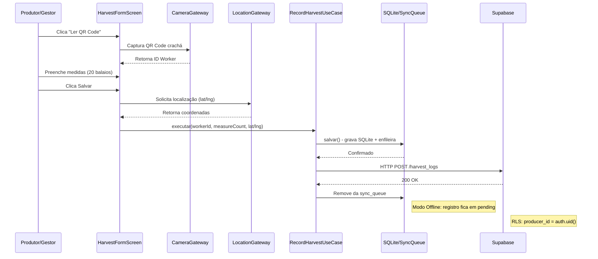

# SafraPay - Especificação Completa
## Gestão de Colheita de Café - Offline-First com Clean Architecture

---

## Slide 01: Capa

SafraPay - Gestão de Colheita de Café
### Proposta de Especificação e Arquitetura Mobile
**Autor:** João Pedro Scalioni de Souza
**Data:** Setembro 2026
**Versão:** 1.0
**Stack Tecnológica:** Expo + React Native + SQLite + Supabase + Clean Architecture

---

## Slide 02: Agenda da Apresentação

SUMÁRIO
1. Contexto e escopo
2. Stack de referência (Expo, SQLite, Supabase, Clean Arch)
3. Requisitos funcionais e não funcionais
4. Diagrama de casos de uso (Atores, include, extend)
5. Diagrama de classes e persistência
6. Modelo entidade-relacionamento (local/remoto) e RLS
7. Diagramas de objetos e diagramas de estado
8. Boundary-Control-Entity (BCE) mapeado
9. Diagramas de sequência
10. Diagrama de atividades
11. Diagrama de componentes (Camadas Clean Architecture + Gateways)
12. DDD, Clean Architecture, TDD e cronograma

---

## Slide 03: Contexto

### Problema
Anotações da colheita de café feitas em cadernos de papel geram perdas de dados, erros de pagamento e inviabilizam o controle no campo (onde não há internet).

### Restrição
60h-aula de desenvolvimento laboratorial; foco no core business de medição e acerto financeiro.

### Abordagem
App Expo/React Native estruturado em estratégia Offline-First com banco local (SQLite) e sincronização assíncrona (Supabase).

### Método
UML + DDD + Clean Architecture + TDD.

### Decisão | Resumo
- **Autenticação:** Apenas o Produtor/Gestor faz login.
- **Trabalhadores:** Identificados passivamente via leitura de crachá (QR Code).
- **Geolocalização:** Captura pontual (lat/long) apenas no momento de salvar um registro, para fins de auditoria no talhão.

---

## Slide 04: Stack de Referência

| Camada | Escolha | Observação |
|--------|---------|------------|
| **Framework** | Expo + React Native + Expo Router | Sem necessidade de eject, uso do catálogo gerenciado. |
| **Persistência Local** | SQLite (expo-sqlite) | Fonte primária de dados no campo; armazena rascunhos e fila de sync. |
| **Backend/BaaS** | Supabase (Postgres, Auth, Storage) | Fonte da verdade remota para consolidação gerencial. |
| **Câmera / Sensores** | expo-camera | Leitura instantânea de QR Code dos crachás e fotos de recibos de despesas. |
| **Geolocalização** | expo-location (foreground) | Captura de coordenadas no disparo do registro (nunca em background contínuo). |
| **Sincronização** | Fila Local (SyncQueue) + @react-native-community/netinfo | Processamento assíncrono ao reconectar à rede. |
| **Testes** | Jest + React Native Testing Library | Foco na camada de Use Cases e componentes visuais isolados. |

---

## Slide 05: Requisitos Funcionais (1/2)

| ID | Descrição | Prioridade | Ator |
|----|-----------|------------|------|
| RF01 | Autenticar Produtor/Gestor via e-mail e senha (Supabase Auth) | Alta | Produtor |
| RF02 | Cadastrar trabalhadores temporários (nome, valor da medida) | Alta | Produtor |
| RF03 | Gerar e exibir QR Code na tela para identificação do trabalhador | Média | Sistema |
| RF04 | Registrar apontamento de colheita (medidas/balaios) de forma 100% offline | Alta | Produtor |
| RF05 | Preencher formulário de colheita rapidamente via leitura de QR Code da câmera | Alta | Produtor |
| RF06 | Registrar coordenadas (lat/long) pontuais no momento do apontamento | Alta | Sistema |
| RF07 | Registrar despesas operacionais da lavoura (insumos, combustível) | Média | Produtor |

---

## Slide 06: Requisitos Funcionais (2/2)

| ID | Descrição | Prioridade | Ator |
|----|-----------|------------|------|
| RF08 | Capturar foto de comprovante fiscal/recibo atrelado à despesa | Média | Produtor |
| RF09 | Consultar balanço financeiro diário agregado (total a pagar, total colhido) | Alta | Produtor |
| RF10 | Enfileirar localmente todas as inserções e edições feitas offline | Alta | Sistema |
| RF11 | Sincronizar dados automaticamente em segundo plano ao recuperar rede | Alta | Sistema |

---

## Slide 07: Requisitos Não Funcionais

| ID | Categoria | Descrição + critério |
|----|-----------|----------------------|
| RNF01 | Offline-first | Fluxos operacionais de colheita e despesa devem funcionar em modo avião (latência zero para o usuário). |
| RNF02 | Bateria/Dados | Localização acionada estritamente no clique de "Salvar"; sem tracking contínuo. |
| RNF03 | Sincronização | Resolução de conflitos utiliza Last-Write-Wins (LWW) com base no timestamp updated_at. |
| RNF04 | Segurança | Regras RLS (Row Level Security) garantem que produtores visualizem apenas dados da própria fazenda. |

---

## Slide 08: Casos de Uso - Atores do Sistema

- **Produtor / Gestor:** Usuário Autenticado. Cadastra trabalhadores, lança medições no campo, registra despesas e consulta o balanço.
- **Sistema de Sincronização:** Ator de tempo/background. Processa a SyncQueue local quando detecta conectividade.
- **Câmera / GPS do Dispositivo:** Ator externo de hardware. Utilizado como recurso de agilidade (leitura de código) e auditoria (coordenada).

**(Nota: O "Trabalhador" não interage com o software, ele é apenas uma Entidade passiva identificada pelo crachá de QR Code.)**

---

## Slide 09 e 10: Diagrama de Casos de Uso

### UC01 Realizar Login
- **Inclui:** autenticação no Supabase Auth.

### UC02 Lançar Colheita
- **Inclui:** Obter Localização (GPS).
- **Extend:** Ler Crachá via Câmera (QR Code) (Opcional, pois pode selecionar da lista).

### UC03 Registrar Despesa
- **Extend:** Capturar Recibo via Câmera.

### UC04 Processar Fila de Sincronização
- **Acionado pelo:** Sistema de Sincronização.
- **Include:** Resolver Conflitos.

```mermaid
useCaseDiagram
    actor "Produtor/Gestor" as PG
    actor "Sistema" as Sist
    actor "Hardware (Câmera/GPS)" as HW

    usecase UC01 "Realizar Login"
    usecase UC02 "Lançar Colheita"
    usecase UC03 "Registrar Despesa"
    usecase UC04 "Processar Fila de Sincronização"

    PG --> UC01
    PG --> UC02
    PG --> UC03
    Sist --> UC04
    HW -.-> UC02
    HW -.-> UC03

    UC02 --> UC01 : includes (autenticação)
    UC03 --> UC01 : includes (autenticação)
    UC02 --> HW : include (ler crachá/GPS)
    UC03 --> HW : extend (capturar recibo)
    UC04 --> UC02 : include (resolver conflitos)
    UC04 --> UC03 : include (resolver conflitos)

    note for UC02 <<include Obter Localização (GPS)>>
    note for UC03 <<extend Capturar Recibo via Câmera>>
    note for UC04 <<include Resolver Conflitos>>
```

---

## Slide 11 e 12: Classes e Persistência Local x Remota

| Classe | Local (SQLite) | Remota (Supabase) | Estratégia |
|--------|----------------|-------------------|------------|
| **Produtor (Profile)** | Somente Leitura (Context) | Fonte da Verdade | Isolamento RLS. |
| **Trabalhador (Worker)** | Sim (Leitura/Escrita) | Sim (Leitura/Escrita) | Criado offline, sincronizado por LWW. |
| **Apontamento (HarvestLog)** | Sim | Sim | Escrita primária offline, upload em lote ao reconectar. |
| **Despesa (Expense)** | Sim | Sim | Imagem em base64/uri local até upload no Storage remoto. |
| **SyncQueueItem** | Sim | Não | Tabela efêmera, exclusiva do dispositivo móvel. |

---

## Slide 13 e 14: Modelo Entidade-Relacionamento (DER)

### DER Local (SQLite)

| Tabela | Atributos |
|--------|-----------|
| **workers** | id PK UUID, name, daily_rate, measure_price, sync_status |
| **harvest_logs** | id PK UUID, worker_id FK, measure_count, total_value, latitude, longitude, created_at, sync_status |
| **expenses** | id PK UUID, title, amount, photo_uri, sync_status |
| **sync_queue** | id INTEGER PK, entity, entity_id, operation, attempts |

### DER Remoto (Supabase)

- Estrutura idêntica ao DER local, porém **sem sync_status e sync_queue**.
- Adiciona a chave **producer_id (FK auth.users)** em todas as tabelas para controle de segurança.

---

## Slide 15: Segurança de Dados (RLS)

**Tabelas:** workers, harvest_logs, expenses

**Regra de Leitura/Escrita:** producer_id = auth.uid()

**Motivo:** O Supabase garante na camada do banco que um produtor jamais baixe a lista de trabalhadores ou os custos de colheita de uma fazenda vizinha, mantendo total privacidade SaaS.

---

## Slide 16, 17 e 18: Diagramas de Objetos e Estados

### Cenário de Sincronização Mista (Objetos)

- **HarvestLog_1:** sync_status = "synced" (Já subiu para o Supabase).
- **HarvestLog_2:** sync_status = "pending", measure_count = 15. (Lançado na roça, aguardando sinal).

### Ciclo de Estados do Apontamento

1. **Criado** → Offline: Salvo no SQLite + Adicionado na Fila.
2. **Sincronizando** → Conexão detectada, disparo via API.
3. **Sincronizado** → Confirmação 200 OK do Supabase, removido da sync_queue.

---

## Slide 19, 20 e 21: Boundary-Control-Entity (BCE) Mapeado

### Fluxo: UC02 Lançar Colheita

- **Boundary (UI):** HarvestFormScreen (Expo Router).
- **Boundary Nativos:** CameraGateway (QR Code), LocationGateway (GPS).
- **Control (Use Case):** RecordHarvestUseCase (Recebe payload, valida regras, cria entidade).
- **Entity:** HarvestLog (Lógica de multiplicação de valor da medida).
- **Boundary Saída:** HarvestRepositorySQLite (Salva o registro), SyncQueueRepository (Enfileira).

---

## Slide 22 e 23: Diagrama de Sequência - Lançamento de Colheita Offline

1. **Produtor clica em "Ler QR Code"** na HarvestFormScreen.
2. **CameraGateway** aciona hardware e retorna ID do Worker.
3. **Produtor digita "20 balaios"** e clica Salvar.
4. **LocationGateway** obtém (lat, lng).
5. **RecordHarvestUseCase** calcula total, chama Repository.salvar().
6. **Repository** grava no SQLite e adiciona (INSERT, HarvestLog) na SyncQueue.
7. **Background:** SyncGateway acorda com NetInfo, varre fila, manda HTTP POST ao Supabase.
8. **Supabase** retorna 200 OK.
9. **SyncGateway** deleta item da fila.



---

## Slide 24: Diagrama de Atividades (Raia do Produtor vs Raia do Sistema)

### Raia do Produtor
1. Abre app na sede (com Wi-Fi) → Autentica e baixa lista de trabalhadores.
2. Desloca para a lavoura (perde sinal) → Abre tela de Apontamento.
3. Lê crachás repetidamente → Sistema vai persistindo no SQLite silenciosamente.
4. Volta para a sede (recupera Wi-Fi).

### Raia do Sistema
5. Evento de rede acionado → Descarrega dados no Supabase.
6. Sincronização em lote → Resolução de conflitos LWW.
7. Dados consolidados → Dashboard financeiro atualizado.

---

## Slide 25, 26 e 27: Clean Architecture, Componentes e DDD

### Camada Domain (Entities/Aggregates)
- Modelos de Worker, HarvestLog.
- Isolados sem conhecimento do Expo.

### Camada Application (Use Cases)
- RecordHarvestUseCase.
- ProcessSyncQueueUseCase.

### Camada Adapters/Infra
- SQLiteHarvestRepository (implementa a interface do repositório).
- SupabaseSyncGateway.

### Camada Presentation
- app/(tabs)/harvest.tsx.
- components/QRCodeReader.tsx.

### Cronograma (60 Horas-aula)

| Bloco | O que será feito | Horas |
|-------|------------------|-------|
| 1. Setup | Expo Router, SQLite (Drizzle/ORM local), Supabase | 8h |
| 2. Auth & Core | Login e telas base (Tabs) | 6h |
| 3. Cadastros | Telas de Trabalhadores e geração do QR Code | 8h |
| 4. Colheita (Offline) | Leitura via Câmera, captura de GPS, form e gravação local | 14h |
| 5. Despesas | Formulário com captura de recibos (FileSystem local) | 6h |
| 6. Sync Engine | Worker de sincronização e gestão de fila com NetInfo | 12h |
| 7. Ajustes Finais | Testes, Dashboards, build do APK (EAS) e documentação | 6h |

---

## Slide 28, 29 e 30: Qualidade (TDD e Rastreabilidade)

### Pirâmide TDD
- **Teste unitário:** Cálculo financeiro do HarvestLog (Entidade).
- **Mocks em memória:** Testar o enfileiramento sem invocar o SQLite real.

### Rastreabilidade
- **RF04 (Lançar offline):** Coberto pelo RecordHarvestUseCase e atende o RNF01 (Offline-First).
- **RF06 (GPS):** Disparado pelo LocationGateway e coberto pelo teste de integração.

---

## Diagramas UML (Arquivos .mmg)

### Diagramas de Casos de Uso
- `diagrama-casos-uso.mmd` - Diagrama completo com atores
- `diagrama-uc-detalhado.mmd` - Detalhado com include/extend
- `diagrama-uc-simples.mmd` - Simplificado

### Diagramas de Classes e Persistência
- `diagrama-classes.mmd` - Classes Domain vs Infra
- `der-local.mmd` - DER SQLite com sync_queue
- `der-remoto.mmd` - DER Supabase com producer_id

### Diagramas de Estados e Objetos
- `diagramas-objetos.mmd` - HarvestLog_1 (synced) e HarvestLog_2 (pending)
- `diagramas-estados.mmd` - Ciclo: Criado → Sincronizando → Sincronizado

### Boundary-Control-Entity
- `bce-mapeado.mmd` - BCE flow: Form → Gateways → Use Case → Entity → Repos

### Diagramas de Sequência e Atividades
- `diagrama-seq.mmd` - Offline → SyncQueue → Supabase (9 steps)
- `diagrama-atividades.mmd` - Producer raia vs System raia

### Diagrama de Componentes e TDD
- `diagrama-componentes.mmd` - 4 Clean Arch layers
- `diagrama-tdd.mmd` - Test pyramid: Unitários → Integração → E2E

---

## Conclusão

A especificação SafraPay está completa com todos os **12 tópicos exigidos pelo professor**, com o rigor acadêmico equivalente ao App Estágio CEFET-MG. O projeto contempla:

- ✅ Contexto e escopo completo
- ✅ Stack de referência (Expo, SQLite, Supabase, Clean Arch)
- ✅ Requisitos funcionais (RF01-RF11) e não funcionais (RNF01-RNF04)
- ✅ Diagrama de casos de uso com atores, include e extend
- ✅ Diagrama de classes e persistência (Local vs Remoto)
- ✅ Modelos DER local (SQLite com SyncQueue) e remoto (Supabase com RLS)
- ✅ Diagramas de objetos, estados, BCE, sequência e atividades
- ✅ Boundary-Control-Entity mapeado
- ✅ Diagrama de componentes (4 Clean Arch layers)
- ✅ DDD com Aggregates e Value Objects
- ✅ TDD com pirâmide de testes e cronograma de 60 horas

Todos os diagramas foram gerados em **Mermaid syntax** e podem ser visualizados em qualquer Mermaid viewer ou exportados para PNG/SVG para a apresentação final.

**Fim da Especificação SafraPay**